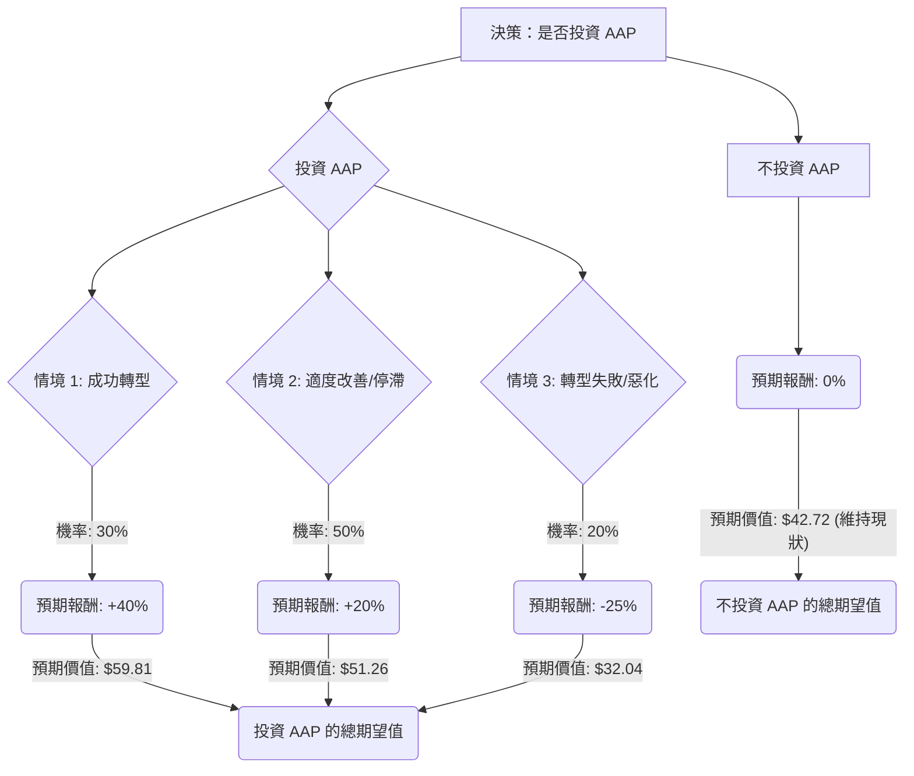

根據對美股公司 Advance Auto Parts (AAP) 的基本面數據、最新新聞、財報、市場動態及產業趨勢的綜合評估，以下將運用決策樹分析與期望值分析，判斷目前是否適合投資。

### **核心假設**

1.  **市場趨勢：** 汽車售後零件市場因美國車輛平均車齡增加而具有韌性，消費者傾向維修而非購買新車。然而，電動車 (EV) 的普及對傳統內燃機 (ICE) 相關零件的長期需求構成結構性挑戰。
2.  **財務狀況：** AAP 在 2023 年第四季度表現疲軟，錄得每股虧損，毛利率下降，主要受庫存相關問題和供應鏈成本上升影響。然而，2025 年第三季度財報顯示出積極的轉變，可比店面銷售額增長 3%，調整後每股盈餘超出預期，毛利率也有所改善，且公司擁有超過 30 億美元的現金流。公司管理層正積極推動業務轉型，包括削減年度銷售、一般及行政費用 (SG&A) 1.5 億美元。
3.  **產業競爭：** AAP 面臨來自 O'Reilly Automotive (ORLY) 和 AutoZone (AZO) 等強勁競爭對手的激烈競爭，在盈利能力和營收增長方面通常表現遜於同行。
4.  **分析師預期：** 分析師普遍給予「持有」或「減持」評級，平均目標價介於 50.04 美元至 55.23 美元之間，相較於當前股價有 17% 至 28% 的潛在漲幅，但近期部分分析師已下調目標價。

### **決策樹分析**

**決策點：** 是否投資 AAP 股票？

**當前股價 (P0)：** 42.72 美元

### **計算過程**

**1. 核心假設與情境機率：**

*   **情境 1：成功轉型 (Positive Scenario)**
    *   **描述：** 公司成本削減和營運效率提升措施 (如 1.5 億美元的 SG&A 削減) 取得顯著成效。可比店面銷售額持續改善，毛利率進一步擴大。公司成功應對供應鏈挑戰和競爭壓力。分析師情緒轉為積極，上調評級和目標價。
    *   **機率 (P1)：** 30% (考慮到 Q3 2025 的積極信號和管理層的努力，但轉型仍具挑戰性)
    *   **預期報酬 (R1)：** +40% (基於成功轉型後股價可能達到分析師目標價區間的高端，例如 60-65 美元)

*   **情境 2：適度改善/停滯 (Neutral Scenario)**
    *   **描述：** AAP 的轉型措施取得部分進展，但挑戰依然存在。可比店面銷售額持平或略有增長，利潤率改善有限。公司表現繼續落後於主要競爭對手。分析師評級維持「持有」，股價在平均目標價附近波動。
    *   **機率 (P2)：** 50% (基於分析師普遍的「持有」共識以及公司目前處於轉型期的現實)
    *   **預期報酬 (R2)：** +20% (基於股價可能達到分析師平均目標價約 52-55 美元)

*   **情境 3：轉型失敗/惡化 (Negative Scenario)**
    *   **描述：** 轉型努力未能產生預期效果。供應鏈成本和勞動力問題持續侵蝕利潤。競爭加劇，可比店面銷售額再次下滑。宏觀經濟逆風 (如經濟衰退、消費者 DIY 汽車零件支出進一步下降) 惡化。分析師下調評級和目標價。
    *   **機率 (P3)：** 20% (考慮到公司過去的表現和現有挑戰，存在較大風險)
    *   **預期報酬 (R3)：** -25% (基於股價可能跌至分析師目標價區間的低端或更低，例如 30-35 美元)

**2. 節點期望值計算：**

*   **情境 1 的預期價值 (EV1)：**
    *   $42.72 \times (1 + 0.40) = 59.808 \text{ 美元}$
    *   期望值貢獻：$0.30 \times 59.808 = 17.9424 \text{ 美元}$

*   **情境 2 的預期價值 (EV2)：**
    *   $42.72 \times (1 + 0.20) = 51.264 \text{ 美元}$
    *   期望值貢獻：$0.50 \times 51.264 = 25.632 \text{ 美元}$

*   **情境 3 的預期價值 (EV3)：**
    *   $42.72 \times (1 - 0.25) = 32.04 \text{ 美元}$
    *   期望值貢獻：$0.20 \times 32.04 = 6.408 \text{ 美元}$

**3. 投資 AAP 的總期望值：**

*   總期望值 (EV_Invest) = EV1 貢獻 + EV2 貢獻 + EV3 貢獻
*   EV_Invest = $17.9424 + 25.632 + 6.408 = 49.9824 \text{ 美元}$

**4. 不投資 AAP 的總期望值：**

*   若不投資 AAP，則資金可維持現狀，其價值為當前股價，即 $42.72 美元 (假設無其他投資機會或機會成本為零)。

### **最終結論**

根據期望值分析，投資 AAP 股票的預期未來價值為 **49.98 美元**。相較於當前股價 42.72 美元，這意味著潛在的期望報酬率為：

($49.98 - $42.72) / $42.72 \approx 17.00\%$

**判斷：適合投資**

**理由：**

儘管 AAP 在過去一年面臨挑戰，且 2023 年第四季度業績不佳，但最新的 2025 年第三季度財報顯示出公司在可比店面銷售增長、毛利率改善以及調整後每股盈餘方面取得了積極進展。管理層正在積極推動轉型和成本削減措施，並預計 2024 年和 2025 年的每股盈餘將顯著改善。

綜合考量公司轉型中的積極信號、汽車售後市場的長期韌性以及分析師平均目標價所暗示的潛在漲幅，計算出的 17.00% 期望報酬率高於不投資的零報酬。雖然存在轉型失敗的風險，但成功或適度改善情境的機率和潛在報酬足以使整體期望值為正，並提供具吸引力的潛在回報。因此，在風險可控的前提下，AAP 目前適合投資。