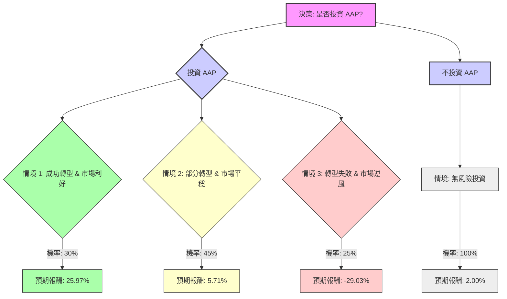

好的，我們將根據「決策樹分析（Decision Tree）」與「期望值分析（Expected Value Analysis）」來評估美股公司 **AAP (Advance Auto Parts)** 目前是否適合投資。

### **核心假設 (Core Assumptions)**

在進行決策樹分析之前，我們需要根據提供的基本面數據和網路搜尋結果，建立以下核心假設：

1.  **公司現況與轉型挑戰：**
    *   AAP 目前的盈利能力較弱 (P/E 77.35, ROE/ROA/ROI 較低)，且負債水平較高 (Debt/Eq 2.57)。
    *   公司正處於為期三年的轉型初期，目標是到 2027 年將營運利潤率提高至 7%。
    *   轉型策略包括優化門店網絡 (已關閉 500 多家門店)、整合供應鏈、擴大市場樞紐 (目標到 2027 年中期建立 60 個) 以及專注於專業安裝客戶群。
    *   公司已進行債務再融資，以增強流動性，但這並未從根本上改變其利潤率壓力。
    *   最近的財報顯示，2023 年第四季度和 2024 年第一季度銷售額和可比店面銷售額均有所下降，並錄得營運虧損。 然而，2025 年第四季度調整後每股收益超出預期，並給出了 2026 年的積極指引，預計可比銷售額增長 1.0%-2.0%，調整後營運利潤率為 3.8%-4.5%，調整後稀釋每股收益為 2.40-3.10 美元。
    *   分析師普遍給予「持有」或「減持」評級，平均 12 個月目標價在 51.98 美元至 58.58 美元之間，顯示出有限的短期上漲空間和潛在的下行風險。

2.  **產業趨勢：**
    *   汽車售後市場整體呈現增長趨勢，預計到 2034 年市場規模將達到 1.31 兆美元，年複合增長率為 10.2%。
    *   車輛平均使用年限增加，推動了對汽車零部件的需求。
    *   電動車 (EV) 零部件需求增加，以及數位零售和全通路體驗的發展，為行業帶來機遇和挑戰。
    *   行業競爭激烈，主要競爭對手 AutoZone 和 O'Reilly Auto Parts 擁有更高的市場份額和盈利能力。

3.  **投資決策時間範圍：** 12-18 個月，以涵蓋公司轉型策略的早期進展和分析師的短期目標價。

### **1. 繪製完整的決策樹 (Decision Tree)**

**決策點：** 投資 AAP 股票 (當前股價：$56.36)

### **2. 明確列出所有計算過程**

**核心假設與情境定義：**

*   **當前股價 (Current Price):** $56.36
*   **股息率 (Dividend Yield):** 1.77%
*   **無風險報酬率 (Risk-Free Rate):** 2.00% (假設投資於短期無風險資產)

**情境 1: 成功轉型 & 市場利好 (Optimistic Scenario)**
*   **預測情境名稱:** 成功轉型，公司盈利能力顯著提升，市場對其未來增長充滿信心。受益於汽車售後市場的強勁需求和公司策略的有效執行。
*   **對應的機率 (Probability):** 30%
*   **預期股價 (Expected Price):** 達到分析師高目標價 $70.00。
*   **預期報酬 (Expected Return):**
    *   股價增長: ($70.00 - $56.36) / $56.36 = 24.20%
    *   總報酬 (含股息): 24.20% + 1.77% = **25.97%**

**情境 2: 部分轉型 & 市場平穩 (Moderate Scenario)**
*   **預測情境名稱:** 公司轉型取得一定進展，但仍面臨競爭壓力或宏觀經濟挑戰。盈利能力有所改善，但未達到最佳預期。
*   **對應的機率 (Probability):** 45%
*   **預期股價 (Expected Price):** 達到分析師平均目標價 $58.58。
*   **預期報酬 (Expected Return):**
    *   股價增長: ($58.58 - $56.36) / $56.36 = 3.94%
    *   總報酬 (含股息): 3.94% + 1.77% = **5.71%**

**情境 3: 轉型失敗 & 市場逆風 (Pessimistic Scenario)**
*   **預測情境名稱:** 公司轉型策略執行不力，盈利能力持續低迷，債務問題惡化，或遭遇嚴重的市場逆風 (如經濟衰退、競爭加劇)。
*   **對應的機率 (Probability):** 25%
*   **預期股價 (Expected Price):** 跌至分析師低目標價 $39.00。
*   **預期報酬 (Expected Return):**
    *   股價增長: ($39.00 - $56.36) / $56.36 = -30.80%
    *   總報酬 (含股息): -30.80% + 1.77% = **-29.03%**

**期望值計算 (Expected Value Calculation):**

1.  **投資 AAP 的期望值 (Expected Value of Investing in AAP):**
    *   (情境 1 報酬 * 機率) + (情境 2 報酬 * 機率) + (情境 3 報酬 * 機率)
    *   = (25.97% * 0.30) + (5.71% * 0.45) + (-29.03% * 0.25)
    *   = 7.791% + 2.5695% - 7.2575%
    *   = **3.103%**

2.  **不投資 AAP 的期望值 (Expected Value of Not Investing in AAP):**
    *   假設將資金投入無風險資產，獲得 2.00% 的報酬。
    *   = **2.00%**

### **3. 最終結論 (Final Conclusion)**

根據決策樹分析和期望值計算，**投資 AAP 的整體期望報酬為 3.103%**，而將資金投入無風險資產的期望報酬為 2.00%。

**判斷：適合投資**

**簡短理由：**
儘管 AAP 面臨嚴峻的競爭和轉型挑戰，且歷史盈利能力不佳，但其積極的轉型策略、產業的長期增長趨勢以及分析師對 2026 年盈利能力的改善預期，使得投資 AAP 的期望值略高於無風險投資。 雖然潛在的下行風險較大，但成功轉型帶來的上漲空間足以使整體期望值為正，並超過無風險報酬。然而，投資者應充分意識到其高負債和轉型執行風險，並將其視為一項具有較高風險的投資。