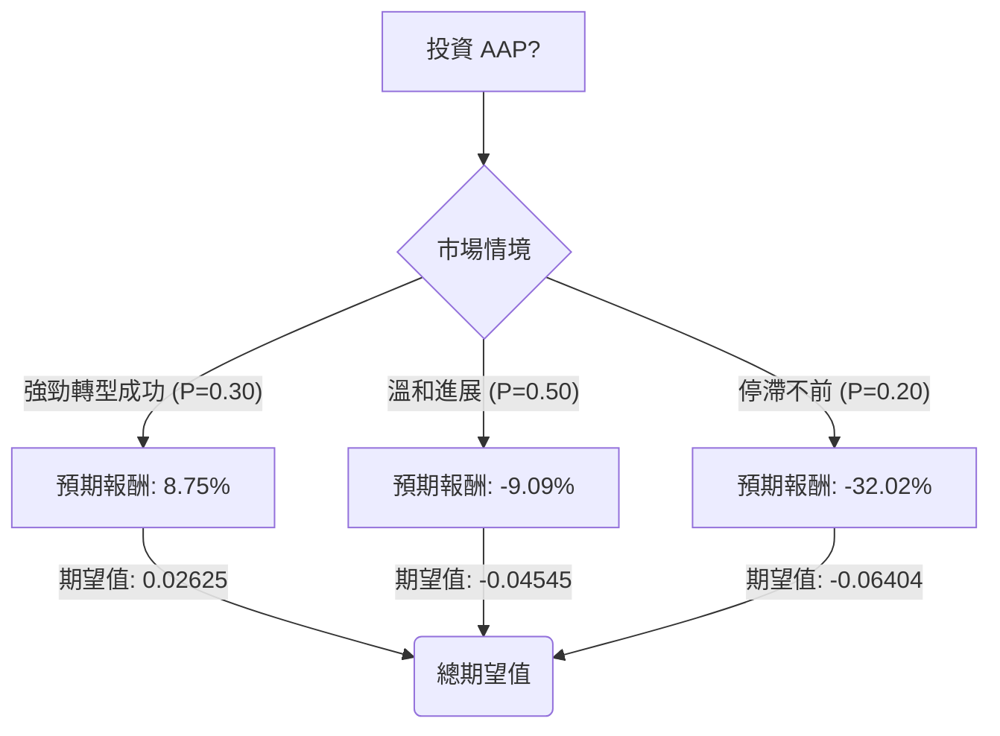

根據您提供的基本面數據以及最新的市場資訊，我們將使用決策樹分析（Decision Tree Analysis）和期望值分析（Expected Value Analysis）來評估美股公司 AAP (Advance Auto Parts) 目前是否適合投資。

### 核心假設

在進行決策樹分析之前，我們基於 AAP 的基本面數據、最新財報、分析師評級和產業趨勢，做出以下核心假設：

*   **市場趨勢：** 汽車售後零件市場整體保持穩健增長，主要受車輛平均使用年限增加以及維修的必要性驅動。電動車（EV）的興起對傳統燃油車零件需求構成長期挑戰，但也為EV專用零件帶來新機遇。
*   **公司財務狀況：** AAP 正在執行一項轉型策略，旨在改善營運效率、優化門店網絡（包括關閉表現不佳的門店和開設市場樞紐）並提升毛利率和營運利潤率。 公司在2025年和2026年被視為「建設年」，預計在2027年實現顯著的利潤率擴張。 然而，公司目前仍面臨銷售額輕微下滑、毛利率壓力以及較高的負債權益比（2.57）等挑戰。
*   **分析師預期：** 大多數分析師對 AAP 持「持有」評級，平均目標價顯示較當前股價存在潛在下行空間。 這表明市場對其轉型成功持謹慎樂觀態度。
*   **股價波動：** 股價將受到公司營運表現、宏觀經濟狀況以及市場對其轉型計畫信心的影響。

### 決策樹分析

我們將考慮三種未來情境，並為每種情境分配機率和預期報酬。

**當前股價 (Close):** $58.85

**決策點：投資 AAP？**

*   **情境 1：強勁轉型成功 / 超越預期 (Optimistic)**
    *   **機率 (Probability):** 30%
    *   **情境描述:** AAP 的戰略轉型計畫（包括門店優化、供應鏈改善、Pro業務增長和EV零件佈局）取得顯著成功。公司營運效率大幅提升，毛利率和營運利潤率顯著擴張，超出市場預期。市場對其未來增長前景信心大增。
    *   **預期股價:** 參考分析師最高目標價，並考慮成功轉型帶來的溢價。我們設定為 $63.00。
    *   **預期報酬 (Expected Return):** (($63.00 - $58.85) / $58.85) + 0.017 (股息率) = 0.0705 + 0.017 = 0.0875 或 8.75%
    *   **期望值 (Expected Value):** 0.30 * 0.0875 = 0.02625

*   **情境 2：溫和進展 / 符合預期 (Neutral)**
    *   **機率 (Probability):** 50%
    *   **情境描述:** AAP 的轉型計畫取得溫和進展，符合分析師的普遍預期。公司業績穩定，但未出現爆發性增長。市場對其前景保持「持有」態度。
    *   **預期股價:** 參考分析師平均目標價。我們設定為 $52.50。
    *   **預期報酬 (Expected Return):** (($52.50 - $58.85) / $58.85) + 0.017 = -0.1079 + 0.017 = -0.0909 或 -9.09%
    *   **期望值 (Expected Value):** 0.50 * (-0.0909) = -0.04545

*   **情境 3：停滯不前 / 表現不佳 (Pessimistic)**
    *   **機率 (Probability):** 20%
    *   **情境描述:** AAP 的轉型計畫遭遇重大挫折，未能有效改善營運或應對市場挑戰。競爭加劇、宏觀經濟惡化或高負債壓力導致公司業績持續低迷，市場信心大幅下降。
    *   **預期股價:** 參考分析師最低目標價。我們設定為 $39.00。
    *   **預期報酬 (Expected Return):** (($39.00 - $58.85) / $58.85) + 0.017 = -0.3372 + 0.017 = -0.3202 或 -32.02%
    *   **期望值 (Expected Value):** 0.20 * (-0.3202) = -0.06404

---

### 決策樹圖 (Markdown)

### 計算過程

**1. 節點期望值計算方式：**
每個情境的期望值 = 該情境的機率 × 該情境的預期報酬。

*   **情境 1 期望值:** 0.30 * 0.0875 = 0.02625
*   **情境 2 期望值:** 0.50 * (-0.0909) = -0.04545
*   **情境 3 期望值:** 0.20 * (-0.3202) = -0.06404

**2. 整體期望值計算：**
整體期望值 = 情境 1 期望值 + 情境 2 期望值 + 情境 3 期望值

整體期望值 = 0.02625 + (-0.04545) + (-0.06404)
整體期望值 = -0.08324 或 -8.324%

### 最終結論

根據我們的決策樹分析和期望值計算，投資 AAP 的**整體期望報酬為 -8.324%**。

因此，基於目前的分析，**不適合投資 AAP**。

**簡短理由：**
儘管 AAP 正在積極進行轉型並在2025年和2026年被視為「建設年」，但市場對其前景仍持謹慎態度，分析師的平均目標價顯示較當前股價存在下行空間。公司近期財報顯示銷售額和可比店面銷售額增長乏力，毛利率承壓，且負債水平較高。 雖然存在強勁轉型成功的可能性，但其機率相對較低，而溫和進展或表現不佳的情境則預示著負面報酬，且這些情境的總機率更高。綜合來看，投資 AAP 的風險較高，預期報酬為負，因此目前不建議投資。