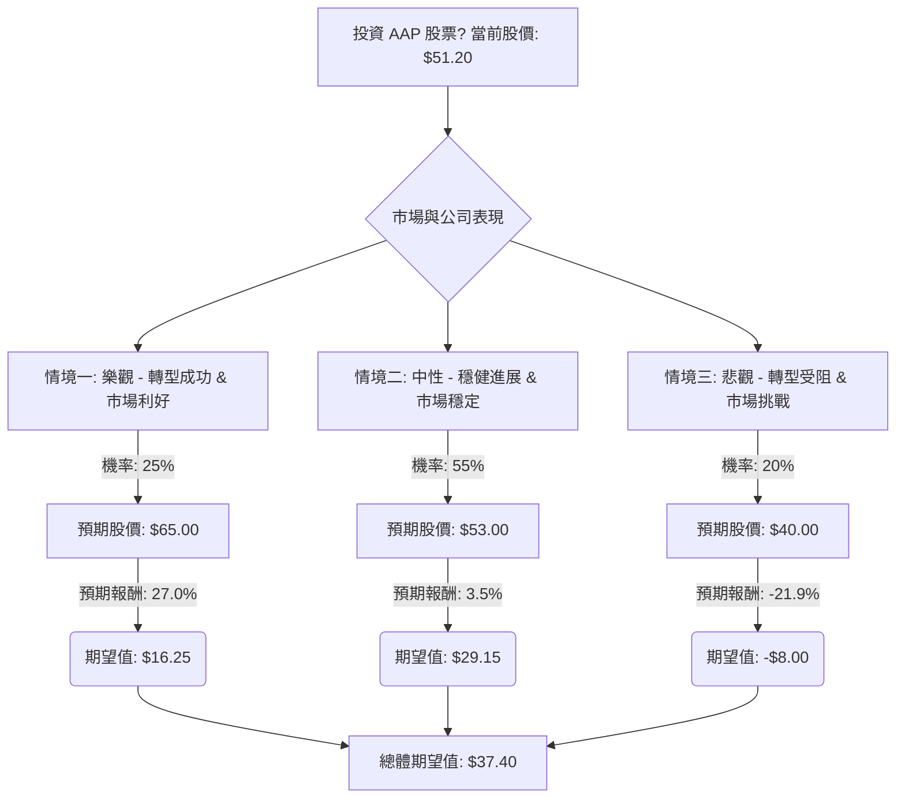

根據對美股公司 AAP (Advance Auto Parts) 的基本面數據、最新新聞、財報、市場動態及產業趨勢的綜合分析，以下將使用決策樹分析與期望值分析來評估其目前是否適合投資。

**核心假設：**

*   **市場趨勢：** 汽車售後市場預計將持續增長，主要受惠於車輛平均使用年限增加、車輛總數增長以及行駛里程數增加。
*   **公司轉型：** AAP 正在積極執行其重組計劃，包括關閉表現不佳的門市、優化供應鏈、改善商品庫存管理以及推出新的客戶忠誠度計劃。這些措施旨在提升營運效率和盈利能力。
*   **競爭環境：** 汽車售後市場競爭激烈，AAP 面臨來自傳統競爭對手和新進入者的持續壓力。公司能否有效執行其策略以縮小與領先同業的利潤差距至關重要。
*   **經濟狀況：** 儘管整體經濟存在不確定性，但汽車維修的剛性需求為汽車售後市場提供了相對的韌性。

**最新資訊摘要：**

*   **近期財報 (2025 年第四季度，於 2026 年 2 月 13 日發布)：** AAP 公布的調整後每股盈餘 (EPS) 為 0.86 美元，顯著超出市場預期的 0.41 美元。季度營收為 19.7 億美元，略高於預期，但較去年同期下降 1.2%。
*   **2026 年財測：** 公司預計 2026 年可比門市銷售額增長 1.0% 至 2.0%，調整後營運利潤率為 3.8% 至 4.5%，調整後稀釋每股盈餘為 2.40 美元至 3.10 美元，以及約 1 億美元的自由現金流。 分析師認為這份財測超出預期，顯示轉型計劃取得進展。
*   **重組進展：** AAP 已關閉超過 700 家門市 (截至 2025 年第四季度末為 4,297 家，而 2024 年第四季度為 4,788 家)，並專注於提升商品供應和專業客戶的配送時間。
*   **分析師評級：** 截至 2026 年 3 月，分析師普遍給予「減持 (Reduce)」或「持有 (Hold)」評級。22 位分析師中，有 3 位建議賣出，17 位建議持有，2 位建議買入。平均目標價約為 51.71 美元至 52.93 美元，最高目標價為 63.00 美元，最低為 39.00 美元。
*   **估值：** 截至 2026 年 3 月初，AAP 股價約在 51.15 美元至 53.16 美元之間。 追蹤市盈率 (P/E) 約為 70.05 - 71.49，遠期市盈率 (Forward P/E) 為 13.53 (來自用戶提供數據)。
*   **產業趨勢：** 全球汽車售後市場預計在 2026 年將超過 5,000 億美元，並在未來十年持續增長。 人工智慧 (AI) 的應用、價值驅動的合作夥伴關係以及供應鏈多元化是未來產業發展的關鍵趨勢。

---

### 1. 決策樹分析 (Decision Tree Analysis)

**起始點：** 投資 AAP 股票？ (當前股價約 $51.20)

**節點說明與計算：**

*   **A (起始點): 投資 AAP 股票？**
    *   當前股價 (Close): $51.20 (來自用戶提供數據，與近期市場價格一致)

*   **B (決策點): 市場與公司表現**
    *   此節點代表未來市場和公司營運可能出現的不同情境。

*   **C1 (情境一): 樂觀 - 轉型成功 & 市場利好**
    *   **預測情境名稱：** AAP 的重組計劃取得顯著成功，營運效率和盈利能力大幅提升，逐步縮小與同業的利潤差距。汽車售後市場表現強勁，AAP 抓住市場機遇，市場份額有所擴大。分析師普遍上調評級和目標價。
    *   **對應的機率 (Probability)：** 25%
        *   理由：儘管公司面臨挑戰，但 2025 年第四季度財報超出預期，2026 年財測積極，且重組計劃正在進行中，顯示出潛在的上升空間。
    *   **預期報酬 / 期望值 (Expected Value)：**
        *   預期股價：$65.00 (參考分析師最高目標價 $63.00 並考慮強勁執行下的額外潛力)
        *   預期報酬率：($65.00 - $51.20) / $51.20 = 27.0%
        *   期望值 (股價)：$65.00 * 0.25 = $16.25

*   **C2 (情境二): 中性 - 穩健進展 & 市場穩定**
    *   **預測情境名稱：** AAP 的轉型計劃按部就班地進行，營運和財務表現符合或略高於 2026 年財測。汽車售後市場保持穩定增長，但 AAP 的市場份額和利潤率改善速度緩慢，競爭壓力持續。分析師評級維持在「持有」或「減持」，目標價接近當前水平或略有上漲。
    *   **對應的機率 (Probability)：** 55%
        *   理由：這是目前分析師共識 (多數為「持有」或「減持」) 和公司自身財測所反映的最可能情境。
    *   **預期報酬 / 期望值 (Expected Value)：**
        *   預期股價：$53.00 (參考分析師平均目標價 $51.71 - $52.93)
        *   預期報酬率：($53.00 - $51.20) / $51.20 = 3.5%
        *   期望值 (股價)：$53.00 * 0.55 = $29.15

*   **C3 (情境三): 悲觀 - 轉型受阻 & 市場挑戰**
    *   **預測情境名稱：** AAP 的重組計劃未能達到預期效果，營運效率和盈利能力改善緩慢甚至惡化。公司可能錯失 2026 年財測目標。激烈的市場競爭、供應鏈問題或宏觀經濟逆風 (如消費者支出疲軟) 對公司業績造成負面影響。分析師下調評級和目標價。
    *   **對應的機率 (Probability)：** 20%
        *   理由：公司歷史上存在管理不善和利潤率落後同業的問題，且市場競爭激烈，這些都是潛在的風險因素。
    *   **預期報酬 / 期望值 (Expected Value)：**
        *   預期股價：$40.00 (參考分析師最低目標價 $39.00 或 $33.00，並考慮轉型失敗的影響)
        *   預期報酬率：($40.00 - $51.20) / $51.20 = -21.9%
        *   期望值 (股價)：$40.00 * 0.20 = -$8.00 (此處為股價的期望值貢獻，而非負報酬)

*   **D (總體期望值):**
    *   總體期望值 = 情境一期望值 + 情境二期望值 + 情境三期望值
    *   總體期望值 = $16.25 + $29.15 + $8.00 = $53.40 (此處的期望值是未來股價的期望值)

---

### 2. 期望值分析 (Expected Value Analysis)

基於上述決策樹的計算，我們得出 AAP 股票在未來 12-18 個月內的**預期股價期望值為 $53.40**。

*   **當前股價：** $51.20
*   **預期股價期望值：** $53.40

**預期投資報酬率計算：**
期望報酬率 = (預期股價期望值 - 當前股價) / 當前股價
期望報酬率 = ($53.40 - $51.20) / $51.20 = $2.20 / $51.20 ≈ 0.0430 = **4.30%**

---

### 3. 最終結論

根據決策樹分析和期望值分析，AAP 股票的**總體期望報酬率約為 4.30%**。

**判斷：不適合投資**

**簡短理由：**

儘管 AAP 在 2025 年第四季度財報中表現超出預期，並給出了積極的 2026 年財測，顯示其重組計劃正在取得初步進展，但 4.30% 的預期報酬率相對較低，未能充分補償投資者可能面臨的風險。

*   **風險與報酬不匹配：** 考慮到 AAP 過去的營運挑戰、與同業相比仍較低的利潤率 以及汽車售後市場的激烈競爭，4.30% 的預期報酬率並不足以吸引投資者承擔這些風險。
*   **分析師共識：** 大多數分析師對 AAP 的評級為「持有」或「減持」，平均目標價也僅略高於當前股價，這表明市場對其未來表現持謹慎態度。
*   **自由現金流：** 2025 年自由現金流為負值 (-2.98 億美元)，儘管 2026 年預計轉正 (約 1 億美元)，但仍需觀察其持續性。
*   **股息可持續性：** 雖然股息收益率接近 2%，但其追蹤股息支付率高達 136.99%，顯示當前股息支付可能不可持續，儘管預計明年會改善。

綜合來看，儘管 AAP 正在努力轉型，但其預期報酬率不足以證明其投資風險是合理的。對於尋求更高風險調整後報酬的投資者而言，AAP 目前可能不是一個理想的投資選擇。