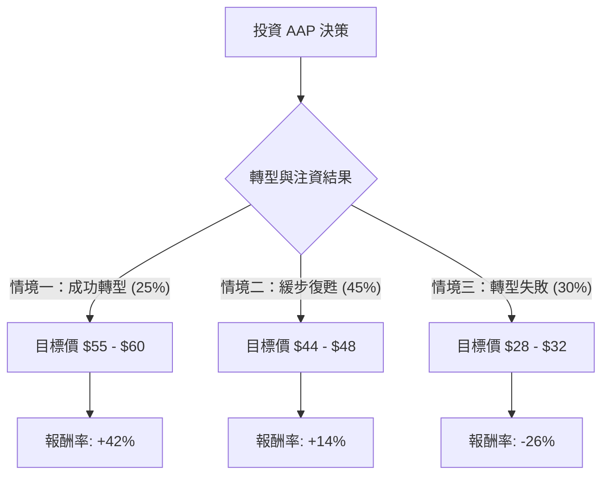

這是一份針對美股 **Advance Auto Parts (股票代號：AAP)** 的投資評估報告。本報告結合了你提供的基本面數據以及最新的市場動態（包含 2024 年第二季財報後的市場反應與策略轉型），並運用「決策樹」與「期望值分析」進行評估。

---

### 1. 市場背景與最新動態分析

在進入計算前，我們先整合最新的關鍵資訊：
*   **資產出售（關鍵轉折點）：** AAP 已於 2024 年 8 月宣布以 **15 億美元現金** 將其旗下批發業務 **Worldpac** 出售給 Carlyle Group。這筆資金將極大地改善其資產負債表，緩解 2.4 倍的高債務壓力。
*   **獲利預期下調：** 儘管有資產出售利多，但公司在最近的財報中下調了全年指引，反映出供應鏈整合的陣痛以及消費者支出疲軟。
*   **產業地位：** 相較於競爭對手 AutoZone (AZO) 和 O'Reilly (ORLY)，AAP 的營運利潤率（-5.09%）與 ROE（-23.85%）表現極差，目前處於「轉型期」的深水區。
*   **估值：** P/S 僅 0.28，遠低於同業，顯示市場已反映了大部分的悲觀預期。

---

### 2. 決策樹分析 (Decision Tree)

我們以 **未來 12 個月** 的投資回報為預測週期。

#### 節點標示與假設：

1.  **情境一：成功轉型 (Probability: 25%)**
    *   **核心假設：** Worldpac 出售後的 15 億美元成功用於償債並優化供應鏈，營運利潤率由負轉正，市場重新給予 Forward P/E 18倍以上的評價。
    *   **預期報酬：** 股價回升至分析師平均目標價以上，約 $57 (較現價 $40.4 漲幅 41.1%)。

2.  **情境二：基準情境/緩步復甦 (Probability: 45%)**
    *   **核心假設：** 雖然債務壓力減輕，但營運效率改善緩慢，面臨 AZO 與 ORLY 的強烈競爭。股價隨市場大盤小幅波動，反映帳面價值 (P/B 1.1)。
    *   **預期報酬：** 股價來到約 $46 (漲幅 13.9%)。

3.  **情境三：悲觀情境/持續惡化 (Probability: 30%)**
    *   **核心假設：** 核心業務持續流失市場份額，高達 17.5% 的空單佔比 (Short Float) 引發進一步拋售，宏觀經濟衰退導致 DIY 市場萎縮。
    *   **預期報酬：** 股價跌至 52 週低點附近，約 $30 (跌幅 -25.7%)。

---

### 3. 期望值分析 (Expected Value Analysis)

#### A. 計算過程：
我們根據各情境的機率與報酬率進行加權平均計算：

*   **期望報酬率 (Expected Return, ER):**
    $ER = (P1 \times R1) + (P2 \times R2) + (P3 \times R3)$
    $ER = (0.25 \times 0.411) + (0.45 \times 0.139) + (0.30 \times -0.257)$
    $ER = 0.10275 + 0.06255 - 0.0771$
    $ER = 0.0882$ (約 **8.82%**)

*   **預期目標價 (Expected Price):**
    $Expected Price = 40.40 \times (1 + 0.0882) = \mathbf{\$43.96}$

#### B. 核心假設說明：
1.  **市場趨勢：** 假設美國汽車保有年限持續增加（目前平均 12.5 年），這有利於後市場維修需求。
2.  **財務健康：** 假設 Worldpac 出售案能如期完成，將 Debt/Eq 從 2.4 降至 1.5 以下。
3.  **技術面：** 目前股價遠低於 SMA20, 50, 200，短期內技術指標極度超賣，存在報復性反彈空間，但長期受制於負利潤率。

---

### 4. 最終結論

#### **判斷：不適合投資 (或僅適合極小倉位的「深度價值」投機)**

**期望值雖然為正 (8.82%)，但基於以下理由，我建議維持觀望：**

1.  **風險回報比不具吸引力：** 8.8% 的預期報酬率相對於該公司目前面臨的「負 ROE (-23.8%)」與「負營運利潤率 (-5.09%)」來說風險過高。市場上同產業有更穩健的選擇 (如 ORLY)。
2.  **轉型不確定性高：** AAP 的問題在於供應鏈與系統老化，這並非單靠出售資產換取現金就能立即解決的。
3.  **負面趨勢：** 所有的移動平均線 (SMA) 均呈現大幅負成長，顯示技術面完全處於空頭排列，目前嘗試抄底屬於「接刀子」行為。
4.  **空頭壓力：** 17.54% 的高空單佔比雖然可能觸發軋空，但更多時候是反映了機構法人對其基本面的強烈看空。

**操作建議：**
除非看到 **連續兩季** 的營運利潤率回升至 3% 以上，或確定 15 億美元現金用於有效派息/大規模回購而非僅是填補虧損，否則目前不建議介入。

---
*免責聲明：本分析僅供參考，不構成投資建議。投資美股具有高度風險，請根據個人風險承受能力做出決策。*