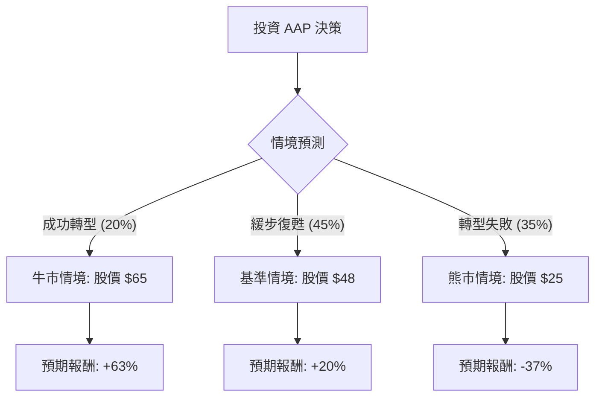

針對美股公司 **Advance Auto Parts (AAP)** 的投資評估，我結合了您提供的基本面數據以及最新的市場動態（包含 2024 年 Q3 財報與轉型計畫），進行決策樹與期望值分析。

---

### 一、 市場現況與核心假設

在進入計算前，必須考慮 AAP 目前面臨的關鍵轉折點：
1.  **資產剝離（Worldpac 售出）：** AAP 已同意以 15 億美元現金將 Worldpac 出售給 Carlyle，預計於 2024 年底完成。這將大幅改善其資產負債表。
2.  **大規模重組：** 公司宣布將關閉 500 多家門店及 4 個分銷中心，旨在提升營運效率。
3.  **財務困境：** 目前 ROE 為 -23.85%，營運利潤率（Oper. Margin）為負，且債務股本比（Debt/Eq）高達 2.4，顯示財務壓力極大。
4.  **競爭壓力：** 相較於競爭對手 ORLY 與 AZO，AAP 的供應鏈效率與利潤率長期落後。

---

### 二、 決策樹分析 (Decision Tree)

以下為 AAP 未來一年的投資決策路徑圖：

#### 節點詳細說明：

1.  **牛市情境 (Bull Case) - 20% 機率：**
    *   **條件：** Worldpac 售出資金成功償還高息債務；門店關閉計畫立即見效，利潤率回升至 5% 以上；市場空頭回補（Short Float 達 17.7%）。
    *   **目標價：** $65 (接近 52 週高點)。

2.  **基準情境 (Base Case) - 45% 機率：**
    *   **條件：** 轉型計畫進度符合預期，但營收因關店而短期下滑；利潤率緩慢改善；股價回歸分析師平均目標價。
    *   **目標價：** $48 (參考 Target Price $53.89 並給予保守折扣)。

3.  **熊市情境 (Bear Case) - 35% 機率：**
    *   **條件：** 核心零售業務持續萎縮；競爭對手進一步侵蝕市佔率；重組成本高於預期，導致現金流枯竭。
    *   **目標價：** $25 (跌破 52 週低點，反映結構性衰退)。

---

### 三、 期望值分析 (Expected Value Analysis)

#### 1. 計算過程
我們以當前股價 **$39.87** 為基準，計算一年後的預期股價期望值 (EV)：

*   **EV = (牛市機率 × 牛市目標價) + (基準機率 × 基準目標價) + (熊市機率 × 熊市目標價)**
*   **EV** = (0.20 × $65) + (0.45 × $48) + (0.35 × $25)
*   **EV** = $13.00 + $21.60 + $8.75 = **$43.35**

#### 2. 預期報酬率計算
*   **預期報酬率** = (EV - 當前股價) / 當前股價
*   **預期報酬率** = ($43.35 - $39.87) / $39.87 ≈ **8.73%**

#### 3. 核心假設與風險評估
*   **財務風險：** 負的 ROE (-23.85%) 與高債務 (Debt/Eq 2.4) 意味著公司容錯率極低。
*   **估值：** Forward P/E 15.36 倍在零售業不算極度便宜，尤其是考慮到其負增長。
*   **技術面：** SMA20/50/200 全線向下，顯示短期內賣壓沉重，市場信心尚未恢復。

---

### 四、 最終結論

**投資建議：不適合投資 (或僅建議極小倉位投機)**

#### 理由如下：

1.  **期望值吸引力不足：** 經過加權計算，預期報酬率僅約 **8.73%**。考慮到 AAP 面臨的巨大營運風險（負利潤、高債務、市佔流失），此報酬率不足以補償其潛在的下行風險（-37%）。
2.  **基本面惡化：** ROE 與 ROA 均為負值，顯示公司目前正在虧損資本。雖然有 Worldpac 的資產售出作為「救命錢」，但這屬於一次性收益，無法解決核心零售業務競爭力低下的問題。
3.  **高不確定性：** 關閉 500 家門店是激進的縮減策略，雖然長期有助於利潤，但短期內會導致營收萎縮與高額的重組費用。
4.  **技術面弱勢：** 股價處於所有均線下方，且近期表現（Perf Month -19.21%）顯示機構投資者正在撤離（Inst Trans -8.15%）。

**總結：** AAP 目前更像是一個「價值陷阱（Value Trap）」。除非您是極高風險偏好者，想博取 Worldpac 交易完成後的短期反彈或空頭擠壓（Short Squeeze），否則從穩健投資的角度來看，目前並非理想的入場時機。建議觀察其關店後的首季財報，確認利潤率是否止跌回升後再行考慮。