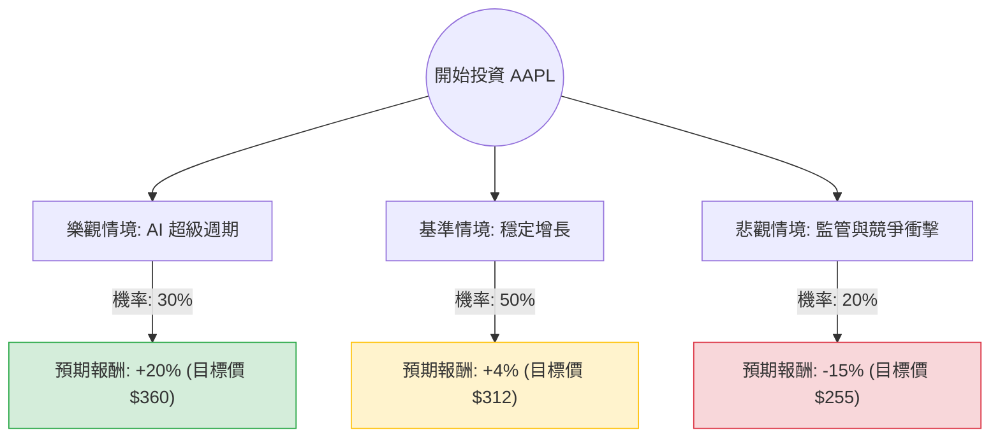

這份分析將結合您提供的數據（Close: 300.23, P/E: 36.55, Target Price: 312.56）與當前市場動態（Apple Intelligence 換機潮、中國市場競爭、歐美監管壓力）進行綜合評估。

---

### 一、 核心假設與市場動態分析

在建立決策樹前，我們基於數據與最新資訊設定以下三大核心假設：

1.  **AI 驅動的超級週期 (Bullish)**：Apple Intelligence (AI) 功能若能顯著推動 iPhone 16/17 的換機潮，將使營收成長率突破目前的個位數預期。
2.  **監管與地緣政治風險 (Bearish)**：美國司法部 (DOJ) 的反壟斷訴訟與歐盟《數位市場法》(DMA) 可能削弱服務部門（Services）的高毛利收入；同時中國市場華為的競爭持續施壓。
3.  **估值溢價 (Valuation)**：目前 P/E 高達 36.55，遠高於歷史平均（約 25-30），這意味著市場已提前反應了大部分利多，容錯率較低。

---

### 二、 決策樹分析 (Decision Tree)

以下為 AAPL 未來一年的投資決策模型：

#### 節點詳細說明：

1.  **樂觀情境 (Bull Case) - 30% 機率**：
    *   **條件**：AI 功能大受好評，iPhone 銷量超預期增長 >10%，服務部門不受監管影響持續擴張。
    *   **預期報酬**：考慮到 EPS 增長加速，給予更高估值，預計股價可達 $360。
2.  **基準情境 (Base Case) - 50% 機率**：
    *   **條件**：AI 換機潮溫和，符合目前數據中 EPS next Y (9.9%) 的預期。股價向分析師平均目標價 $312.56 靠攏。
    *   **預期報酬**：約 +4%（接近目前 Target Price）。
3.  **悲觀情境 (Bear Case) - 20% 機率**：
    *   **條件**：中國市場份額持續流失，反壟斷訴訟導致 App Store 抽成模式受損，全球消費力因高利率維持而疲軟。
    *   **預期報酬**：估值修正回歸 P/E 30 倍左右，股價回落至 $255。

---

### 三、 期望值分析 (Expected Value Analysis)

我們根據上述情境計算投資 AAPL 一年的預期收益率：

#### 1. 計算過程：
$$EV = (P_{Bull} \times R_{Bull}) + (P_{Base} \times R_{Base}) + (P_{Bear} \times R_{Bear})$$

*   $P$ = 機率 (Probability)
*   $R$ = 報酬率 (Return)

**帶入數值：**
*   樂觀：$0.30 \times 20\% = 6.0\%$
*   基準：$0.50 \times 4.1\% = 2.05\%$ (以 $312.56 / $300.23 計算)
*   悲觀：$0.20 \times (-15\%) = -3.0\%$

**總期望值 (Total EV)：**
$$6.0\% + 2.05\% - 3.0\% = 5.05\%$$

#### 2. 財務數據輔助驗證：
*   **PEG (2.58)**：數值大於 1，顯示目前股價相對於其增長速度偏貴。
*   **P/E (36.55)**：處於歷史高位，若增長未達預期，下行壓力大。
*   **ROE (1.4147)**：極高的股東權益報酬率顯示其護城河極強，支撐了高估值的合理性。

---

### 四、 最終結論

**判斷：不建議目前「重倉」買入，建議「觀望」或「逢低分批佈局」。**

#### 理由：
1.  **期望值過低**：計算出的預期報酬率僅為 **5.05%**。在當前美債殖利率仍有 4% 左右的環境下，承擔股市風險僅換取 5% 的期望回報，風險報酬比（Risk-Reward Ratio）並不具吸引力。
2.  **估值過高**：P/E 36.55 且 PEG 2.58 顯示市場已將「AI 成功」的情境完全定價（Priced in）。目前的股價 ($300.23) 距離分析師平均目標價 ($312.56) 僅剩不到 5% 的上漲空間。
3.  **技術面背離**：數據顯示 SMA20, 50, 200 均呈現正乖離（7%~16%），顯示短期內股價有過熱跡象，回調風險增加。
4.  **監管逆風**：近期歐美對大型科技公司的反壟斷力道是未來半年最大的不確定性因素，可能導致服務部門毛利受損。

**總結：** AAPL 是一家極其優秀的公司（高 ROE、高利潤率），但目前**「價格」高於「價值」**。建議等待股價回落至 $270-$280 區間（縮小與均線的乖離）或等待 AI 實際銷售數據出爐後再行介入。