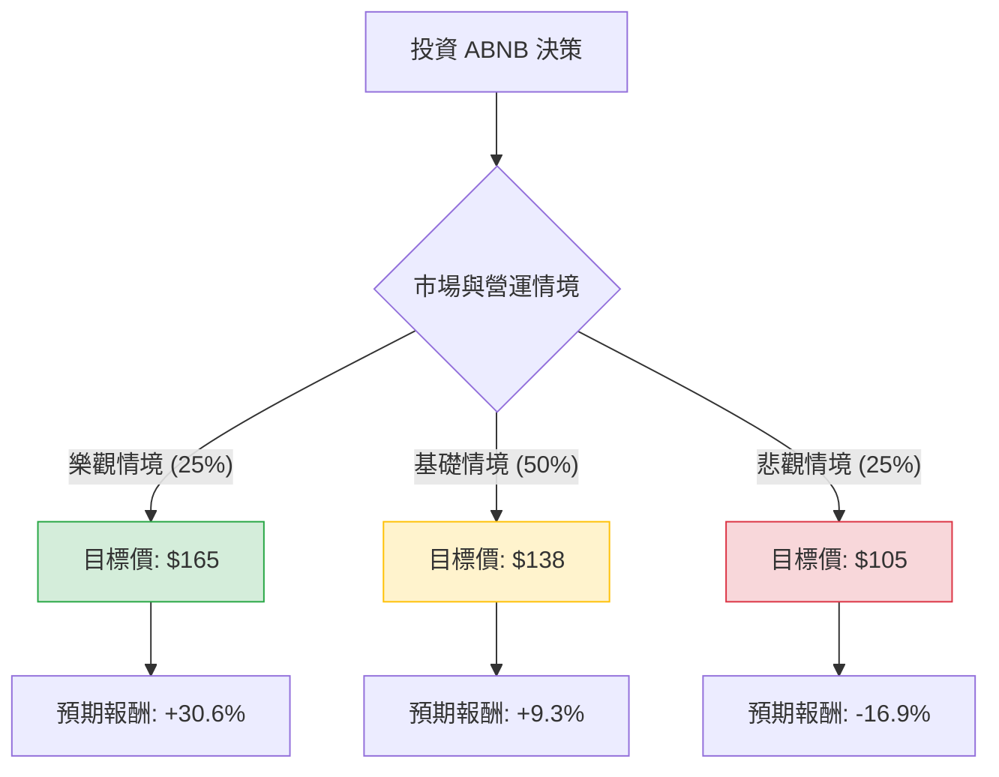

針對美股公司 **Airbnb (ABNB)** 的投資評估，我結合了您提供的基本面數據，並檢索了最新的市場動態（包含 2024 年 Q2 財報後的市場反應與產業趨勢），進行決策樹與期望值分析。

---

### 一、 最新市場動態與背景分析

在進行定量分析前，需考慮以下關鍵即時資訊：
1.  **Q2 財報警訊**：Airbnb 在最近的財報中警告「美國需求放緩」以及「預訂窗口縮短」（消費者更晚才訂房），導致股價近期承壓。
2.  **監管壓力**：全球各大城市（如巴塞隆納、紐約）對短租市場的監管趨嚴，這對其長期增長構成威脅。
3.  **財務強健度**：儘管增長放緩，ABNB 的現金流極其強大（P/FCF 僅 16.67），且擁有高毛利（72%）與高 ROE（30%），財務結構穩健。
4.  **新業務擴張**：公司正積極推動「體驗」業務與長期租賃，試圖分散單一短租市場的風險。

---

### 二、 決策樹分析 (Decision Tree)

以下決策樹基於未來 12 個月的預期表現：

#### 節點詳細說明：

1.  **樂觀情境 (Bull Case) - 25% 機率**：
    *   **條件**：美國經濟軟著陸，旅遊需求超預期回升；新業務（如國際市場擴張、AI 驅動的搜索優化）貢獻顯著營收。
    *   **預期股價**：$165 (參考 52W 高點並考量盈利增長)。
    *   **期望值貢獻**：$165 \times 0.25 = \$41.25$

2.  **基礎情境 (Base Case) - 50% 機率**：
    *   **條件**：旅遊市場進入「常態化」增長，符合公司指引；監管影響侷限於部分城市；回購股票支撐 EPS。
    *   **預期股價**：$138 (接近分析師平均目標價 $144.52 的保守估計)。
    *   **期望值貢獻**：$138 \times 0.50 = \$69.00$

3.  **悲觀情境 (Bear Case) - 25% 機率**：
    *   **條件**：美國消費支出大幅萎縮；更多主要旅遊城市跟進嚴格監管；競爭對手（Booking.com）市佔擴大。
    *   **預期股價**：$105 (接近 52W 低點 $99.88)。
    *   **期望值貢獻**：$105 \times 0.25 = \$26.25$

---

### 三、 期望值分析 (Expected Value Analysis)

#### 1. 核心假設
*   **當前股價 (Current Price)**：$126.30
*   **持有期限**：12 個月。
*   **估值邏輯**：結合 Forward P/E (21.93) 與 PEG (1.18)，顯示目前估值處於歷史相對低位，但受限於短期增長指引。

#### 2. 期望值計算過程
$$EV = (P_{Bull} \times V_{Bull}) + (P_{Base} \times V_{Base}) + (P_{Bear} \times V_{Bear})$$

*   **計算**：
    *   $EV = (0.25 \times 165) + (0.50 \times 138) + (0.25 \times 105)$
    *   $EV = 41.25 + 69.00 + 26.25 = \mathbf{136.5}$

#### 3. 預期報酬率
*   **預期股價**：$136.5
*   **潛在漲幅**：$\frac{136.5 - 126.3}{126.3} \approx \mathbf{8.08\%}$

---

### 四、 最終結論

#### **判斷：適合投資 (謹慎買入 / 分批佈局)**

**理由如下：**

1.  **期望值高於現價**：計算出的期望值 $136.5 高於目前市價 $126.3，顯示目前股價具有約 8% 的安全邊際。
2.  **財務護城河極強**：
    *   **ROE (30.23%)** 與 **Gross Margin (72.27%)** 顯示其在平台經濟中的極高效率。
    *   **P/FCF (16.67)** 對於一家高成長科技公司來說非常便宜，這意味著公司有大量現金進行股票回購或應對經濟下行。
3.  **估值合理化**：Forward P/E 降至 21.93 倍，相較於其歷史平均水平已大幅去泡沫化。
4.  **風險提示**：短期內受「旅遊需求放緩」的新聞情緒影響，股價可能在 $115 - $130 區間震盪。

**建議策略：**
由於目前處於 SMA20, SMA50, SMA200 均線下方（數據顯示均為負值），技術面偏弱。建議**不要一次性投入**，而是在 $120 - $125 區間採取**分批買入**策略，長期持有以等待旅遊市場情緒回暖及新業務轉型成果。