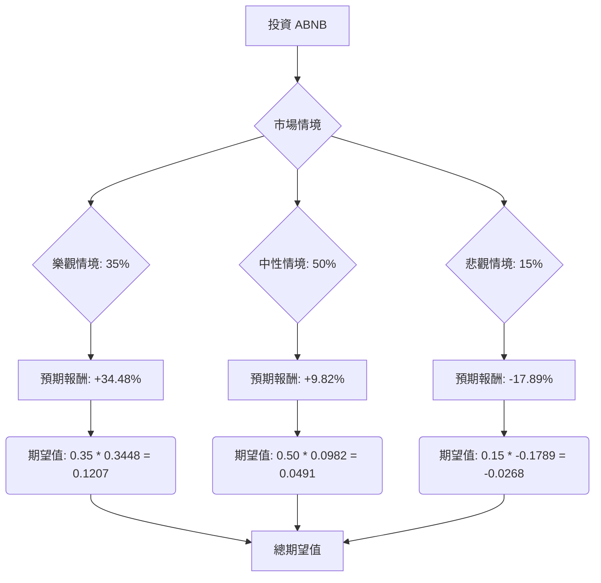

根據對美股公司 ABNB 的基本面數據、最新新聞、財報、市場動態及產業趨勢的綜合評估，以下將透過決策樹分析與期望值分析，判斷 ABNB 目前是否適合投資。

### 核心假設

在進行決策樹分析前，我們基於收集到的資訊，建立以下核心假設：

*   **市場趨勢：**
    *   全球線上旅遊市場預計在 2026-2034 年間以 9.75% 的複合年增長率 (CAGR) 增長，顯示整體市場前景樂觀。
    *   Gen Z 和千禧一代是主要的旅遊消費群體，偏好短途國際城市旅行、體驗式旅遊以及與大型活動相關的「主舞台旅遊」。
    *   對自然和戶外體驗的需求顯著增加，美國國家公園的搜索量增長了 35%。
    *   預訂窗口縮短，住宿時間變短，反映出更即興的旅行行為。
    *   AI 在旅行規劃中的應用日益普及，尤其受到千禧一代的青睞。
*   **財務表現與公司策略：**
    *   ABNB 在 2025 年第四季度表現強勁，營收同比增長 12% 達到 28 億美元，總預訂價值 (GBV) 增長 16%，過夜和體驗預訂量增長 10%。
    *   公司預計 2026 年第一季度營收將增長 14-16%，全年營收增長預計達到兩位數低端，調整後 EBITDA 利潤率保持穩定。
    *   ABNB 積極透過 Project Y、Project Hawaii 等創新項目簡化預訂和定價，並擴大在巴西、印度、日本等新市場的業務，同時拓展服務、體驗和精品酒店等新業務線。
    *   公司擁有健康的現金流，2025 財年自由現金流達 46 億美元。
*   **產業競爭與風險：**
    *   短期租賃市場的入住率趨於穩定在 50% 左右，但平均每日房價 (ADR) 仍比疫情前高出 25% 並持續增長。
    *   市場供應增長趨於緩和，但市場飽和度因地區而異，經營者品質成為關鍵成功因素。
    *   面臨來自競爭對手的壓力以及潛在的監管風險，例如對「全包式定價」和「隱藏費用」的審查。
    *   部分內部人士有股票出售行為。
*   **分析師預期：**
    *   分析師對 ABNB 的共識評級為「買入」或「適度買入」，平均目標價約為 145.25 美元至 149.40 美元，最高目標價為 180 美元至 185 美元，最低目標價為 110 美元至 120 美元。

### 決策樹分析

我們將考慮三種未來情境來評估 ABNB 的投資價值：

*   **樂觀情境 (Strong Growth)：** ABNB 成功抓住市場趨勢，國際擴張和新業務線表現出色，AI 整合提升用戶體驗，營收和利潤超預期增長，股價達到分析師高點。
*   **中性情境 (Steady Growth)：** ABNB 按照公司指引穩健增長，受益於線上旅遊市場的整體擴張，但面臨一定的競爭壓力或輕微的監管影響，股價達到分析師平均目標價。
*   **悲觀情境 (Stagnation/Decline)：** ABNB 受到激烈競爭、嚴格監管（如「隱藏費用」打擊）、全球經濟放緩導致旅遊需求下降或創新不足的影響，營收和利潤停滯甚至下滑，股價跌至分析師低點。

**當前股價：** $133.85

**情境預期報酬計算：**
*   **樂觀情境 (股價 $180)：** ($180 - $133.85) / $133.85 = 34.48%
*   **中性情境 (股價 $147)：** ($147 - $133.85) / $133.85 = 9.82%
*   **悲觀情境 (股價 $110)：** ($110 - $133.85) / $133.85 = -17.89%

**情境機率分配：**
*   **樂觀情境：** 35% (基於公司強勁的近期表現、積極的指引和分析師的「買入」評級)
*   **中性情境：** 50% (基於線上旅遊市場的穩健增長預期和分析師的「持有」評級佔比)
*   **悲觀情境：** 15% (考慮到競爭加劇、潛在的監管風險和宏觀經濟不確定性)

### 期望值分析 (Expected Value Analysis)

根據上述決策樹，我們計算投資 ABNB 的總期望值：

*   **樂觀情境期望值：** 0.35 \* 0.3448 = 0.1207
*   **中性情境期望值：** 0.50 \* 0.0982 = 0.0491
*   **悲觀情境期望值：** 0.15 \* (-0.1789) = -0.0268

**總期望值 (Total Expected Value) = 0.1207 + 0.0491 + (-0.0268) = 0.1430**

這表示投資 ABNB 的預期報酬率為 14.30%。

### 最終結論

根據決策樹分析和期望值分析，ABNB 目前**適合投資**。

**理由：**
計算出的總期望值為 14.30%，這是一個正向且相對可觀的預期報酬率。儘管存在悲觀情境下的潛在損失，但樂觀和中性情境的較高機率和正向報酬足以抵消風險。ABNB 在 2025 年第四季度表現強勁，並給出了積極的 2026 年指引，顯示其核心業務穩健增長，且公司積極透過創新和市場擴張來抓住線上旅遊市場的趨勢。分析師的共識評級也偏向「買入」，進一步支持了其投資潛力。雖然需要關注競爭和監管風險，但目前的數據表明 ABNB 具備良好的增長潛力。