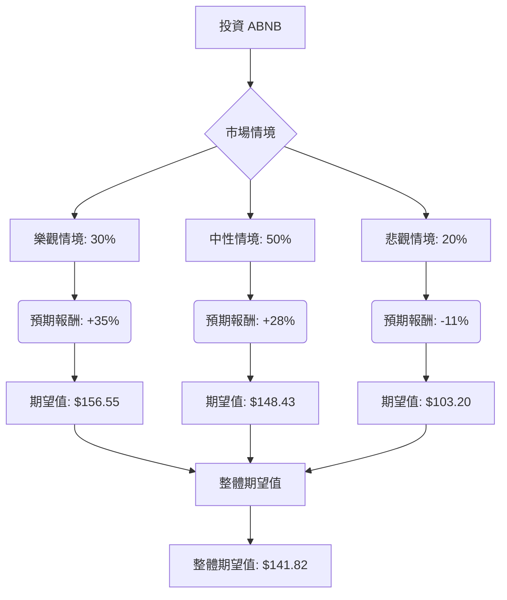

根據對美股公司 ABNB（Airbnb）的決策樹分析與期望值分析，並綜合其基本面數據及最新市場資訊，以下是詳細評估：

### **核心假設**

在進行決策樹分析前，我們基於當前市場動態、ABNB 財報及產業趨勢做出以下核心假設：

*   **市場趨勢：** 線上旅遊市場預計將持續增長，預計從 2024 年到 2032 年的複合年增長率超過 10%，到 2026 年線上預訂將佔所有旅遊預訂的 65%。移動設備使用、數據驅動的個性化和 AI 整合是主要趨勢。
*   **ABNB 財務表現：** ABNB 在 2025 年第四季度表現強勁，營收超出預期，並預計 2026 年營收將實現至少兩位數的低增長，調整後 EBITDA 利潤率保持穩定。
*   **產業競爭與策略：** ABNB 正積極透過 AI 整合、國際擴張（特別是巴西）、推出新服務和體驗，以及擴展酒店業務來多元化其平台。 儘管市場競爭加劇且增長速度從疫情後高峰期有所放緩，但 ABNB 在 2024 年的市場份額已從 2019 年的 28% 增長到 44%。
*   **宏觀經濟：** 假設全球經濟環境相對穩定，支持旅遊需求持續增長，儘管預計會從「報復性旅遊」的高峰期有所緩和。潛在的經濟逆風和監管挑戰仍是風險因素。
*   **分析師預期：** 分析師普遍給予 ABNB「買入」或「適度買入」的共識評級，平均目標價介於 143.64 美元至 148.5 美元之間，相較於當前股價有 22.95% 至 28.19% 的潛在上漲空間。

### **決策樹分析**

**當前股價 (Close):** $115.96

#### **情境說明與計算過程：**

1.  **樂觀情境 (Optimistic Scenario)**
    *   **情境名稱：** 強勁增長與市場擴張
    *   **情境描述：** ABNB 的 AI 整合、酒店業務擴張、國際市場滲透等戰略舉措取得顯著成功，顯著超越市場預期。旅遊需求持續強勁，ABNB 進一步擴大市場份額，監管環境有利。股價有望達到分析師目標價的高端，甚至更高。
    *   **機率 (Probability)：** 30%
    *   **預期報酬 (Expected Return)：** +35%
        *   此預期報酬參考分析師最高目標價 $200 與當前股價的潛在漲幅，並考慮到公司積極的增長策略和 Q4 2025 的強勁表現。
    *   **期望值 (Expected Value)：** $115.96 \* (1 + 0.35) = $156.55

2.  **中性情境 (Neutral Scenario)**
    *   **情境名稱：** 穩健增長與預期達成
    *   **情境描述：** ABNB 按照 2026 年的指引實現低兩位數的營收增長，調整後 EBITDA 利潤率保持穩定。旅遊需求保持健康但增長速度趨於正常化。戰略舉措取得穩步進展，但面臨一定的執行挑戰或競爭壓力。股價達到分析師的平均目標價。
    *   **機率 (Probability)：** 50%
        *   此為最可能的情境，符合公司指引和分析師共識。
    *   **預期報酬 (Expected Return)：** +28%
        *   此預期報酬參考分析師平均目標價 $148.5 與當前股價的潛在漲幅。
        *   計算：($148.5 - $115.96) / $115.96 ≈ 0.2806
    *   **期望值 (Expected Value)：** $115.96 \* (1 + 0.28) = $148.43

3.  **悲觀情境 (Pessimistic Scenario)**
    *   **情境名稱：** 經濟逆風與挑戰加劇
    *   **情境描述：** 全球經濟面臨嚴重衰退或高通脹，導致旅遊需求大幅下降。ABNB 面臨更嚴格的監管限制、激烈的競爭或新業務拓展不及預期。營收增長顯著放緩，利潤率受壓。股價跌至分析師目標價的低端，甚至更低。
    *   **機率 (Probability)：** 20%
        *   考慮到宏觀經濟不確定性和行業競爭風險。
    *   **預期報酬 (Expected Return)：** -11%
        *   此預期報酬參考分析師最低目標價 $103 與當前股價的潛在跌幅。
        *   計算：($103 - $115.96) / $115.96 ≈ -0.1118
    *   **期望值 (Expected Value)：** $115.96 \* (1 - 0.11) = $103.20

#### **整體期望值計算：**

整體期望值 = (樂觀情境期望值 \* 樂觀情境機率) + (中性情境期望值 \* 中性情境機率) + (悲觀情境期望值 \* 悲觀情境機率)
整體期望值 = ($156.55 \* 0.30) + ($148.43 \* 0.50) + ($103.20 \* 0.20)
整體期望值 = $46.965 + $74.215 + $20.64
**整體期望值 = $141.82**

### **最終結論**

根據上述決策樹分析，投資 ABNB 的整體期望值為 **$141.82**。

由於當前 ABNB 的股價為 $115.96，而其整體期望值 ($141.82) 高於當前股價，這表示投資 ABNB 具有正向的預期報酬。預期報酬率約為 22.30% ( ($141.82 - $115.96) / $115.96 )。

**判斷：適合投資**

**理由：**
ABNB 在 2025 年第四季度表現強勁，並對 2026 年給出了積極的營收增長指引。公司正積極透過 AI、酒店業務擴張和國際市場滲透等戰略舉措來推動未來增長。儘管存在宏觀經濟不確定性和競爭壓力，但線上旅遊市場的長期增長趨勢、ABNB 在市場中的主導地位 以及分析師普遍看好的前景，使得其整體期望值顯著高於當前股價，表明潛在的上漲空間。