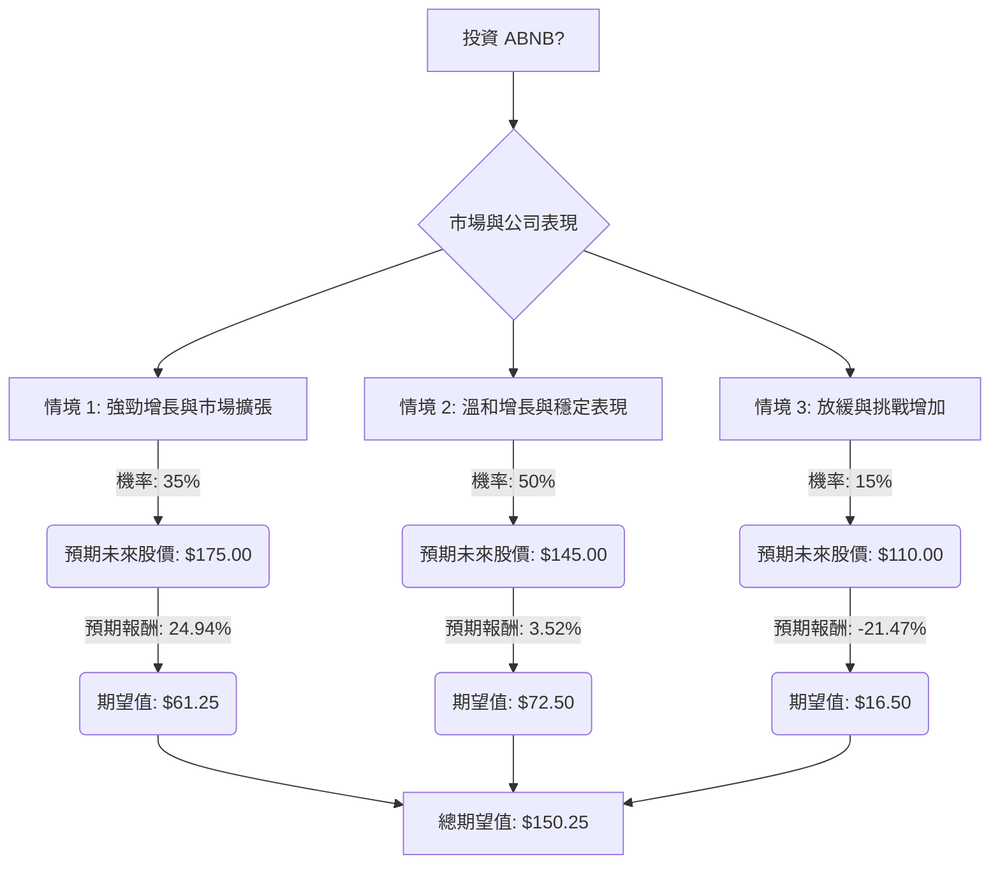

根據您提供的基本面數據以及最新的市場資訊，我將使用決策樹分析和期望值分析來評估美股公司 ABNB 目前是否適合投資。

### **核心假設**

在進行決策樹分析之前，我們需要建立以下核心假設：

*   **市場趨勢：**
    *   全球線上旅遊市場預計將持續增長，複合年增長率超過 10% (2024-2032)。
    *   國際旅遊預計在 2024 年將超越疫情前水平。
    *   「報復性旅遊」效應正在減弱，2024 年增長預計將放緩至 16%，因為物價上漲影響消費者旅遊意願。
    *   數位化和 AI 整合是旅遊業的關鍵驅動力，行動裝置在旅遊研究和預訂中扮演重要角色。
*   **財務表現：**
    *   ABNB 在 2023 年第四季度表現強勁，營收增長 17%，預訂量增長 12%。
    *   2024 年全年營收達到 111 億美元，同比增長 12%，自由現金流為 45 億美元。
    *   公司預計 2025 年第一季度營收增長 4% 至 6%。
    *   ABNB 計劃在 2024 年「重塑」自己，並在 2025 年投資 2-2.5 億美元擴展新業務，例如旅遊體驗和額外服務。
    *   分析師對 ABNB 的共識評級介於「買入」至「持有」之間，平均目標價約為 143.53 美元至 148.21 美元，較目前股價有 2.60% 至 7.63% 的上漲空間。
    *   近期有高階主管在 2025 年 12 月出售大量股票，這可能是一個需要關注的信號。
*   **產業趨勢與競爭：**
    *   ABNB 在短租市場佔據重要地位，2024 年在美國市場份額達到 44%。
    *   面臨來自 Booking.com (歐洲)、Agoda (亞洲)、Expedia、Vrbo 等平台的激烈競爭。
    *   監管挑戰持續存在，例如紐約市的法規限制、西班牙的租賃清單禁令以及義大利的稅務問題。
    *   ABNB 正在利用 AI 提升客戶服務效率，並測試擴展酒店供應以應對高流量城市的需求。

### **決策樹分析 (Decision Tree Analysis)**

我們將評估投資 ABNB 的決策，並考慮三種未來情境：樂觀、中性、悲觀。

**當前股價 (Close):** 140.07 美元

#### **節點說明與計算過程：**

*   **起始點：投資 ABNB?**
    *   這是我們的決策點。
*   **節點 B：市場與公司表現**
    *   我們將市場和公司未來的表現分為三個情境。

*   **情境 1: 強勁增長與市場擴張 (Optimistic Scenario)**
    *   **預測情境名稱：** ABNB 成功執行其「重塑」戰略，新業務擴展順利，AI 應用顯著提升效率，並有效應對監管挑戰。國際旅遊需求強勁，公司市場份額和盈利能力顯著提升。
    *   **對應的機率 (Probability)：** 35%
        *   理由：儘管公司有增長潛力，但考慮到競爭和宏觀經濟不確定性，給予中等偏高的機率。
    *   **預期未來股價：** 175.00 美元
        *   理由：高於分析師平均目標價，但低於最高目標價 (200 美元)，反映出較好的增長前景。
    *   **預期報酬 (Expected Return)：** (($175.00 - $140.07) / $140.07) = 24.94%
    *   **期望值 (Expected Value)：** $175.00 \* 0.35 = $61.25

*   **情境 2: 溫和增長與穩定表現 (Neutral Scenario)**
    *   **預測情境名稱：** ABNB 保持穩定增長，但面臨持續的競爭壓力、監管挑戰和宏觀經濟逆風。新業務的貢獻需要時間顯現，盈利能力保持穩定但沒有大幅提升。
    *   **對應的機率 (Probability)：** 50%
        *   理由：這是分析師共識評級 (「持有」/「溫和買入」) 和當前市場狀況下最可能的情境。
    *   **預期未來股價：** 145.00 美元
        *   理由：接近分析師的平均目標價 (約 143.53 - 148.21 美元)。
    *   **預期報酬 (Expected Return)：** (($145.00 - $140.07) / $140.07) = 3.52%
    *   **期望值 (Expected Value)：** $145.00 \* 0.50 = $72.50

*   **情境 3: 放緩與挑戰增加 (Pessimistic Scenario)**
    *   **預測情境名稱：** 宏觀經濟狀況惡化，消費者旅遊支出大幅減少。監管壓力加劇，導致關鍵市場營收損失。競爭對手侵蝕市場份額，新業務未能成功啟動。高階主管出售股票引發負面市場情緒。
    *   **對應的機率 (Probability)：** 15%
        *   理由：考慮到潛在的經濟衰退風險、監管不確定性和競爭加劇，給予一定的下行風險機率。
    *   **預期未來股價：** 110.00 美元
        *   理由：低於當前股價，但高於分析師最低目標價 (103-107 美元)，反映出顯著的下跌。
    *   **預期報酬 (Expected Return)：** (($110.00 - $140.07) / $140.07) = -21.47%
    *   **期望值 (Expected Value)：** $110.00 \* 0.15 = $16.50

#### **整體期望值計算：**

將所有情境的期望值加總，得到投資 ABNB 的整體期望值。

**整體期望值 = (情境 1 期望值) + (情境 2 期望值) + (情境 3 期望值)**
整體期望值 = $61.25 + $72.50 + $16.50 = $150.25

### **最終結論**

根據我們的決策樹分析和期望值計算，投資 ABNB 的整體期望值為 **150.25 美元**。

*   **判斷：適合投資**

**簡短理由：**
由於計算出的整體期望值 (150.25 美元) 高於 ABNB 的當前股價 (140.07 美元)，這表明從期望值的角度來看，投資 ABNB 具有正向的潛在回報。儘管存在監管挑戰、競爭加劇以及高階主管出售股票等風險，但 ABNB 在線上旅遊市場的強勁地位、持續的營收增長、穩健的自由現金流以及對 AI 和新業務的投資，為其未來的增長提供了支持。分析師的平均目標價也顯示出一定的上漲空間。因此，基於這些評估，ABNB 目前被認為適合投資。