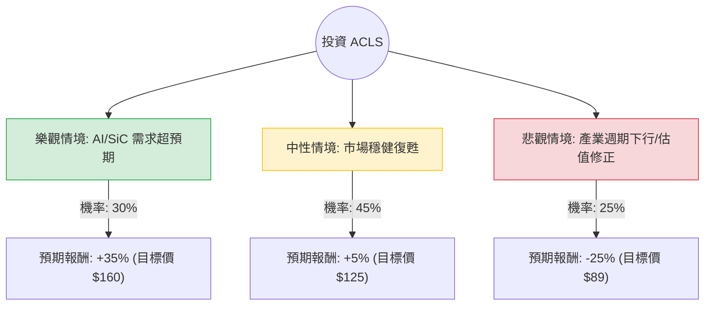

這份分析將結合您提供的 ACLS（Axcelis Technologies）基本面數據，以及當前半導體產業（特別是 SiC 碳化矽與 AI 相關需求）的最新動態，利用**決策樹（Decision Tree）**與**期望值分析（Expected Value Analysis）**進行評估。

---

### 一、 核心假設與市場背景分析

在建立模型前，我們先釐清 ACLS 的現狀：
1.  **產業地位**：ACLS 是離子佈植（Ion Implantation）設備的領導者，其 Purion 系列設備在 **SiC（碳化矽）功率元件**製造中具有壟斷性優勢。
2.  **財務亮點**：負債比極低（Debt/Eq 0.07），流動比率高（4.77），財務結構非常穩健。
3.  **警訊**：
    *   **估值偏高**：目前股價 $118.73 遠高於數據中的 Target Price $92.0。
    *   **短期動能過熱**：股價高於 SMA200 達 38.6%，且近期漲幅巨大（月漲 38%），存在回檔壓力。
    *   **市場分歧**：Short Float 達 12.53%，顯示市場有相當比例的空頭力量。

---

### 二、 決策樹分析圖 (Decision Tree)

我們將未來一年的投資情境分為三種：**樂觀（AI 與 SiC 爆發）**、**中性（穩健復甦）**、**悲觀（電動車需求放緩與估值修正）**。

---

### 三、 期望值分析與計算過程

#### 1. 情境參數設定與理由
*   **樂觀情境 (Bull Case) - 30% 機率**：
    *   **理由**：AI 伺服器對高階電源管理晶片需求激增，且電動車（EV）市場回暖帶動 SiC 設備訂單。ACLS 憑藉技術壟斷實現 EPS 超預期增長。
    *   **預期報酬**：+35%（參考歷史高點與 Forward P/E 擴張）。
*   **中性情境 (Base Case) - 45% 機率**：
    *   **理由**：半導體庫存去化完成，公司維持現有訂單能見度。雖然股價已反映部分預期，但隨大盤緩步上揚。
    *   **預期報酬**：+5%（股價在高位震盪，小幅超越目前市價）。
*   **悲觀情境 (Bear Case) - 25% 機率**：
    *   **理由**：高利率環境壓抑電動車需求，且 ACLS 目前股價與分析師目標價（$92）落差過大，引發技術性回檔與估值修正。
    *   **預期報酬**：-25%（回測數據中的 Target Price $92 附近）。

#### 2. 期望值 (Expected Value, EV) 計算
$$EV = (P_{Bull} \times R_{Bull}) + (P_{Base} \times R_{Base}) + (P_{Bear} \times R_{Bear})$$

*   $EV = (0.30 \times 35\%) + (0.45 \times 5\%) + (0.25 \times -25\%)$
*   $EV = 10.5\% + 2.25\% - 6.25\%$
*   **$EV = 6.5\%$**

---

### 四、 綜合評估與最終結論

#### 1. 數據洞察
*   **期望值為正 (6.5%)**：從數學機率來看，長期持有仍具備正向收益。
*   **風險收益比 (Risk/Reward)**：潛在獲利（35%）與潛在虧損（25%）相比，倍數約為 1.4 倍，不算特別優厚。
*   **技術面警示**：SMA20/50/200 全線噴發，且股價已大幅偏離平均線，短期追高風險極大。

#### 2. 最終判斷：**不適合立即「重倉」投資，建議「分批佈局」或「觀望回檔」**

*   **理由**：
    1.  **估值過熱**：目前的股價（$118.73）已嚴重透支了未來的成長預期，且遠高於數據提供的目標價（$92）。
    2.  **空頭壓力**：12.5% 的券商放空比例（Short Float）意味著市場對目前價位有強烈質疑，短期內可能出現劇烈波動。
    3.  **安全邊際不足**：雖然 ACLS 基本面極佳（低負債、高毛利），但 6.5% 的期望報酬率在半導體設備股中並不突出，尤其是考慮到其 25% 的潛在下行風險。

#### 3. 投資建議操作：
*   **若已持股**：建議分批獲利了結，鎖定近期 38% 的月漲幅利潤。
*   **若未持股**：不建議在此價位追入。建議等待股價回落至 **$100 - $105** 區間（靠近 SMA50 或更具安全邊際的價位）再行考慮。
*   **關注指標**：下一次財報中關於 **SiC 設備訂單**的指引，以及電動車市場的復甦力道。