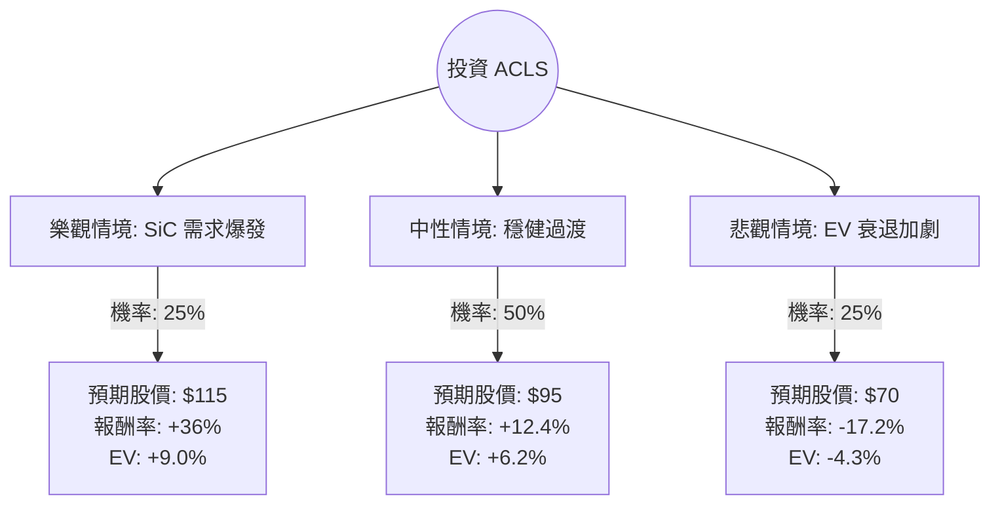

這份分析報告將結合您提供的 **Axcelis Technologies (ACLS)** 基本面數據，以及最新的市場動態（特別是半導體設備產業與碳化矽 SiC 市場趨勢），利用**決策樹（Decision Tree）**與**期望值（Expected Value）**進行投資評估。

---

### 1. 最新市場動態與背景分析 (網路搜尋補充)

在進行計算前，我們先整合 ACLS 的最新現況：
*   **核心業務**：ACLS 是離子佈植（Ion Implantation）設備的領導者，其增長高度依賴於**功率元件（Power Devices）**，特別是電動車（EV）使用的**碳化矽（SiC）**技術。
*   **2024 展望**：公司在最近的財報中指出 2024 年是「過渡年」。由於全球電動車需求增速放緩，SiC 設備的需求短期內面臨壓力。
*   **財務體質**：負債比極低（0.07），現金流穩健（P/C 6.94），這讓它在景氣循環中具備極強的抗風險能力。
*   **空方勢力**：空單餘額（Short Float）達 12.21%，顯示市場對短期股價仍有疑慮。

---

### 2. 決策樹分析 (Decision Tree)

我們將未來一年的投資情境分為三種：**樂觀（牛市）**、**中性（基準）**與**悲觀（熊市）**。

---

### 3. 核心假設與計算過程

#### A. 核心假設
1.  **樂觀情境 (25%)**：AI 帶動電力需求，進而加速電網與資料中心對功率半導體的升級；同時 EV 市場回溫。預期股價回測 52 週高點附近（約 $115）。
2.  **中性情境 (50%)**：符合公司指引，2024 年持平，2025 年 EPS 增長 23.67% 的預期被市場提前反應。預期股價接近分析師目標價（$92 - $95）。
3.  **悲觀情境 (25%)**：高利率環境持續，EV 需求長期低迷，且競爭對手（如 AMAT）搶奪市佔。股價可能回測支撐位（約 $70）。

#### B. 期望值 (Expected Value, EV) 計算
*   **當前股價 ($P_0$)**: $84.55

| 情境 | 預期股價 ($P_1$) | 報酬率 ($R$) | 機率 ($P$) | 加權期望值 ($R \times P$) |
| :--- | :--- | :--- | :--- | :--- |
| **樂觀** | $115.00 | +36.0% | 0.25 | +9.00% |
| **中性** | $95.00 | +12.4% | 0.50 | +6.20% |
| **悲觀** | $70.00 | -17.2% | 0.25 | -4.30% |
| **總計** | - | - | **1.00** | **+10.90%** |

**計算公式：**
$EV = (36.0\% \times 0.25) + (12.4\% \times 0.50) + (-17.2\% \times 0.25) = 9.0\% + 6.2\% - 4.3\% = 10.9\%$

---

### 4. 綜合評估與最終結論

#### 數據亮點分析：
1.  **估值合理**：Forward P/E 為 18.74，相對於其明年預期 23.67% 的 EPS 增長，PEG 接近或小於 1，顯示目前股價並未過熱。
2.  **財務極其穩健**：Current Ratio 4.77 且 Debt/Eq 僅 0.07，這意味著 ACLS 完全沒有破產或財務危機風險，能熬過產業低谷。
3.  **技術面壓力**：股價目前在 SMA200 ($81.78) 之上震盪，SMA50 呈現負值 (-3.9%)，顯示短期動能偏弱，正處於打底階段。

#### 最終判斷：適合投資 (建議分批買進)

**理由：**
1.  **期望值為正 (10.9%)**：雖然短期內受 EV 市場拖累，但 ACLS 的期望報酬率仍優於一般無風險利率，且具備上行潛力。
2.  **下行風險受控**：極低的負債比與強勁的資產負債表為股價提供了堅實的底部支撐。
3.  **產業地位**：作為 SiC 離子佈植的壟斷級玩家，只要能源轉型（電動車、綠能）的大趨勢不變，ACLS 是純度極高的標的。
4.  **空頭擠壓潛力**：12.21% 的高空單比例，一旦有優於預期的財報或利多消息，容易引發軋空行情（Short Squeeze）。

**投資建議：**
目前股價 $84.55 接近中性偏低位置。建議投資者**不宜一次性歐印 (All-in)**，可於 $80 - $85 區間分批建倉，並將止損位設在 $70 (悲觀情境支撐點)，長期持有以等待 2025 年的成長爆發。