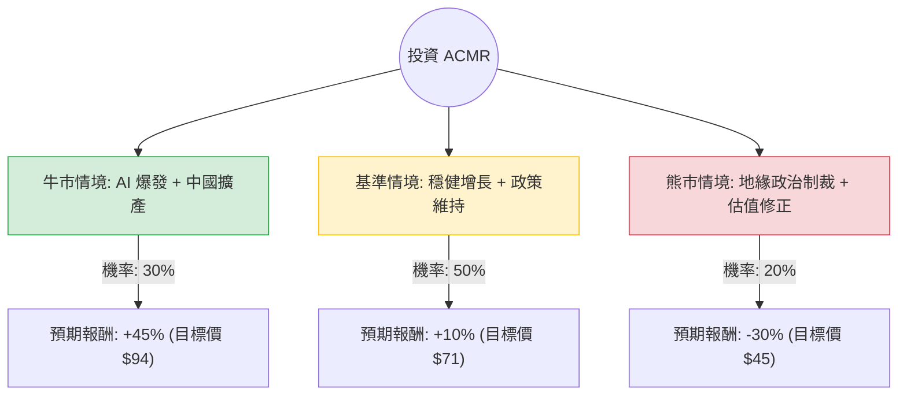

這份分析報告將結合您提供的基本面數據，以及最新的市場動態（如 AI 浪潮對半導體設備的需求、中國國產化替代趨勢等），利用**決策樹（Decision Tree）**與**期望值分析（Expected Value Analysis）**來評估 ACMR（盛美半導體）的投資價值。

---

### 一、 核心假設與市場背景分析

在建立決策樹之前，我們基於最新資訊設定以下核心假設：

1.  **產業趨勢（利多）**：AI 晶片需求帶動先進封裝與高階清洗設備需求。ACMR 在中國市場擁有極強的競爭力，受惠於中國半導體設備「國產化」的政策紅利。
2.  **財務表現（利多）**：2023 年財報顯示營收大幅增長，且 2024 年營收指引（Guidance）樂觀（預計達 6.5 億至 7.25 億美元）。
3.  **地緣政治（利空/風險）**：美國對華半導體出口管制可能進一步收緊，雖然 ACMR 透過多地佈局規避，但仍具不確定性。
4.  **估值壓力（中性/利空）**：目前股價（$64.84）遠高於數據中的目標價（$46.45），且過去一年漲幅達 179%，短期有過熱回調風險。

---

### 二、 決策樹分析 (Decision Tree)

以下決策樹模擬未來 12 個月內 ACMR 可能面臨的三種情境：

#### 節點詳細說明：

1.  **牛市情境 (Bull Case) - 30% 機率**：
    *   **條件**：AI 相關訂單超預期，ACMR 成功進入更多一線晶圓廠供應鏈，且美國未祭出更嚴苛的設備禁令。
    *   **預期報酬**：基於 Forward P/E 擴張至 40x，股價有望挑戰 $94。
2.  **基準情境 (Base Case) - 50% 機率**：
    *   **條件**：公司達成 2024 年營收指引，中國市場需求穩定，股價隨大盤波動。
    *   **預期報酬**：股價在 52 週高點附近震盪，小幅增長至 $71。
3.  **熊市情境 (Bear Case) - 20% 機率**：
    *   **條件**：美國商務部實施更嚴厲的清洗設備出口限制，或中國經濟復甦不如預期導致擴產放緩。
    *   **預期報酬**：股價回歸分析師平均目標價（$46.45）或 SMA200 支撐位，約 $45。

---

### 三、 期望值計算 (Expected Value Calculation)

我們將各情境的機率與預期報酬率相乘，得出整體的期望報酬率。

*   **計算公式**：
    $EV = (P_{Bull} \times R_{Bull}) + (P_{Base} \times R_{Base}) + (P_{Bear} \times R_{Bear})$

*   **代入數值**：
    1.  牛市：$0.30 \times 45\% = 13.5\%$
    2.  基準：$0.50 \times 10\% = 5.0\%$
    3.  熊市：$0.20 \times (-30\%) = -6.0\%$

*   **總期望報酬率**：
    $13.5\% + 5.0\% - 6.0\% = \mathbf{12.5\%}$

---

### 四、 綜合評估與最終結論

#### 1. 數據深度解析
*   **動能強勁但乖離率高**：股價目前高於 SMA200 達 86%（SMA200: 0.8639），這在技術面上屬於極度超買，短期回調壓力大。
*   **基本面紮實**：Current Ratio (3.48) 與 Quick Ratio (2.48) 顯示財務極其穩健，Debt/Eq (0.21) 顯示負債比極低，有充足的資金應對擴張。
*   **估值矛盾**：Forward P/E (29.38) 雖低於目前的 37.47，但相較於歷史平均仍偏高。

#### 2. 最終判斷：**適合投資（但建議採取「分批買入」或「等待回調」策略）**

*   **判斷理由**：
    1.  **期望值為正 (12.5%)**：儘管存在地緣政治風險，但 AI 驅動的半導體設備升級週期是長期利多，期望值顯示長期持有仍具獲利空間。
    2.  **中國市場護城河**：ACMR 在中國清洗設備市場的領先地位短期內難以被取代，且中國晶圓廠為了規避制裁，會更傾向採購 ACMR 的產品。
    3.  **成長性抵銷估值壓力**：EPS next Y 預期增長 25.1%，若能維持此增速，目前的 Forward P/E 尚屬合理。

*   **風險提示**：
    目前的股價（$64.84）顯著高於數據中標註的 Target Price ($46.45)，這意味著市場情緒已計入大量利多。**不建議在目前價位一次性重倉投入**，較佳策略是等待股價回測 SMA50（約 $48-$50 區間）時再行佈局，以提高安全邊際。

---
**免責聲明：** 本分析僅供參考，不構成任何投資建議。投資者應自行承擔市場風險。