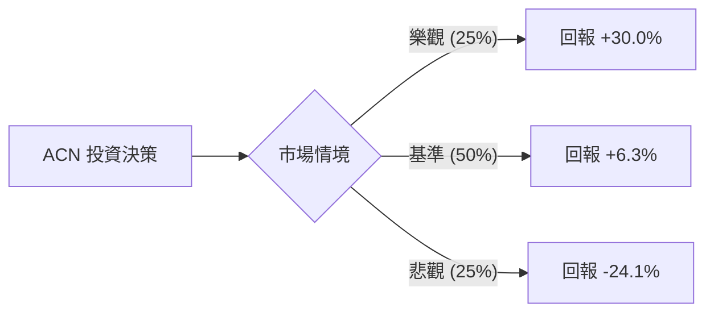

# Accenture (ACN) 定量投資分析報告

作為量化投資分析師，我將結合您提供的基本面數據（顯示 ACN 目前處於歷史估值低位，P/E 13.2x，較 52 週高點大幅回落）與當前市場對 IT 服務產業的最新動態進行概率建模。

---

### 1. 核心驅動因素與風險 (Drivers & Risks)

#### **關鍵催化劑 (Catalysts)**
1.  **生成式 AI (GenAI) 訂單轉化率加速**：Accenture 已轉型為企業 AI 實施的首選顧問。若未來 6-12 個月內，其超過 30 億美元的 AI 相關訂單（Bookings）能更快速地轉化為實際營收（Revenue），將觸發估值修復。
2.  **企業「成本優化」外包需求增加**：在宏觀經濟不確定下，企業傾向將 IT 運維外包以降低成本。ACN 的 Managed Services 業務具備抗週期性，若該板塊增長超預期，將穩定現金流。
3.  **併購 (M&A) 整合效益顯現**：ACN 持續收購精品諮詢與雲端服務公司。若新收購資產的利潤率整合優於預期，將帶動 ROE 進一步提升（目前 ROE 24.95% 已屬優秀）。

#### **主要風險點 (Risks)**
1.  **諮詢支出（Discretionary Spending）萎縮**：企業在面臨高利率環境時，往往首選推遲非必要的戰略諮詢項目，這直接衝擊 ACN 的 Consulting 業務。
2.  **人才成本與利潤率擠壓**：儘管 ACN 進行了裁員與自動化，但高端 AI 人才的薪資通膨仍可能侵蝕其 15.47% 的營業利益率。
3.  **技術去中心化風險**：若企業轉向使用開源模型或自行開發 AI 工具，減少對外部顧問的依賴，ACN 的長期護城河將受損。

---

### 2. 情境設定與機率賦予 (Scenario Modeling)

基於目前股價 $164.66（P/E 13.2x，遠低於歷史均值）與分析師目標價 $175.41，設定以下 12 個月情境：

#### **樂觀情境 (Bull Case)**
*   **發生條件**：GenAI 營收貢獻佔比突破 10%，全球經濟軟著陸帶動企業重啟數位轉型預算，Forward P/E 回升至 18x。
*   **預估機率**：25%
*   **目標價格與預期回報**：**$214.00 (+30.0%)**。基於 EPS 增長超預期及估值倍數修復。

#### **基準情境 (Base Case)**
*   **發生條件**：業務穩健增長，AI 訂單按計畫轉化，Managed Services 抵銷諮詢業務的疲軟。估值維持在 Forward P/E 12-13x。
*   **預估機率**：50%
*   **目標價格與預期回報**：**$175.00 (+6.3%)**。接近分析師平均目標價，反映穩定的股息與小幅增長。

#### **悲觀情境 (Bear Case)**
*   **發生條件**：全球經濟衰退，企業大幅削減 IT 預算，ACN 營收出現負增長，股價下探至 52 週低點附近尋求支撐。
*   **預估機率**：25%
*   **目標價格與預期回報**：**$125.00 (-24.1%)**。基於安全邊際與歷史極端低估值測試。

---

### 3. 期望值計算與決策樹 (EV Calculation & Decision Tree)

#### **決策樹結構**

#### **總期望值計算**
*   `EV = (0.25 * 0.30) + (0.50 * 0.063) + (0.25 * -0.241)`
*   `EV = 0.075 + 0.0315 - 0.06025`
*   **`EV = 0.04625` (即 4.63%)**

#### **風險回報比分析**
*   **上行潛力 (Upside)**：30.0%
*   **下行空間 (Downside)**：24.1%
*   **風險回報比 (Risk/Reward Ratio)**：1.24
*   **分析**：期望值為正，但 4.63% 的預期回報相對於 24% 的潛在下行風險，不對稱性並不顯著。這反映了目前市場對 ACN 既認可其基本面，又擔憂宏觀壓力的矛盾心理。

---

### 4. 決策總結 (Decision Summary)

| 情境 | 發生機率 (%) | 預期報酬率 (%) | 關鍵驅動/觸發因素 |
| :--- | :--- | :--- | :--- |
| **樂觀 (Bull)** | 25% | +30.0% | AI 營收爆發、估值倍數修復至 18x P/E |
| **基準 (Base)** | 50% | +6.3% | 訂單穩健轉化、符合分析師預期 |
| **悲觀 (Bear)** | 25% | -24.1% | 宏觀衰退、企業 IT 支出凍結 |
| **整體期望值** | **100%** | **+4.63%** | **加權平均預期回報** |

**最終結論：**
1. **投資建議**：**持有 (Hold)**
2. **核心邏輯**：根據提供的數據，ACN 目前 P/E 僅 13.2x，顯著低於其歷史平均與行業水平，具備較強的估值支撐。然而，計算出的期望值僅為 4.63%，在當前高利率環境下（無風險利率約 4-5%），該投資的風險溢價（Equity Risk Premium）幾乎為零。雖然下行空間受限，但缺乏強大的短期催化劑來驅動大幅上行。
3. **風控建議**：
    *   **進場觀察**：若股價跌破 $150，P/E 進入 11x 區間，期望值將顯著提升，屆時可考慮分批買入。
    *   **出場訊號**：若連續兩個季度營收增長率（Sales Q/Q）低於 3% 或營業利益率跌破 14%，說明競爭力受損，應執行止損。
    *   **保護措施**：考慮賣出價外看漲期權（Covered Call）以賺取權利金，補償低預期回報。

【結束指令】