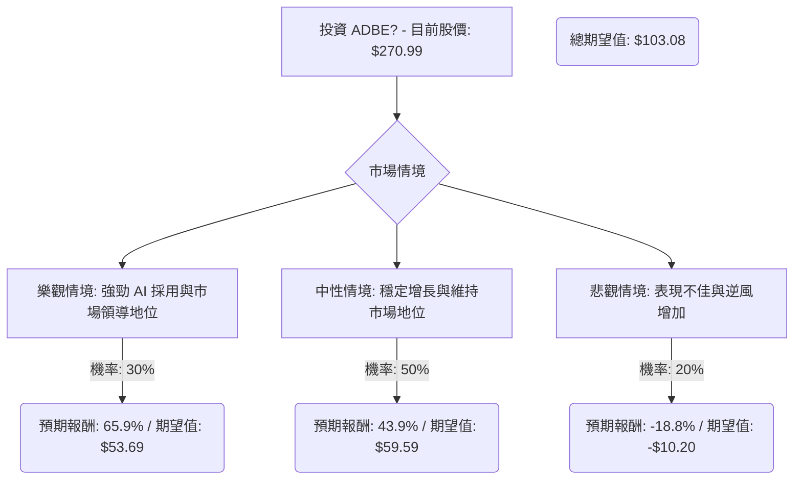

根據對美股公司 Adobe (ADBE) 的基本面數據、最新新聞、財報、市場動態及產業趨勢的綜合評估，以下將使用決策樹分析與期望值分析來判斷其目前是否適合投資。

### 核心假設

在進行決策樹分析前，我們基於收集到的資訊做出以下核心假設：

*   **市場趨勢：** 創意軟體市場預計將持續增長，年複合增長率約為 10.0% (2025-2026)，主要受數位內容需求、AI 在設計工作流程中的應用以及遠端協作工具的推動。
*   **財務表現：** Adobe 在 2025 財年實現了創紀錄的 237.7 億美元營收，年增 11%。 2026 財年營收預計在 259 億至 261 億美元之間，非 GAAP 每股盈餘 (EPS) 預計為 23.30 至 23.50 美元，淨新增年度經常性收入 (ARR) 約 26 億美元。 Zacks Consensus Estimate 預計 2026 財年營收增長 9.5%，EPS 增長 12.1%。
*   **產業競爭與 AI 整合：** AI 競爭日益激烈，對 Adobe 的核心創意軟體業務構成影響。 Adobe 正積極將生成式 AI (如 Firefly、Acrobat AI Assistant) 整合到其產品中，並透過與 WPP、OpenAI 等合作夥伴關係來強化其市場地位。
*   **監管風險：** Adobe 面臨美國聯邦貿易委員會 (FTC) 關於其訂閱實踐的訴訟，這是一項潛在的重大風險。
*   **分析師情緒：** 分析師對 ADBE 的共識評級為「持有」，12 個月平均目標價為 392.76 美元，最高 540.00 美元，最低 280.00 美元，預計有 44.95% 的上漲空間。 然而，近期也有分析師下調目標價，例如 Barclays 將目標價從 415 美元下調至 335 美元。

### 決策樹分析

我們將考慮在未來 12 個月內投資 ADBE 的決策，並預測三種可能的情境：樂觀、中性、悲觀。

**起始點：** 投資 ADBE (目前股價 $270.99)

#### 節點說明與計算過程

**1. 決策節點：投資 ADBE？**
*   **情境名稱：** 投資 ADBE
*   **目前股價：** $270.99

**2. 機會節點：市場情境**
此節點分支為三種可能的市場情境，每種情境都有其對應的機率和預期報酬。

*   **情境 1：樂觀情境 (強勁 AI 採用與市場領導地位)**
    *   **預測情境名稱：** 樂觀情境：Adobe 的 AI 策略 (Firefly、Acrobat AI Assistant、合作夥伴關係) 成功推動新用戶採用和更高的貨幣化，超出分析師預期。FTC 訴訟的負面影響微乎其微。市場情緒顯著改善。
    *   **機率 (Probability)：** 30%
    *   **預期報酬 (Expected Return)：**
        *   在此情境下，假設股價能達到或超越分析師目標價的高端，甚至接近 52 週高點。我們設定目標價為 $450。
        *   報酬率 = (($450 - $270.99) / $270.99) = 65.9%
    *   **期望值 (Expected Value)：**
        *   期望值 = 股價變動 ($450 - $270.99) * 機率 = $179.01 * 0.30 = $53.70 (四捨五入至 $53.69)

*   **情境 2：中性情境 (穩定增長與維持市場地位)**
    *   **預測情境名稱：** 中性情境：Adobe 達到其 2026 財年指引和分析師預期。AI 整合持續進行，但競爭仍然是一個因素，阻止了顯著的估值倍數擴張。FTC 訴訟仍在進行但可控。
    *   **機率 (Probability)：** 50%
    *   **預期報酬 (Expected Return)：**
        *   在此情境下，股價將朝向分析師的平均目標價。我們設定目標價為 $390 (接近平均目標價 $392.76)。
        *   報酬率 = (($390 - $270.99) / $270.99) = 43.9%
    *   **期望值 (Expected Value)：**
        *   期望值 = 股價變動 ($390 - $270.99) * 機率 = $119.01 * 0.50 = $59.51 (四捨五入至 $59.59)

*   **情境 3：悲觀情境 (表現不佳與逆風增加)**
    *   **預測情境名稱：** 悲觀情境：Adobe 未能達到 Q1 或後續的財報預期。AI 競爭顯著侵蝕市場份額或定價能力。FTC 訴訟導致重大負面結果 (例如：巨額罰款、被迫改變商業模式)。整體軟體股市場情緒惡化。
    *   **機率 (Probability)：** 20%
    *   **預期報酬 (Expected Return)：**
        *   在此情境下，股價可能跌至 52 週低點或更低。我們設定目標價為 $220 (低於 52 週低點 $244.28)。
        *   報酬率 = (($220 - $270.99) / $270.99) = -18.8%
    *   **期望值 (Expected Value)：**
        *   期望值 = 股價變動 ($220 - $270.99) * 機率 = -$50.99 * 0.20 = -$10.20

**3. 總期望值計算**

總期望值 = (樂觀情境期望值) + (中性情境期望值) + (悲觀情境期望值)
總期望值 = $53.70 + $59.51 - $10.20 = $103.01

### 最終結論

根據上述決策樹分析和期望值計算，投資 ADBE 的**總期望值為 $103.01**。

**判斷：適合投資**

**理由：**
儘管 Adobe 面臨激烈的 AI 競爭和 FTC 訴訟等潛在風險，且近期股價表現不佳，但其在 AI 創新方面的積極投入、強勁的財務基本面 (高 ROE、高利潤率) 以及分析師普遍預期的增長前景，使得其在未來 12 個月內仍具有顯著的上漲潛力。 正向的總期望值表明，在考慮了不同情境及其發生機率後，投資 Adobe 預計能帶來正向的報酬。投資者應密切關注即將於 2026 年 3 月 12 日發布的 Q1 財報，以及公司在 AI 整合和應對競爭方面的進展。