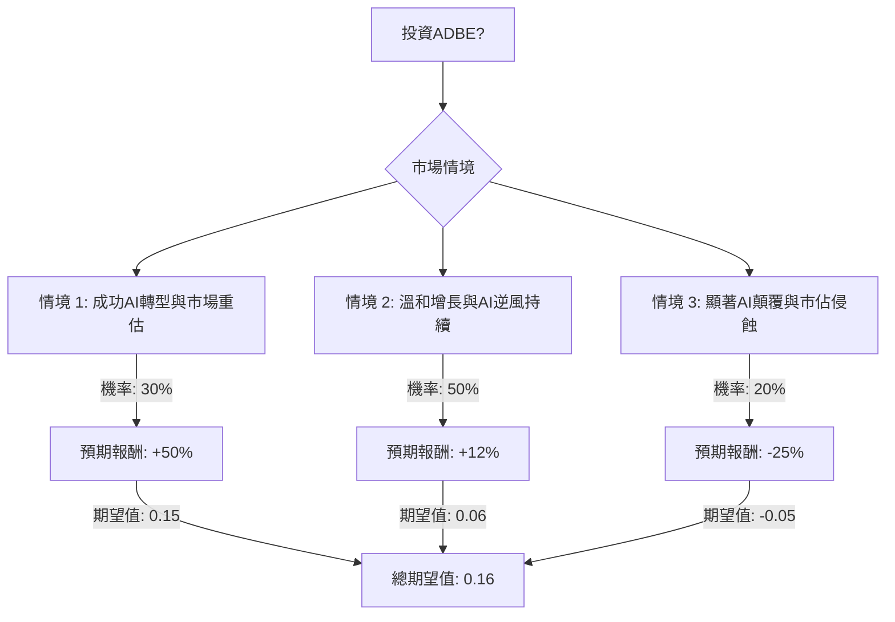

根據對美股公司 **ADBE (Adobe Inc.)** 的基本面數據、最新市場資訊、產業趨勢以及決策樹分析與期望值分析，以下是評估其目前是否適合投資的詳細報告。

### 核心假設 (Core Assumptions)

在進行決策樹分析之前，我們基於提供的基本面數據和最新的網路搜尋結果，建立以下核心假設：

*   **市場趨勢 (Market Trends):**
    *   全球創意軟體和數位體驗平台 (DXP) 市場預計將持續增長，但AI技術的快速發展正帶來顛覆性變革。
    *   AI正加速設計工作的民主化，並可能導致傳統軟體訂閱模式（如「席位數」）面臨「席位壓縮」的威脅。
    *   市場對AI對Adobe核心業務影響的「信心危機」導致股價近期表現不佳，並出現估值重估。
*   **財務表現 (Financial Performance):**
    *   Adobe在2025財年表現強勁，營收和EPS均超出預期，並預計2026財年將實現雙位數的ARR（年度經常性收入）增長。
    *   公司擁有高毛利率 (88.6%)、穩健的營運利潤率 (36.63%) 和強勁的現金流（2025財年營運現金流超過100億美元）。
    *   Adobe正積極投資AI技術，這可能導致2026年調整後的營運利潤率略有壓縮（預計從2025年的46%降至2026年的45%）。
*   **產業趨勢 (Industry Trends):**
    *   Adobe透過其Creative Cloud和Experience Cloud之間的深度整合，建立了「生態護城河」，並透過Firefly的商業賠償條款在企業級AI應用中具有競爭優勢，使其成為風險規避型財富500強客戶的首選。
    *   新興的AI原生平台（如Canva、Midjourney、Anthropic、OpenAI）對Adobe的市場主導地位構成挑戰，尤其是在入門級和自動化工具領域。
    *   數位體驗平台 (DXP) 市場預計將在2026年達到152億至153億美元，並在2033/2036年增長至287億至356億美元，複合年增長率為6.5%至12.8%，主要由雲端優先、超個人化和AI驅動的數據分析推動。

### 決策樹分析 (Decision Tree Analysis)

我們將評估投資ADBE的決策，並考慮未來12-18個月內可能發生的三種主要市場情境。

#### 1. 繪製完整的決策樹 (使用 Markdown)

#### 2. 明確列出所有計算過程

*   **當前股價 (Current Stock Price):** $268.38 (來自用戶提供數據)
*   **分析師目標價 (Analyst Target Price):** $412.45 (來自用戶提供數據)

**情境 1: 成功AI轉型與市場重估 (Optimistic Scenario)**
*   **預測情境名稱:** Adobe成功整合AI，維持企業級市場主導地位，並有效應對競爭。市場對AI威脅的擔憂減輕，導致股價重新獲得更高估值，接近或達到分析師目標價。
*   **對應的機率 (Probability):** 30%
*   **預期報酬 (Expected Return):** +50%
    *   *計算方式:* 假設股價從當前 $268.38 上漲50%，達到約 $402.57 (268.38 * 1.50)。這反映了市場對Adobe AI戰略成功的積極反應和估值重估。
*   **期望值 (Expected Value):** 0.30 (機率) * 0.50 (預期報酬) = 0.15

**情境 2: 溫和增長與AI逆風持續 (Neutral Scenario)**
*   **預測情境名稱:** Adobe繼續實現雙位數增長，但AI競爭和「席位壓縮」的擔憂持續存在，限制了估值擴張。股價表現與其預期EPS增長率大致持平。
*   **對應的機率 (Probability):** 50%
*   **預期報酬 (Expected Return):** +12%
    *   *計算方式:* 根據Zacks對2026財年EPS增長12.1%的預期，假設股價上漲幅度與此相符。
*   **期望值 (Expected Value):** 0.50 (機率) * 0.12 (預期報酬) = 0.06

**情境 3: 顯著AI顛覆與市佔侵蝕 (Pessimistic Scenario)**
*   **預測情境名稱:** AI原生競爭者獲得顯著市場份額，導致Adobe的營收增長大幅放緩，利潤率因激烈的競爭和高額AI投資而受壓。投資者信心進一步下降。
*   **對應的機率 (Probability):** 20%
*   **預期報酬 (Expected Return):** -25%
    *   *計算方式:* 考慮到ADBE在過去一年已下跌38.4%，在嚴重不利情境下，股價可能從當前水平進一步下跌25%。
*   **期望值 (Expected Value):** 0.20 (機率) * -0.25 (預期報酬) = -0.05

**整體期望值計算 (Overall Expected Value Calculation):**
總期望值 = (情境 1 期望值) + (情境 2 期望值) + (情境 3 期望值)
總期望值 = 0.15 + 0.06 + (-0.05) = 0.16

### 最終結論 (Final Conclusion)

根據決策樹分析和期望值計算，投資美股公司ADBE的**整體期望值為 +16%**。

因此，根據此分析，**目前適合投資ADBE**。

**簡短理由 (Brief Reasoning):**
儘管Adobe面臨來自AI技術的顯著競爭和市場對其未來增長的擔憂，導致近期股價表現不佳並出現估值重估，但其強勁的基本面、持續的雙位數營收和ARR增長、高利潤率以及在AI領域的積極投入和「生態護城河」提供了堅實的支撐。公司在2025財年表現出色，並給出了積極的2026財年指引。目前的股價相對於其歷史估值和分析師目標價而言具有吸引力。雖然存在AI顛覆的風險，但綜合考慮各情境的機率和預期報酬，投資ADBE的預期正向回報較高，表明其具備投資價值。