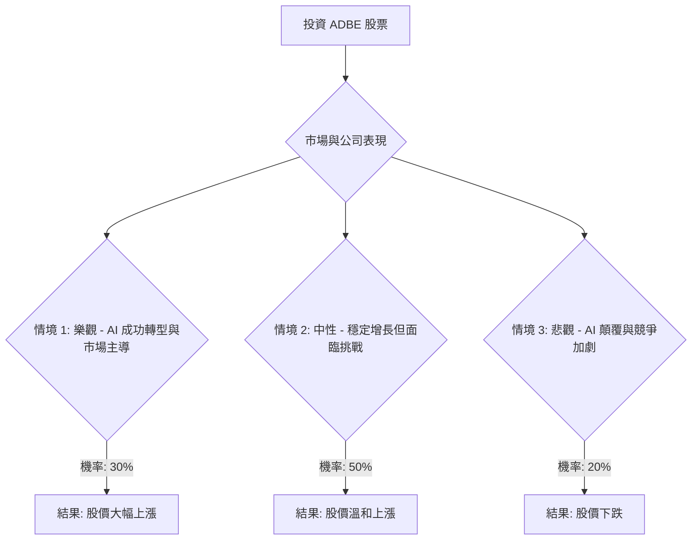

根據對 Adobe (ADBE) 股票的決策樹分析和期望值分析，並結合其基本面數據和最新的市場資訊，以下是詳細的評估。

### **核心假設**

1.  **市場趨勢：**
    *   **AI 顛覆與整合：** 生成式 AI 工具對創意產業的影響是當前最主要的市場動態。Adobe 必須證明其 AI 產品（如 Firefly）能夠有效應對競爭並創造新收入，而非僅僅保護現有市場份額。AI 代理和 AI 驅動的自動化是 2026 年的關鍵趨勢，將重塑創意和技術工作流程。
    *   **SaaS 行業增長：** 軟體即服務 (SaaS) 市場預計將持續增長，全球支出預計在 2026 年達到 3,755.7 億美元。 Adobe 作為 SaaS 巨頭，將受益於此趨勢，但同時也面臨來自新興競爭者的壓力。
    *   **競爭加劇：** Canva 和 Figma 等競爭對手，以及潛在的 Apple "Creator Studio"，正在對 Adobe 的市場主導地位構成威脅，尤其是在價格敏感和更廣泛的用戶群體中。

2.  **財務狀況：**
    *   **收入增長放緩：** Adobe 的收入增長率預計將從過去的 15% 以上放緩至 2026 財年的 9-10%。 儘管如此，公司在 2025 財年仍實現了創紀錄的 237.7 億美元收入和超過 100 億美元的營運現金流。
    *   **盈利能力：** Adobe 擁有強勁的毛利率 (0.886)、營業利潤率 (0.3663) 和淨利潤率 (0.3)。 然而，AI 推理成本可能會侵蝕未來的營運利潤率。
    *   **估值：** 股票近期大幅下跌，從 2024 年高點的 642 美元跌至目前的約 299.73 美元，跌幅達 53%。 目前的預期市盈率 (Forward P/E) 約為 12-13，被一些分析師認為是「便宜」或「十年一遇的估值」。

3.  **產業趨勢：**
    *   **專業市場的韌性：** Adobe 在創意和行銷專業人士市場中仍佔據主導地位，這些客戶更關注品質控制和商業安全，這也是 Adobe Firefly 的優勢所在（基於授權內容訓練）。
    *   **AI 產品發展：** Adobe 的 Firefly 平台在 2025 年 11 月已產生超過 240 億次內容，顯示其在 AI 領域的積極投入和用戶採用。

### **決策樹分析**

**起始節點：投資 ADBE 股票 (當前股價: $299.73)**

---

#### **節點詳情與計算過程**

**1. 情境 1: 樂觀 - AI 成功轉型與市場主導**
*   **預測情境名稱：** Adobe 成功將 AI 深度整合到其核心產品中，Firefly 等 AI 工具獲得廣泛商業採用，有效抵禦競爭，並在專業市場保持強勁增長。公司營收增長加速，利潤率保持健康。
*   **機率 (Probability)：** 30%
*   **預期股價：** $450.00 (反映強勁復甦，接近 52 週高點 $465.70，但仍低於 2024 年高點 $642)
*   **預期報酬 (Expected Return)：** (($450.00 - $299.73) / $299.73) * 100% = 50.13%
*   **期望值 (Expected Value)：** 0.30 * 50.13% = 15.04%

**2. 情境 2: 中性 - 穩定增長但面臨挑戰**
*   **預測情境名稱：** Adobe 繼續保持增長，但 AI 競爭（如 Canva、Apple）和 AI 相關成本對其市場份額和利潤率構成持續壓力。公司能夠適應但未能實現爆發性增長，股價達到分析師平均目標。
*   **機率 (Probability)：** 50%
*   **預期股價：** $402.85 (分析師平均目標價)
*   **預期報酬 (Expected Return)：** (($402.85 - $299.73) / $299.73) * 100% = 34.40%
*   **期望值 (Expected Value)：** 0.50 * 34.40% = 17.20%

**3. 情境 3: 悲觀 - AI 顛覆與競爭加劇**
*   **預測情境名稱：** Adobe 未能有效應對 AI 顛覆和激烈競爭，導致市場份額顯著流失，營收增長停滯甚至下滑，利潤率受損。股價跌至或跌破分析師最低目標價和 52 週低點。
*   **機率 (Probability)：** 20%
*   **預期股價：** $280.00 (分析師最低目標價)
*   **預期報酬 (Expected Return)：** (($280.00 - $299.73) / $299.73) * 100% = -6.58%
*   **期望值 (Expected Value)：** 0.20 * -6.58% = -1.32%

---

#### **整體期望值計算**

將所有情境的期望值加總：

整體期望值 = (情境 1 期望值) + (情境 2 期望值) + (情境 3 期望值)
整體期望值 = 15.04% + 17.20% + (-1.32%)
**整體期望值 = 30.92%**

### **最終結論**

根據決策樹分析和期望值計算，ADBE 股票的整體期望報酬為 **30.92%**。

**判斷：適合投資**

**簡短理由：**
儘管 Adobe 目前面臨 AI 顛覆和激烈競爭的重大挑戰，導致股價大幅下跌並引發市場擔憂，但其強勁的基本面、在專業創意市場的領導地位、積極的 AI 策略（如 Firefly 的商業安全優勢）以及穩健的財務狀況（高利潤率、強勁現金流和股票回購）為其提供了韌性。 當前股價處於多年低點，且預期市盈率相對較低，分析師平均目標價顯示出可觀的潛在上漲空間。 雖然存在下行風險，但樂觀和中性情境下的預期報酬足以抵消悲觀情境的潛在損失，使得整體期望值為正，表明在當前估值下，ADBE 具有吸引力的投資機會。