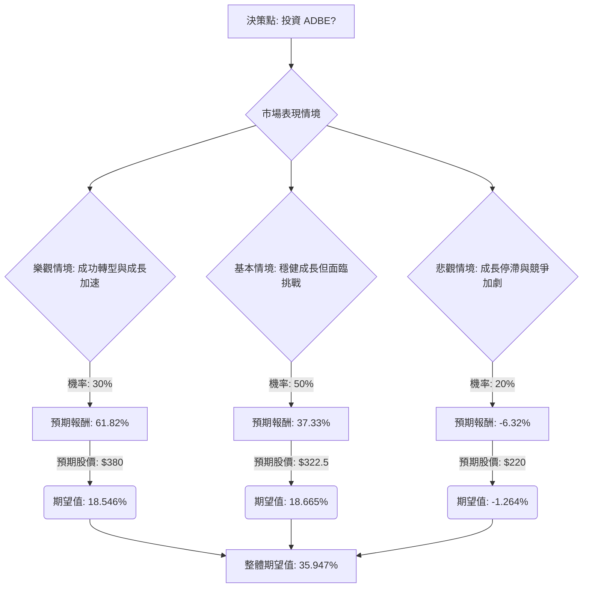

根據對美股公司 Adobe (ADBE) 的決策樹分析與期望值分析，並參考其最新基本面數據、財報、市場動態及產業趨勢，以下是評估結果：

### **ADBE 基本面數據摘要 (截至 2026 年 3 月 28 日)**

*   **收盤價 (Close):** $234.84
*   **本益比 (P/E):** 13.87
*   **股價淨值比 (P/B):** 8.46
*   **市值 (Market Cap):** $97.77 億
*   **52 週高點/低點 (52W Range):** $237.38 - $422.95
*   **分析師目標價 (Target Price):** $317.84 (提供數據中的目標價，但最新分析師平均目標價更高)
*   **ROE:** 0.5877
*   **ROA:** 0.2416
*   **ROI:** 0.4201
*   **毛利率 (Gross Margin):** 0.8877
*   **營業利益率 (Oper. Margin):** 0.3665
*   **負債權益比 (Debt/Eq):** 0.58
*   **預期本益比 (Forward P/E):** 9.02
*   **PEG:** 0.74

### **最新資訊補充與核心假設**

**1. 最新財報與營運狀況 (Q1 FY2026，截至 2026 年 2 月 27 日):**
*   Adobe 在 2026 財年第一季度實現創紀錄的 64 億美元營收，同比增長 12% (按固定匯率計算為 11%)。訂閱收入同比增長 13%。
*   非 GAAP 每股收益 (EPS) 為 6.06 美元，超出市場預期 5.87 美元。
*   季度末的年度經常性收入 (ARR) 總額為 260.6 億美元，同比增長 10.9%。其中，「AI 優先」產品的 ARR 同比增長超過三倍。
*   營運現金流創下第一季度紀錄，達到 29.6 億美元。
*   公司回購了約 810 萬股股票。
*   Adobe 重申了 2026 財年的指引，預計總收入在 259 億至 261 億美元之間，ARR 增長 10.2%，非 GAAP EPS 在 23.30 至 23.50 美元之間。

**2. 市場動態與產業趨勢:**
*   **AI 整合與競爭:** Adobe 正積極將 AI 整合到其產品中，AI 優先的 ARR 顯著增長。然而，市場對其 AI 產品能否有效變現並抵禦來自 AI 原生工具的激烈競爭仍存在疑慮。
*   **創意軟體市場增長:** 創意軟體市場預計將持續快速增長，2025 年至 2026 年的複合年增長率 (CAGR) 為 10.0%，主要受數位內容創作、線上教育和 AI 整合的推動。Adobe 在此市場中仍佔據領先地位。
*   **雲端與訂閱模式:** 雲端化和訂閱模式仍是產業主流，為 Adobe 提供穩定的經常性收入。

**3. 關鍵挑戰與風險:**
*   **CEO 領導層變動:** 擔任 CEO 18 年的 Shantanu Narayen 宣布將在繼任者確定後卸任，這為公司帶來了領導層不確定性，並導致近期股價下跌。
*   **ARR 增長放緩:** 儘管 ARR 仍保持雙位數增長，但其增速在過去幾個季度有所放緩，這引發了投資者的擔憂。
*   **監管與法律問題:** Adobe 與美國當局就訂閱披露和取消慣例達成 1.5 億美元的和解，且英國監管機構也對其取消費用問題展開調查。
*   **股價表現:** 截至 2026 年 3 月 26 日，Adobe 股價今年以來已下跌超過 27%，並觸及 52 週低點。

**4. 分析師評級與目標價:**
*   分析師對 ADBE 的共識評級為「持有」(Hold)，平均目標價約為 343.88 美元至 352.63 美元。
*   Morningstar 給出的公允價值估計為 380 美元。
*   近期有分析師因 CEO 變動和競爭加劇而下調評級或目標價，例如 Goldman Sachs 將目標價下調至 220 美元。

### **決策樹分析 (Decision Tree Analysis)**

**決策點:** 投資 ADBE 股票？

**核心假設:**
*   **市場環境:** 創意軟體市場持續增長，AI 技術是主要驅動力，但也帶來競爭。
*   **公司營運:** Adobe 擁有強大的產品生態系統和穩健的財務基礎，但面臨領導層變動和 AI 變現的挑戰。
*   **股價基準:** 當前股價為 $234.84。

---

---

### **計算過程**

**1. 預測情境與機率設定：**

*   **樂觀情境 (成功轉型與成長加速):**
    *   **情境描述:** 新 CEO 成功上任並帶來新動能，AI 產品 (如 Firefly) 實現強勁變現，有效抵禦競爭，ARR 增長加速。監管問題影響輕微。分析師評級普遍上調。
    *   **機率 (Probability):** 30%
    *   **預期股價 (Expected Price):** $380 (參考 Morningstar 公允價值)
    *   **預期報酬 (Expected Return):** (($380 - $234.84) / $234.84) = 61.82%

*   **基本情境 (穩健成長但面臨挑戰):**
    *   **情境描述:** CEO 過渡平穩，公司維持穩健的營收和 ARR 增長，AI 變現逐步推進但速度不快，競爭壓力持續存在。監管問題帶來中等程度的財務影響。股價趨近分析師平均目標價。
    *   **機率 (Probability):** 50%
    *   **預期股價 (Expected Price):** $322.5 (參考近期分析師中位目標價)
    *   **預期報酬 (Expected Return):** (($322.5 - $234.84) / $234.84) = 37.33%

*   **悲觀情境 (成長停滯與競爭加劇):**
    *   **情境描述:** CEO 變動導致長期不確定性，AI 競爭嚴重侵蝕市場份額或定價權，AI 投資未能有效變現，ARR 增長進一步放緩或停滯。監管罰款或限制更為嚴格。分析師持續下調評級。
    *   **機率 (Probability):** 20%
    *   **預期股價 (Expected Price):** $220 (參考 Goldman Sachs 的目標價)
    *   **預期報酬 (Expected Return):** (($220 - $234.84) / $234.84) = -6.32%

**2. 期望值計算：**

*   **樂觀情境期望值:** 0.30 * 61.82% = 18.546%
*   **基本情境期望值:** 0.50 * 37.33% = 18.665%
*   **悲觀情境期望值:** 0.20 * (-6.32%) = -1.264%

**3. 整體期望值 (Overall Expected Value):**
*   整體期望值 = 18.546% + 18.665% - 1.264% = **35.947%**

**4. 預期未來股價 (Expected Future Price):**
*   預期未來股價 = (0.30 * $380) + (0.50 * $322.5) + (0.20 * $220)
*   預期未來股價 = $114 + $161.25 + $44 = **$319.25**

### **最終結論**

根據決策樹分析和期望值計算，投資 ADBE 股票的**整體期望值為 35.947%**。這表示從當前股價 $234.84 來看，預期未來股價約為 $319.25。

**判斷：適合投資**

**簡短理由：**
儘管 Adobe 目前面臨 CEO 變動、AI 競爭加劇以及監管問題等挑戰，導致近期股價承壓並觸及 52 週低點，但其強勁的 Q1 FY2026 財報顯示公司基本面依然穩健，營收和訂閱收入保持雙位數增長，AI 優先產品的 ARR 更是大幅增長。 此外，Adobe 在創意軟體市場的領導地位和持續增長的產業趨勢為其提供了堅實的基礎。 考慮到當前股價相對於分析師平均目標價和 Morningstar 公允價值存在顯著的潛在上漲空間，且整體期望報酬為正，表明其投資風險與報酬權衡後仍具吸引力。對於能夠承受短期不確定性並看好 Adobe 長期 AI 轉型和市場領導地位的投資者而言，ADBE 目前是適合投資的標的。