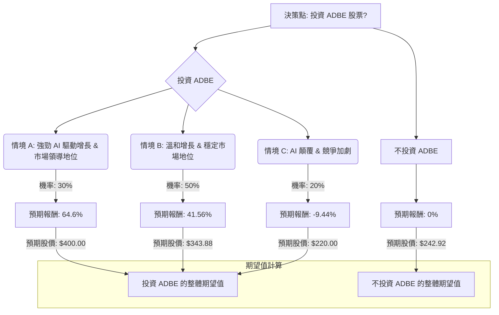

根據對美股公司 Adobe (ADBE) 的基本面數據、最新新聞、財報、市場動態及產業趨勢的綜合評估，以下將透過決策樹分析與期望值分析，評估其目前是否適合投資。

### **核心假設**

1.  **市場假設：** 整體科技股市場對AI相關技術的發展持謹慎樂觀態度。雖然AI帶來顛覆性創新，但也加劇了競爭。
2.  **財務假設：** Adobe 將維持其強勁的訂閱制商業模式，並能持續產生穩健的現金流。公司需達成或超越其2026財年的營收和EPS指引。
3.  **產業趨勢假設：** 數位創意和體驗市場將持續增長，AI在其中扮演核心角色。Adobe 必須成功適應並引領AI驅動的創新，以應對來自Canva、Figma和OpenAI等競爭對手的挑戰。
4.  **估值假設：** 目前股價已反映部分競爭壓力及近期表現不佳，導致估值倍數較歷史高點有所壓縮。未來估值將取決於其能否展現持續的AI驅動增長。
5.  **時間範圍：** 本分析主要著眼於未來約一年的投資期間，與分析師的目標價預測相符。

### **決策樹分析 (Decision Tree Analysis)**

**決策點：投資 ADBE 股票？**

*   **當前股價 (P0):** $242.92

#### **節點詳情與計算過程：**

**1. 決策點：投資 ADBE 股票？**
   *   **當前股價：** $242.92

**2. 選擇：投資 ADBE**

   *   **情境 A：強勁 AI 驅動增長 & 市場領導地位 (Optimistic)**
        *   **預測情境名稱：** Adobe 成功利用 AI 創新，擴大用戶基礎並保持定價權。AI 優先的年度經常性收入 (ARR) 持續加速增長，抵消傳統業務的任何潛在下滑。市場將 Adobe 視為 AI 領導者，帶動估值倍數擴張。股價將達到分析師目標價的高端。
        *   **機率 (Probability)：** 30%
        *   **預期報酬計算：**
            *   參考分析師最高目標價 $475.00，以及部分分析師給出的 $400.00 左右的目標價。我們取一個較為樂觀但合理的目標價 $400.00。
            *   預期報酬 = ($400.00 - $242.92) / $242.92 = 64.6%
        *   **預期股價：** $400.00

   *   **情境 B：溫和增長 & 穩定市場地位 (Neutral / Base Case)**
        *   **預測情境名稱：** Adobe 繼續增長，但 AI 帶來的效益部分被競爭壓力抵消。增長符合公司當前指引 (約 10-12% ARR/營收增長)。估值保持穩定但壓縮，反映其成熟但盈利的地位。股價將趨向分析師的平均目標價。
        *   **機率 (Probability)：** 50%
        *   **預期報酬計算：**
            *   參考分析師平均目標價 $343.88。
            *   預期報酬 = ($343.88 - $242.92) / $242.92 = 41.56%
        *   **預期股價：** $343.88

   *   **情境 C：AI 顛覆 & 競爭加劇 (Pessimistic)**
        *   **預測情境名稱：** AI 競爭顯著侵蝕 Adobe 的市場份額和定價權。增長速度低於指引，甚至在某些核心業務領域出現下滑。市場將 Adobe 視為「AI 受害者」，導致估值倍數進一步壓縮，股價下跌。股價將跌至分析師目標價的低端或更低。
        *   **機率 (Probability)：** 20%
        *   **預期報酬計算：**
            *   參考分析師最低目標價 $220.00。
            *   預期報酬 = ($220.00 - $242.92) / $242.92 = -9.44%
        *   **預期股價：** $220.00

**3. 選擇：不投資 ADBE**
   *   **預期報酬：** 0% (假設資金持有現金或無風險資產，短期內收益可忽略不計)
   *   **預期股價：** $242.92 (資本不變)

### **期望值分析 (Expected Value Analysis)**

#### **投資 ADBE 的整體期望值計算：**

期望值 (EV_Invest) = (情境 A 預期股價 × 情境 A 機率) + (情境 B 預期股價 × 情境 B 機率) + (情境 C 預期股價 × 情境 C 機率)
EV_Invest = ($400.00 × 0.30) + ($343.88 × 0.50) + ($220.00 × 0.20)
EV_Invest = $120.00 + $171.94 + $44.00
**EV_Invest = $335.94**

#### **不投資 ADBE 的整體期望值計算：**

期望值 (EV_NoInvest) = 當前股價 × 1 (假設不投資則持有現金，價值不變)
**EV_NoInvest = $242.92**

### **最終結論**

根據上述決策樹和期望值分析，投資 ADBE 股票的整體期望值為 **$335.94**，高於當前股價 $242.92 以及不投資的期望值 $242.92。

因此，根據此分析，**ADBE 目前適合投資。**

**簡短理由：**
儘管 Adobe 面臨來自 AI 競爭的挑戰，且近期股價表現不佳，但公司在 2026 財年第一季度表現強勁，營收和非 GAAP EPS 均超出預期。其 AI 優先的年度經常性收入 (ARR) 增長超過三倍，顯示其在 AI 轉型中取得初步成功。分析師的平均目標價也顯示出可觀的潛在上漲空間。綜合考量其穩健的訂閱模式、強勁的現金流 以及在 AI 領域的積極佈局和初步成果，投資 ADBE 具有正向的期望值。