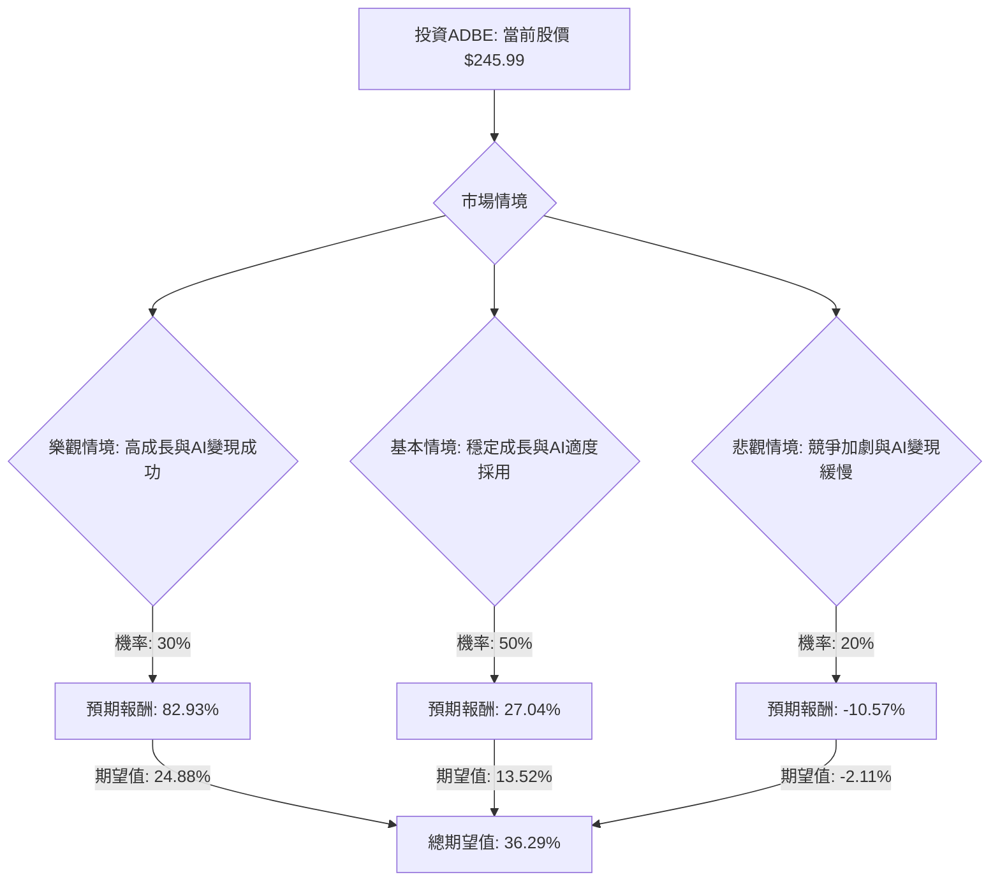

根據您提供的基本面數據以及對美股公司 **ADBE (Adobe Inc.)** 的最新市場資訊進行綜合評估，以下是基於決策樹分析和期望值分析的投資建議。

### **核心假設**

在進行決策樹分析之前，我們首先確立以下核心假設：

*   **市場趨勢 (Market Trends):**
    *   全球軟體市場，特別是AI驅動的軟體領域，預計將持續增長。Adobe在AI領域的投入（如Firefly、Acrobat AI Assistant、Express）使其在這一趨勢中佔據有利地位。Adobe在2025財年第四季度和2026財年第一季度業績中，AI驅動工具的快速採用是其增長的主要動力。
    *   雲端原生架構和AI/ML整合已成為企業技術採用的主流趨勢，預計到2026年，95%的新數位工作負載將部署在雲端原生平台上。
*   **財務表現 (Financial Performance):**
    *   Adobe的訂閱制商業模式提供穩定的經常性收入，2026財年第一季度訂閱收入增長13%。
    *   公司歷史上展現出強勁的盈利能力和現金流生成能力，2026財年第一季度營運現金流增長19.3%至29.6億美元。
    *   管理層預計2026財年營收和EPS將持續增長，年度經常性收入 (ARR) 目標增長率為10.2%。
*   **產業競爭 (Industry Competition):**
    *   生成式AI領域的競爭日益激烈，主要競爭者包括Microsoft、OpenAI、Alphabet、Salesforce、Midjourney和Canva。Adobe需要持續創新並有效變現其AI產品以維持市場份額。
*   **公司特定因素 (Company-Specific Factors):**
    *   長期CEO Shantanu Narayen的離職引入了不確定性，可能影響投資者信心和公司未來戰略方向。
    *   儘管2026財年第一季度業績超出預期，但近期股價表現不佳（過去一年下跌34.8%），且分析師評級和目標價普遍下調，反映市場對其增長前景和競爭力的擔憂。
    *   Adobe與OpenAI和NVIDIA的合作夥伴關係可能為其AI產品帶來新的增長機會。

### **決策樹分析**

我們將考慮未來一年的投資情境，並設定三個主要情境：樂觀、基本和悲觀。

**起始節點：投資ADBE**
*   **當前股價 (Current Price):** $245.99

### **計算過程**

**1. 樂觀情境 (Optimistic Scenario)**
*   **情境名稱:** 高成長與AI變現成功
*   **描述:** Adobe的AI戰略（Firefly、Express、Acrobat AI Assistant）獲得顯著成功，推動大量新訂閱和升級。新任CEO展現強大領導力，提供清晰的戰略方向。市場情緒改善，股價強勁反彈。
*   **機率 (Probability):** 30%
*   **預期股價 (Expected Price):** 假設股價達到分析師目標價區間的較高水平，約 $450。
*   **預期報酬 (Expected Return):** (($450 - $245.99) / $245.99) * 100% = 82.93%
*   **期望值 (Expected Value):** 0.30 * 82.93% = 24.88%

**2. 基本情境 (Base Case Scenario)**
*   **情境名稱:** 穩定成長與AI適度採用
*   **描述:** Adobe達成其2026財年的營收和EPS指引。AI採用持續穩定，但激烈的競爭限制了爆發性增長。CEO過渡平穩，但未立即帶來新的增長催化劑。股價朝向分析師中位目標價移動。
*   **機率 (Probability):** 50%
*   **預期股價 (Expected Price):** 採用分析師中位目標價 $312.50。
*   **預期報酬 (Expected Return):** (($312.50 - $245.99) / $245.99) * 100% = 27.04%
*   **期望值 (Expected Value):** 0.50 * 27.04% = 13.52%

**3. 悲觀情境 (Pessimistic Scenario)**
*   **情境名稱:** 競爭加劇與AI變現緩慢
*   **描述:** Adobe在激烈競爭中難以有效區分其AI產品。ARR增長進一步放緩，CEO過渡期產生不確定性或戰略失誤。市場對估值和競爭威脅的擔憂加劇，導致股價進一步下跌。
*   **機率 (Probability):** 20%
*   **預期股價 (Expected Price):** 假設股價跌至分析師最低目標價 $220.00。
*   **預期報酬 (Expected Return):** (($220.00 - $245.99) / $245.99) * 100% = -10.57%
*   **期望值 (Expected Value):** 0.20 * (-10.57%) = -2.11%

**總期望值 (Overall Expected Value)**
*   總期望值 = 樂觀情境期望值 + 基本情境期望值 + 悲觀情境期望值
*   總期望值 = 24.88% + 13.52% + (-2.11%) = **36.29%**

### **最終結論**

根據上述決策樹分析和期望值計算，ADBE 目前的**總期望值為 36.29%**。

**判斷：適合投資**

**理由：**
儘管Adobe面臨激烈的AI領域競爭和CEO過渡期的不確定性，且近期股價表現不佳，但其強勁的2026財年第一季度業績（營收和EPS均超出預期）以及AI-first ARR的顯著增長，表明公司在AI轉型方面取得了實質性進展。 此外，公司穩健的訂閱模式、高利潤率和強大的現金流生成能力提供了堅實的財務基礎。

當前股價 $245.99 接近其52週低點 $244.28，而分析師的平均目標價 $352.63 或中位目標價 $312.50 均顯示出可觀的潛在上漲空間。綜合考慮各情境的機率和預期報酬，36.29% 的正向總期望值表明，在當前價格水平下，投資ADBE具有吸引力。投資者應密切關注公司在AI領域的創新進展、新CEO的戰略方向以及市場競爭格局的變化。