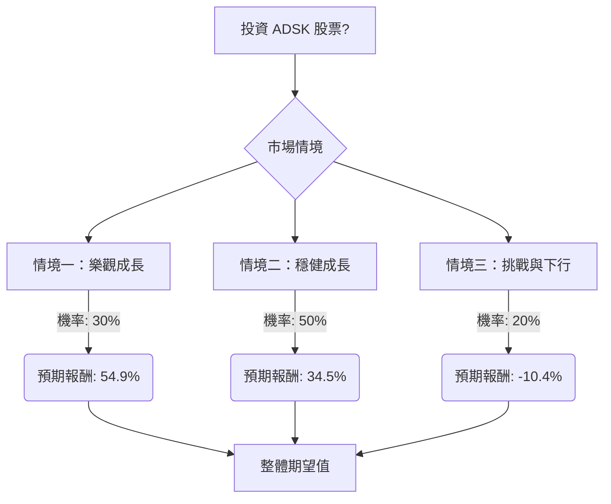

根據對美股公司 Autodesk (ADSK) 的基本面數據、最新財報、市場動態、產業趨勢及分析師評級的綜合評估，以下將透過決策樹分析與期望值分析，評估其目前的投資適合性。

### 核心假設

1.  **市場領導地位與產業趨勢：** Autodesk 在 CAD 軟體市場佔據主導地位，市佔率約 65%。建築、工程、營造 (AEC) 和製造業的數位轉型以及對 AI 驅動設計工具的需求，為 Autodesk 提供了強勁的成長動力。地理資訊系統 (GIS) 市場的強勁成長預測也支持其長期市場擴張。
2.  **AI 與雲端策略：** 公司正積極轉向「代理式 AI (agentic AI)」和 Autodesk Platform Services，旨在透過新的消費模式將機器驅動的工作流程貨幣化。Autodesk 擁有專有的 3D 數據、深厚的產業背景和近十年的 AI 專業知識，這些是競爭對手難以複製的競爭優勢。
3.  **營運效率與重組：** Autodesk 在 2026 財年第四季度實施了銷售和行銷優化重組計畫，包括裁員 7%，旨在提高效率並將資源重新投入到成長重點領域。儘管這可能導致短期業務中斷，但預期長期將帶來更高的營運利潤率。
4.  **財務表現與展望：** 公司在 2026 財年第四季度表現強勁，營收成長 19%，非 GAAP 每股盈餘 (EPS) 達 2.85 美元，超出預期。2027 財年指引預計營收介於 81.0 億至 81.7 億美元，自由現金流介於 27 億至 28 億美元，非 GAAP EPS 預計為 12.29 至 12.56 美元。
5.  **分析師預期：** 大多數分析師對 ADSK 持「強烈買入」或「適度買入」評級，平均目標價介於 323.84 美元至 335.93 美元之間，顯示出顯著的潛在上漲空間。

### 決策樹分析

**起始節點：投資 ADSK 股票？**
*   當前股價：245.31 美元

**情境一：樂觀成長 (Bullish Scenario)**
*   **預測情境名稱：** AI/雲端策略成功、重組效益顯著、市場需求強勁。
*   **對應的機率 (Probability)：** 30%
*   **預期報酬 / 期望值 (Expected Value)：**
    *   **情境假設：** Autodesk 成功執行其 AI 和雲端策略，新產品和服務獲得市場高度認可，銷售重組迅速見效，帶來更高的效率和利潤率。宏觀經濟環境有利，建築和製造業支出加速。股價達到分析師最高目標價附近。
    *   **目標股價：** 380.00 美元 (參考分析師最高目標價 456 美元 及平均目標價，取一個較為樂觀但合理的數值)
    *   **預期報酬計算：** (($380.00 - $245.31) / $245.31) * 100% = 54.9%
    *   **期望值計算：** 0.30 * 54.9% = 16.47%

**情境二：穩健成長 (Neutral Scenario)**
*   **預測情境名稱：** 符合財測指引、AI/雲端溫和採用、重組效益逐步顯現。
*   **對應的機率 (Probability)：** 50%
*   **預期報酬 / 期望值 (Expected Value)：**
    *   **情境假設：** Autodesk 按照其 2027 財年指引穩健成長，AI 和雲端產品的採用率符合預期，銷售重組帶來一些短期干擾，但長期效益逐步顯現。宏觀經濟保持穩定，但無顯著超預期表現。股價達到分析師共識目標價。
    *   **目標股價：** 330.00 美元 (參考分析師平均目標價 323.84 美元至 335.93 美元)
    *   **預期報酬計算：** (($330.00 - $245.31) / $245.31) * 100% = 34.5%
    *   **期望值計算：** 0.50 * 34.5% = 17.25%

**情境三：挑戰與下行 (Bearish Scenario)**
*   **預測情境名稱：** 重組嚴重干擾、AI/雲端採用緩慢、競爭加劇或宏觀經濟惡化。
*   **對應的機率 (Probability)：** 20%
*   **預期報酬 / 期望值 (Expected Value)：**
    *   **情境假設：** 銷售重組導致比預期更嚴重的短期業務中斷，新交易模式和 AI 驅動的消費模式遭到客戶抵制。競爭加劇或全球宏觀經濟顯著惡化，影響企業支出。股價跌至分析師最低目標價或略低於當前水平。
    *   **目標股價：** 220.00 美元 (參考分析師最低目標價 246 美元，考慮到潛在的負面影響，略低於當前價格)
    *   **預期報酬計算：** (($220.00 - $245.31) / $245.31) * 100% = -10.4%
    *   **期望值計算：** 0.20 * (-10.4%) = -2.08%

### 整體期望值計算

整體期望值 = (樂觀情境期望值) + (穩健情境期望值) + (挑戰情境期望值)
整體期望值 = 16.47% + 17.25% + (-2.08%) = **31.64%**

### 最終結論

根據決策樹分析和期望值計算，Autodesk (ADSK) 股票的整體期望值為 **31.64%**。

**判斷：適合投資**

**理由：**
儘管 ADSK 的 P/E 估值相對較高 (46.71)，但其在 CAD 軟體市場的領導地位、強勁的財務表現 (高毛利率、穩健的自由現金流) 以及對 AI 和雲端技術的戰略性投入，為其提供了堅實的成長基礎。公司最新的財報顯示營收和 EPS 均超出預期，且 2027 財年指引樂觀。分析師普遍給予「強烈買入」或「適度買入」評級，平均目標價顯示出顯著的上漲空間。

雖然銷售重組和宏觀經濟不確定性可能帶來短期波動和風險，但這些因素在我們的決策樹分析中已被納入「挑戰與下行」情境，並賦予了相應的機率。即使在最保守的「挑戰與下行」情境下，預期損失也相對有限。綜合來看，其顯著的潛在報酬率 (31.64%) 高於一般可接受的投資門檻，表明 ADSK 目前是一個適合投資的標的。