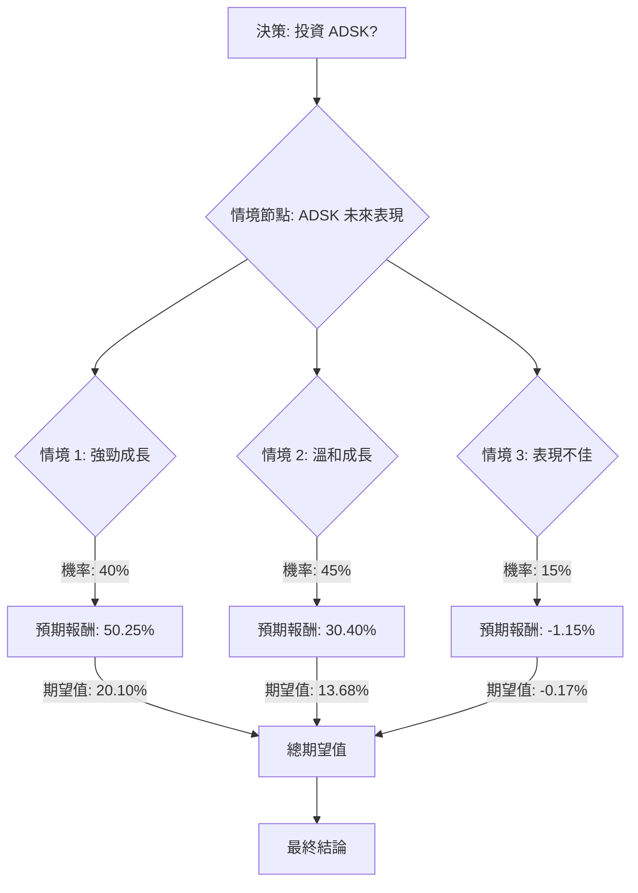

根據對美股公司 Autodesk (ADSK) 的基本面數據、最新市場資訊、財報、分析師評級及產業趨勢的綜合評估，以下將透過決策樹分析與期望值分析，判斷其目前是否適合投資。

### 核心假設

在進行決策樹分析前，我們建立以下核心假設：
*   **當前股價 (P_current)**：約為 $252.92 (截至 2026 年 3 月 18 日)。
*   **分析時間範圍**：未來 12 個月，與分析師目標價的時間框架一致。
*   **市場環境**：軟體和科技產業整體情緒保持正面，但需留意潛在的宏觀經濟不確定性。
*   **公司執行力**：Autodesk 成功執行其雲端、AI 和銷售優化策略的能力是關鍵。
*   **產業成長**：CAD 軟體市場預計將穩健成長，主要受 3D、雲端和 AI 整合的驅動。

### 最新基本面數據補充與分析

根據最新的網路搜尋結果，我們更新並補充了 ADSK 的基本面數據：

*   **最新收盤價 (Close)**：約 $252.92 (截至 2026 年 3 月 18 日)。 (原數據：$248.48)
*   **本益比 (P/E)**：約 48.0x - 48.27x (與原數據 47.75 接近)。
*   **股東權益報酬率 (ROE)**：53.51% (顯著高於原數據 39.68%)，顯示公司盈利能力強勁。
*   **下一年度 EPS 成長率 (EPS next Y_%)**：預計成長 14.58% (從 $5.76 增至 $6.60)，與原數據 13.19% 接近。
*   **市值 (Market Cap)**：約 $53.62 億 (與原數據 $52.7 億接近)。
*   **目標價 (Target Price)**：分析師平均目標價介於 $330.00 至 $342.96 之間，中位數為 $330.00，最高可達 $460.00。 (原數據：$335.04)
*   **最新財報 (Q4 FY2026，截至 2026 年 1 月 31 日)**：
    *   非 GAAP 每股盈餘 (EPS) 為 $2.85，超出市場預期 ($2.63-$2.64)。
    *   營收為 $19.6 億，超出市場預期 ($19.1 億)，年增 19%。
    *   總計費 (Billings) 年增 33% 至 $28 億。
    *   剩餘履約義務 (RPO) 增長 20% 至 $83 億，顯示未來營收可見度良好。
*   **FY2027 財測**：預計 EPS 介於 $12.29–$12.56，營收介於 $81 億–$81.7 億。
*   **分析師評級**：普遍為「買入」或「適度買入」(Moderate Buy)，來自 24-29 位分析師。
*   **產業趨勢**：CAD 軟體市場預計在 2025 年至 2026 年間以 7% 的複合年增長率 (CAGR) 成長，並在 2026 年至 2035 年間以 6.8% 的 CAGR 成長。主要驅動力包括雲端解決方案、AI 驅動的 3D 建模、與 CAM/CAE 整合、設計工作流程自動化等。
*   **風險因素**：新的交易模式可能導致營收成長放緩 (從 Q1 的約 3.5% 降至全年約 1.5%)，並對非 GAAP 營運利潤率造成 1 個百分點的壓力。宏觀經濟狀況、競爭加劇、領導層變動和銷售策略重組也構成潛在風險。

### 決策樹分析 (Decision Tree Analysis)

我們將投資 ADSK 的決策分為三個主要情境：強勁成長、溫和成長和表現不佳。

#### 節點詳情與計算過程

**1. 決策節點：投資 ADSK？**
*   這是初始決策點，我們將評估投資 ADSK 的整體期望值。

**2. 情境節點：ADSK 未來表現**
*   基於對公司基本面、產業趨勢和分析師預期的綜合判斷，我們設定了以下三個情境及其機率：

    *   **情境 1：強勁成長 (Bull Case)**
        *   **預測情境名稱**：Autodesk 成功執行其 AI 和雲端策略，市場份額增加，並從基礎設施和數位轉型支出中顯著受益，業績超出分析師預期。
        *   **對應的機率 (Probability)**：40%
        *   **預期股價**：$380.00 (接近分析師目標價區間的高端，例如 Piper Sandler 的 $383.00 目標價)
        *   **預期報酬 (Return)**：($380.00 - $252.92) / $252.92 = 0.5025 或 50.25%
        *   **期望值 (Expected Value)**：0.40 * 0.5025 = 0.2010 或 20.10%

    *   **情境 2：溫和成長 (Base Case)**
        *   **預測情境名稱**：Autodesk 達到分析師預期，營收和 EPS 穩健成長。公司成功應對銷售重組和宏觀經濟逆風。
        *   **對應的機率 (Probability)**：45%
        *   **預期股價**：$330.00 (分析師中位數目標價)
        *   **預期報酬 (Return)**：($330.00 - $252.92) / $252.92 = 0.3040 或 30.40%
        *   **期望值 (Expected Value)**：0.45 * 0.3040 = 0.1368 或 13.68%

    *   **情境 3：表現不佳 (Bear Case)**
        *   **預測情境名稱**：Autodesk 面臨嚴重的宏觀經濟放緩、競爭加劇或銷售策略重組問題。公司未能達到盈利或財測目標。
        *   **對應的機率 (Probability)**：15%
        *   **預期股價**：$250.00 (接近分析師目標價區間的低端，略低於當前股價)
        *   **預期報酬 (Return)**：($250.00 - $252.92) / $252.92 = -0.0115 或 -1.15%
        *   **期望值 (Expected Value)**：0.15 * -0.0115 = -0.0017 或 -0.17%

### 期望值分析 (Expected Value Analysis)

將所有情境的期望值加總，得出投資 ADSK 的整體期望報酬：

**整體期望報酬 (EV_ADSK)** = 情境 1 期望值 + 情境 2 期望值 + 情境 3 期望值
EV_ADSK = 0.2010 + 0.1368 + (-0.0017)
EV_ADSK = 0.3361 或 33.61%

### 最終結論

根據上述決策樹和期望值分析，投資 Autodesk (ADSK) 的**整體期望報酬為 33.61%**。

**判斷：適合投資**

**理由：**
Autodesk 在最新的財報中表現強勁，超出市場預期，並給出了樂觀的 FY2027 財測。公司在 CAD 軟體市場中處於領先地位，並積極佈局雲端、AI 等高成長領域，這些都是未來產業發展的關鍵驅動力。儘管存在銷售策略重組和宏觀經濟不確定性等風險，但分析師普遍給予「買入」評級，且平均目標價顯示出可觀的潛在上漲空間。綜合來看，其高於零的顯著正向期望報酬表明，ADSK 是一項具有吸引力的投資。