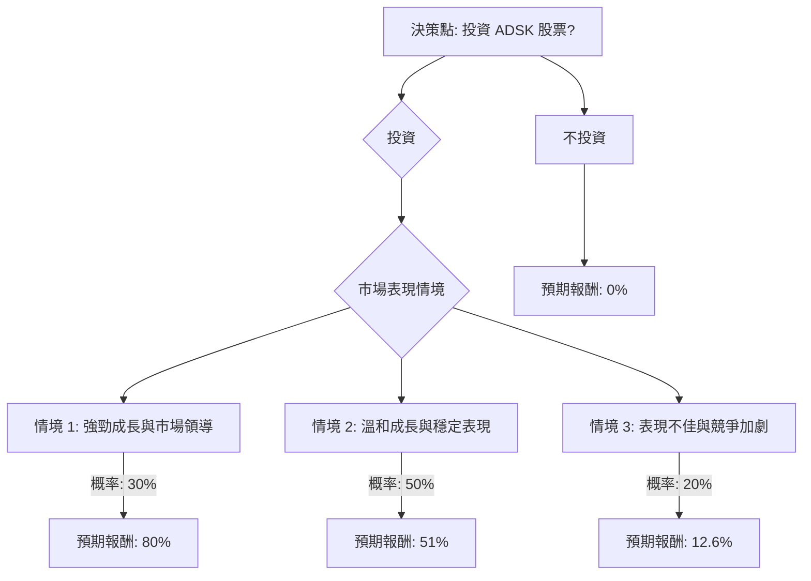

根據對 Autodesk (ADSK) 的基本面數據、最新新聞、財報、市場動態和產業趨勢的綜合分析，以下是使用決策樹分析和期望值分析對其目前是否適合投資的評估。

### 核心假設

1.  **市場成長：** CAD 軟體市場，特別是 3D CAD 和雲端解決方案，預計將穩步成長。3D CAD 軟體市場預計在 2026 年達到 143.1 億美元，並以 6.8% 的複合年增長率增長到 2035 年的 258.8 億美元。整體技術 CAD 軟體市場預計在 2026 年達到 118.8 億美元，並以 8.5% 的複合年增長率增長到 2033 年的 193.8 億美元。AI 整合、雲端運算和工業 4.0 是主要驅動力。
2.  **Autodesk 的市場地位：** Autodesk 在建築、工程和營造 (AEC) 市場中佔據主導地位，並積極投資於雲端、AI 和平台整合。其高毛利率 (92.3%) 和營運利潤率 (27.2%) 以及強勁的自由現金流 (27.9 億美元) 表明其業務模式穩健。
3.  **競爭格局：** 來自現有競爭對手（如 Dassault Systèmes、Siemens、Bentley Systems）和新興 AI 原生公司以及免費開源替代方案的競爭日益激烈，構成潛在風險。
4.  **財務表現：** 儘管最近的財報（2026 財年第四季度）表現強勁，但新的交易模式預計將在 2027 財年減緩營收增長動力。分析師普遍持樂觀態度，但最近的評級下調突顯了對近期增長催化劑和 AI 競爭的擔憂。
5.  **估值：** 目前的本益比 (P/E: 41.76) 和市淨率 (P/B: 15.21) 較高，表明這是一支成長型股票。預期本益比 (Forward P/E: 15.57) 更為合理，預示著未來盈利增長。該股近期大幅下跌，使其接近分析師目標價的低端 [提供數據, cite: 1, 14]。

### 決策樹分析

**決策點：投資 ADSK 股票？**

*   **當前股價 (Close):** $218.45

#### 節點計算過程

**1. 投資情境 (Invest Scenario)**

*   **情境 1: 強勁成長與市場領導 (Optimistic)**
    *   **情境描述：** Autodesk 成功利用 AI 和雲端整合，保持其在 AEC 市場的領導地位，並在製造業取得進展。新的交易模式帶來的阻力得到有效管理，營收/每股盈餘 (EPS) 增長超出預期。分析師情緒進一步改善，股價接近目標價的高端。
    *   **機率 (Probability):** 30%
    *   **預期未來股價：** 參考分析師中位數目標價 ($330.00) 和最高目標價 ($456.00) 的平均值，約為 $393.00。
    *   **預期報酬 (Expected Return):** (($393.00 - $218.45) / $218.45) * 100% = 80.00%
    *   **期望值 (Expected Value):** 0.30 * 80.00% = **24.00%**

*   **情境 2: 溫和成長與穩定表現 (Neutral)**
    *   **情境描述：** Autodesk 持續成長，但面臨來自競爭和新交易模式的一些壓力。成長符合市場預期和分析師共識（中位數目標價）。公司保持強勁的盈利能力和現金流。
    *   **機率 (Probability):** 50%
    *   **預期未來股價：** 參考分析師中位數目標價 $330.00。
    *   **預期報酬 (Expected Return):** (($330.00 - $218.45) / $218.45) * 100% = 51.06% (約 51%)
    *   **期望值 (Expected Value):** 0.50 * 51.06% = **25.53%**

*   **情境 3: 表現不佳與競爭加劇 (Pessimistic)**
    *   **情境描述：** Autodesk 在適應快速的 AI 創新方面遇到困難，或因激烈的競爭（尤其是來自 AI 原生公司或免費替代方案）而面臨顯著的市場份額侵蝕。宏觀經濟逆風或執行問題進一步抑制增長。分析師評級下調更為普遍，股價跌至目標價的低端，甚至更低。
    *   **機率 (Probability):** 20%
    *   **預期未來股價：** 參考 Citigroup 最近下調後的目標價 $246.00。
    *   **預期報酬 (Expected Return):** (($246.00 - $218.45) / $218.45) * 100% = 12.61% (約 12.6%)
    *   **期望值 (Expected Value):** 0.20 * 12.61% = **2.52%**

**2. 不投資情境 (Do Not Invest Scenario)**

*   **情境描述：** 選擇不投資 ADSK 股票，將資金保留或投資於其他預期報酬為零的資產以進行比較。
*   **預期報酬 (Expected Return):** 0%
*   **期望值 (Expected Value):** **0%**

#### 整體期望值計算

**投資 ADSK 的整體期望值 =** (情境 1 期望值) + (情境 2 期望值) + (情境 3 期望值)
= 24.00% + 25.53% + 2.52%
= **52.05%**

### 最終結論

根據決策樹分析和期望值分析，投資 Autodesk (ADSK) 股票的整體期望報酬為 **52.05%**。

**判斷：適合投資**

**簡短理由：**
儘管近期股價有所下跌，且 Citigroup 最近下調了評級，但 ADSK 的基本面依然強勁，在 AEC 市場佔據主導地位，並積極佈局 AI 和雲端技術。CAD 軟體市場的長期增長趨勢為其提供了有利的外部環境。分析師的共識目標價仍顯示出顯著的潛在上漲空間。雖然存在競爭加劇和新交易模式帶來的短期逆風，但其強勁的盈利能力、高利潤率和自由現金流為公司提供了應對這些挑戰的緩衝和未來增長的基礎。考慮到當前股價相對於分析師目標價的折價，以及超過 50% 的正向期望報酬，ADSK 目前被認為適合投資。