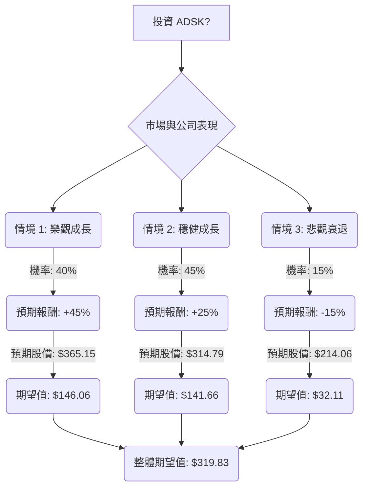

好的，這是一份根據「決策樹分析（Decision Tree）」與「期望值分析（Expected Value Analysis）」評估美股公司 **ADSK** (Autodesk) 是否適合投資的報告。

---

### **ADSK (Autodesk) 投資評估：決策樹與期望值分析**

**當前股價 (Close):** $251.83 [來自用戶提供數據]

**一、核心假設**

本次分析基於以下對市場、財務及產業趨勢的假設：

*   **市場假設：**
    *   全球經濟持續數位轉型，特別是在建築、工程、營造與營運 (AEC) 產業，對設計軟體的需求保持強勁。
    *   人工智慧 (AI) 在設計和營造工作流程中的應用日益普及，成為產業成長的關鍵驅動力。
    *   儘管商業房地產市場可能存在一些疲軟，但資料中心和基礎設施投資的增長預計將抵消這些影響。
*   **財務假設：**
    *   Autodesk 能夠維持其強勁的訂閱收入增長（佔總收入的 97%）。
    *   公司能有效執行新的交易模式和銷售優化計畫，並成功管理因雲端和 AI 投資帶來的潛在利潤壓力。
    *   公司將繼續產生強勁的自由現金流，並透過股票回購等方式回饋股東。
*   **產業趨勢假設：**
    *   Autodesk 在 AEC 軟體領域，特別是建築資訊模型 (BIM) 和雲端解決方案方面，保持領先地位。
    *   公司能成功將 AI 功能整合並貨幣化到其產品組合中。
    *   公司在空間 AI 和媒體娛樂等新興領域的投資將帶來新的增長機會。

**二、最新公司與產業資訊補充**

根據最新的網路搜尋結果，ADSK 展現出強勁的財務表現和積極的市場展望：

*   **2026 財年第四季度及全年業績亮眼：**
    *   2026 財年第四季度營收達 19.6 億美元，年增 19%，超出市場預期。
    *   非 GAAP 每股盈餘 (EPS) 為 2.85 美元，超出預期。
    *   2026 財年全年營收達 72.1 億美元，較 2025 財年增長 18%。
    *   2026 財年自由現金流為 24.09 億美元，年增 54%。
    *   遞延收入 (Deferred Revenue) 增長 14% 至 46.9 億美元，剩餘履約義務 (RPO) 增長 20% 至 83 億美元，顯示未來收入可見度高。
*   **2027 財年展望積極：**
    *   管理層預計 2027 財年營收將達到 81 億至 81.7 億美元，自由現金流為 27 億至 28 億美元，非 GAAP 營運利潤率預計在 38.5% 至 39% 之間。
    *   2027 財年帳單收入 (Billings) 指引預計在 84.8 億至 85.8 億美元之間。
*   **AI 驅動成長：**
    *   Autodesk 正積極將 AI 整合到其產品中，並被視為 AI 趨勢的主要受益者。公司投資 2 億美元於 World Labs，專注於空間 AI。
    *   AEC 產業正經歷數位轉型，AI 應用從試點階段走向實際生產，預計將顯著提升效率和決策速度。
*   **分析師評級：**
    *   多數分析師給予「買入」或「增持」評級，平均目標價介於 330 美元至 341.39 美元之間，最高目標價達 460 美元。
    *   Piper Sandler 將目標價上調至 383 美元。RBC Capital 維持「跑贏大盤」評級，目標價 335 美元。
    *   儘管有 AI 分析師指出其估值偏高且技術動能較弱，給予「中性」評級，但整體市場共識仍偏向樂觀。

**三、決策樹分析**

我們將投資 ADSK 的決策分為三個主要情境，並為每個情境分配機率和預期報酬。

**決策樹節點詳情與計算過程：**

*   **根節點：投資 ADSK?**
    *   **整體期望值 (Overall Expected Value):** $319.83 (計算詳見下方)

*   **情境 1: 樂觀成長 (Optimistic Growth)**
    *   **預測情境名稱：** Autodesk 成功利用 AI 整合，擴大在 AEC 市場的領導地位，並在所有業務領域實現強勁需求。宏觀經濟環境有利。
    *   **對應的機率 (Probability, P1)：** 40%
    *   **預期報酬 (Expected Return, R1)：** +45%
        *   此報酬率基於公司強勁的財報、積極的 2027 財年指引，以及分析師高達 460 美元的目標價。
    *   **預期股價 (Future Value, FV1)：** $251.83 * (1 + 0.45) = $365.15
    *   **期望值 (Expected Value, EV1)：** P1 * FV1 = 0.40 * $365.15 = $146.06

*   **情境 2: 穩健成長 (Moderate Growth)**
    *   **預測情境名稱：** Autodesk 保持穩定增長，符合分析師的普遍預期。AI 採用進度適中，市場雖有逆風但可控。
    *   **對應的機率 (Probability, P2)：** 45%
    *   **預期報酬 (Expected Return, R2)：** +25%
        *   此報酬率接近分析師平均目標價 330-341 美元的中間值，以及用戶提供數據中的目標價 335.04 美元。
    *   **預期股價 (Future Value, FV2)：** $251.83 * (1 + 0.25) = $314.79
    *   **期望值 (Expected Value, EV2)：** P2 * FV2 = 0.45 * $314.79 = $141.66

*   **情境 3: 悲觀衰退 (Pessimistic Decline)**
    *   **預測情境名稱：** Autodesk 面臨重大挑戰，例如 AI 貨幣化進度不如預期、競爭加劇或經濟大幅下滑。利潤壓力顯著增加。
    *   **對應的機率 (Probability, P3)：** 15%
    *   **預期報酬 (Expected Return, R3)：** -15%
        *   此報酬率考慮了市場下行風險，並略低於分析師最低目標價 250 美元，以反映更保守的悲觀情境。
    *   **預期股價 (Future Value, FV3)：** $251.83 * (1 - 0.15) = $214.06
    *   **期望值 (Expected Value, EV3)：** P3 * FV3 = 0.15 * $214.06 = $32.11

**四、期望值分析 (Expected Value Analysis)**

**整體期望值 (Overall Expected Value) = EV1 + EV2 + EV3**
整體期望值 = $146.06 + $141.66 + $32.11 = **$319.83**

**五、最終結論**

根據決策樹分析和期望值計算，ADSK 的整體期望值為 **$319.83**。

由於整體期望值 ($319.83) 高於當前股價 ($251.83)，因此評估結果為：**適合投資**。

**簡短理由：**
Autodesk 在 2026 財年表現強勁，並對 2027 財年給出了樂觀的指引，顯示其核心業務（特別是 AEC 領域）需求旺盛，且在向雲端和 AI 轉型方面取得進展。儘管存在潛在的利潤壓力 和市場波動風險，但公司在 AI 領域的戰略投資、穩固的訂閱模式 以及分析師普遍看好的前景，使其具備良好的長期增長潛力。當前股價相對於其預期未來價值仍有顯著的上升空間。