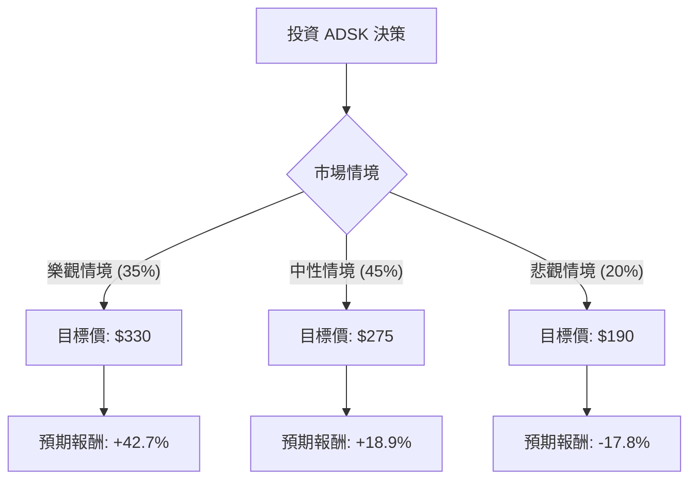

這份分析報告將結合您提供的基本面數據，以及最新的市場動態（包含 **Starboard Value 維權投資者介入**、**會計調查結案**、**AI 策略**等），利用「決策樹」與「期望值分析」評估 Autodesk (ADSK) 的投資價值。

---

### 一、 最新市場動態與核心假設

在進行計算前，我們先整合最新的外部資訊：
1.  **會計調查結案**：Autodesk 先前因自由現金流與利潤率的會計處理問題遭到調查，目前內部調查已結束，雖有管理層異動（CFO 離職），但**無需重編財報**，消除了最大的不確定性。
2.  **維權投資者介入**：知名維權對沖基金 **Starboard Value** 已入股約 5 億美元，正施壓董事會進行改革，要求提高利潤率並改善公司治理。這通常對股價有支撐作用。
3.  **業務轉型**：公司正從代理商模式轉向「直接交易模式（New Transaction Model）」，短期可能造成現金流波動，但長期有助於掌握客戶數據與利潤。
4.  **AI 佈局**：Autodesk AI 整合進 Revit 與 Maya 等核心產品，維持其在建築（AEC）與製造業的壟斷地位。

---

### 二、 決策樹分析 (Decision Tree)

我們將未來一年的情境分為三種：**樂觀（牛市）、中性（基準）、悲觀（熊市）**。

#### 節點詳細說明：

1.  **樂觀情境 (Bull Case) - 35% 機率**：
    *   **條件**：Starboard Value 成功推動成本削減；AI 功能開始貢獻訂閱溢價；宏觀經濟復甦帶動建築業需求。
    *   **預期股價**：$330 (接近 52 週高點並反映維權溢價)。
    *   **期望值貢獻**：$330 \times 0.35 = \$115.5$

2.  **中性情境 (Base Case) - 45% 機率**：
    *   **條件**：會計風波完全平息；直接交易模式轉型平穩；營收維持 10-13% 的穩定增長。
    *   **預期股價**：$275 (回歸歷史平均估值，Forward P/E 約 25x)。
    *   **期望值貢獻**：$275 \times 0.45 = \$123.75$

3.  **悲觀情境 (Bear Case) - 20% 機率**：
    *   **條件**：全球高利率環境導致建築與製造業資本支出萎縮；維權投資者撤資；轉型模式導致客戶流失。
    *   **預期股價**：$190 (跌破 52 週低點，反映增長停滯)。
    *   **期望值貢獻**：$190 \times 0.20 = \$38.0$

---

### 三、 期望值 (Expected Value) 計算過程

#### 1. 核心數據基準
*   **當前股價 ($P_0$)**：$231.22
*   **分析師平均目標價**：$370.96 (此數據較為激進，本分析採用較保守的預估值)

#### 2. 期望股價計算
$$EV_{price} = (P_{bull} \times Prob_{bull}) + (P_{base} \times Prob_{base}) + (P_{bear} \times Prob_{bear})$$
$$EV_{price} = (330 \times 0.35) + (275 \times 0.45) + (190 \times 0.20)$$
$$EV_{price} = 115.5 + 123.75 + 38 = \$277.25$$

#### 3. 預期報酬率計算
$$Expected\ Return = \frac{EV_{price} - P_0}{P_0}$$
$$Expected\ Return = \frac{277.25 - 231.22}{231.22} \approx 19.9\%$$

---

### 四、 綜合評估與基本面分析補充

*   **估值面**：Forward P/E 為 19.31，相對於其歷史平均與軟體業同行（如 Adobe, ANSYS），目前處於**相對低位**。PEG 1.19 顯示股價相對於增長速度並不昂貴。
*   **獲利能力**：Gross Margin 高達 84.96%，ROE 40.33%，顯示其在產業鏈中擁有極強的議價能力與護城河。
*   **技術面**：目前股價低於 SMA20, 50, 200（均線空頭排列），且 YTD 下跌 24.5%，顯示市場情緒極度悲觀。然而，這通常是價值投資者的**左側進場機會**。

---

### 五、 最終結論

**判斷：適合投資 (Buy / Overweight)**

#### 理由：
1.  **期望值為正且具吸引力**：計算得出的預期報酬率約為 **19.9%**，遠高於無風險利率，且在當前美股高估值環境下具備較好的風險回報比。
2.  **利空出盡**：會計調查結案且無實質財務造假，消除了下行風險的「黑天鵝」因素。
3.  **維權投資者催化劑**：Starboard Value 的介入通常會迫使公司優化利潤率或進行股票回購，這對股價是強大的支撐。
4.  **基本面穩健**：極高的毛利率與壟斷性的產業地位，使其在經濟波動中具備韌性。

**建議操作策略：**
由於目前技術面仍疲軟（SMA 呈現負值），建議採取**分批進場**策略，以應對短期內可能因宏觀經濟數據波動帶來的震盪。目標價設定在 **$275 - $280** 區間。