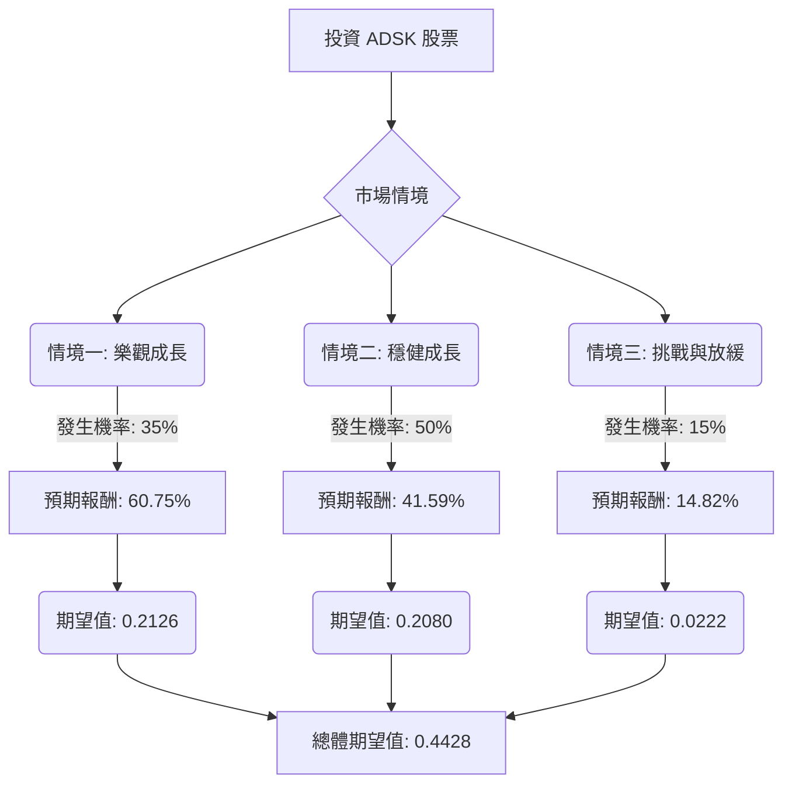

根據對美股公司 Autodesk (ADSK) 的基本面數據、最新市場資訊、財報、產業趨勢以及分析師預期的綜合評估，以下將運用決策樹分析與期望值分析，判斷 ADSK 目前是否適合投資。

### 核心假設

在進行決策樹分析前，我們基於收集到的資訊，建立以下核心假設：

*   **市場趨勢：** CAD 軟體產業正受雲端運算、人工智慧 (AI) 整合（特別是生成式設計）、3D 列印和擴增/虛擬實境 (AR/VR) 等技術趨勢的推動，這些趨勢預計將持續為產業帶來成長動能。Autodesk 在這些領域積極投入並取得進展。
*   **財務表現：** Autodesk 擁有強勁的經常性收入模式（訂閱收入佔總收入的 98%），並展現出穩健的營收成長（財年 2024 營收成長 10%，財年 2026 預計成長 16.8%）。公司毛利率高達 91-92%，顯示其強大的定價能力和成本管理效率。
*   **競爭格局：** 儘管面臨來自 Dassault Systèmes (SolidWorks)、PTC、Siemens 等主要競爭對手的挑戰，Autodesk 仍是 3D 設計軟體領域的全球領導者，並透過持續創新和轉型新的交易模式來維持競爭力。
*   **分析師預期：** 大多數分析師對 ADSK 持「買入」或「適度買入」評級，平均 12 個月目標價約為 370 美元，顯示市場對其未來表現持樂觀態度。
*   **宏觀經濟風險：** 建築行業可能面臨的下行風險以及更廣泛的宏觀經濟不確定性，可能對公司業績造成一定壓力，但 Autodesk 的業務韌性在一定程度上能抵禦這些挑戰。

### 決策樹分析

**當前股價 (P0):** $261.28

**決策點：** 投資 ADSK 股票

#### 節點說明與計算過程：

1.  **決策點：投資 ADSK 股票**
    *   這是我們做出投資決策的起點。

2.  **機會節點：市場情境**
    *   此節點代表未來可能發生的不同市場情境，我們將其分為三種：樂觀成長、穩健成長和挑戰與放緩。

3.  **情境一：樂觀成長 (Strong Growth)**
    *   **預測情境名稱：** 樂觀成長
    *   **情境描述：** Autodesk 成功利用 AI 和雲端技術的領先優勢，顯著擴大市場份額，新產品（如生成式 AI 解決方案）獲得市場高度認可，且宏觀經濟環境表現強勁，推動建築、製造等核心產業需求大幅增長。公司營收和盈利能力超預期，分析師上調目標價至高位。
    *   **對應的機率 (Probability)：** 35%
        *   理由：基於分析師普遍看好 ADSK 在 AI 和雲端轉型方面的潛力，以及其穩定的雙位數營收成長預期。
    *   **預期未來股價 (P1_Opt)：** $420
        *   理由：參考分析師最高目標價 $460.00 及 UBS 提出的 $400 目標價，並考慮到公司在 AI 領域的潛在突破。
    *   **預期報酬 (Return_Opt)：** ($420 - $261.28) / $261.28 = 0.6075 或 60.75%
    *   **期望值 (Expected Value_Opt)：** 0.35 \* 0.6075 = 0.2126

4.  **情境二：穩健成長 (Steady Growth)**
    *   **預測情境名稱：** 穩健成長
    *   **情境描述：** Autodesk 保持其現有的成長軌跡，持續從訂閱模式中獲取穩定收入，並有效應對競爭。AI 和雲端解決方案的採用率穩步提升，符合分析師的平均預期。宏觀經濟環境保持穩定，對公司業務沒有顯著的負面或超預期正面影響。
    *   **對應的機率 (Probability)：** 50%
        *   理由：這是最可能的情境，符合公司歷史表現、分析師平均預期以及其高比例的經常性收入模式。
    *   **預期未來股價 (P1_Mod)：** $370
        *   理由：接近分析師平均 12 個月目標價 $364.27 - $377.62。
    *   **預期報酬 (Return_Mod)：** ($370 - $261.28) / $261.28 = 0.4159 或 41.59%
    *   **期望值 (Expected Value_Mod)：** 0.50 \* 0.4159 = 0.2080

5.  **情境三：挑戰與放緩 (Slowdown/Challenges)**
    *   **預測情境名稱：** 挑戰與放緩
    *   **情境描述：** 由於全球經濟顯著放緩，特別是建築和製造業投資減少，導致客戶對軟體支出的緊縮。同時，來自競爭對手的壓力加劇，或 Autodesk 在新技術（如 AI）的商業化進程不如預期，導致營收成長放緩，盈利能力承壓。
    *   **對應的機率 (Probability)：** 15%
        *   理由：儘管公司業務模式穩健，但宏觀經濟下行和激烈競爭仍是潛在風險。
    *   **預期未來股價 (P1_Pes)：** $300
        *   理由：高於分析師最低目標價 $280.00 - $319.00，但反映了成長受阻的情況。
    *   **預期報酬 (Return_Pes)：** ($300 - $261.28) / $261.28 = 0.1482 或 14.82%
    *   **期望值 (Expected Value_Pes)：** 0.15 \* 0.1482 = 0.0222

6.  **總體期望值 (Overall Expected Value)**
    *   **計算方式：** 將所有情境的期望值加總。
    *   **總體期望值：** 0.2126 (樂觀) + 0.2080 (穩健) + 0.0222 (挑戰) = 0.4428
    *   這表示在考慮所有情境及其機率後，投資 ADSK 股票的預期年化報酬率約為 **44.28%**。

### 最終結論

根據決策樹分析和期望值計算，Autodesk (ADSK) 目前**適合投資**。

**理由：**

計算出的總體期望值為 **44.28%**，這是一個相當高的預期報酬率，遠高於一般市場的平均報酬。這表明在綜合考慮了樂觀、穩健和挑戰情境及其各自的機率後，投資 ADSK 具有顯著的潛在上行空間。

Autodesk 的投資吸引力主要來自以下幾點：
1.  **強勁的業務模式：** 98% 的經常性收入確保了營收的穩定性和可預測性。
2.  **產業領先地位與創新：** 作為 CAD 軟體領域的領導者，Autodesk 積極擁抱雲端、AI（特別是生成式設計）等新興技術，這些是推動未來成長的關鍵驅動力。
3.  **穩健的財務表現：** 持續的營收成長、高毛利率和健康的現金流，為公司提供了堅實的財務基礎。
4.  **積極的分析師展望：** 大多數分析師給予「買入」評級，且平均目標價顯示出可觀的潛在漲幅。

儘管存在宏觀經濟下行和競爭加劇的風險，但 Autodesk 的創新能力和穩固的市場地位使其能夠較好地應對這些挑戰。因此，基於當前分析，ADSK 是一項具有吸引力的投資。