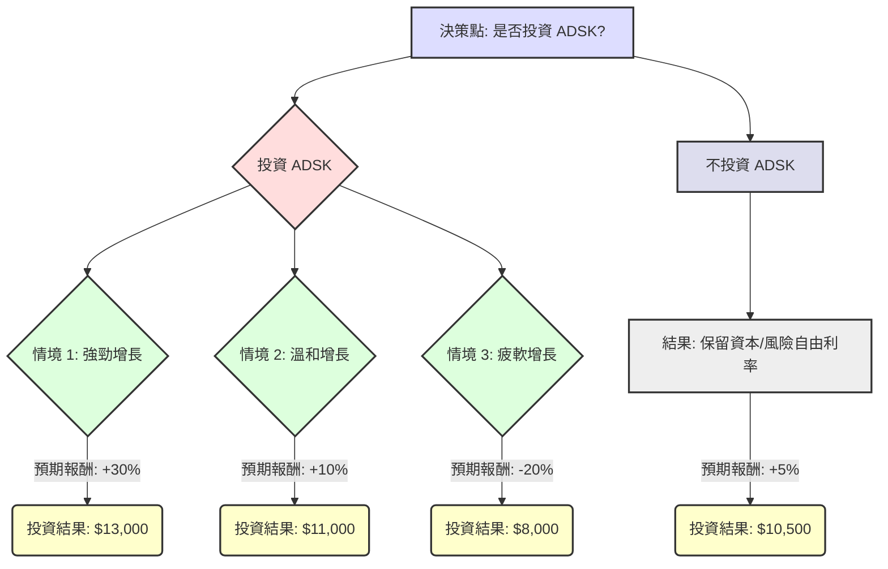

本分析將使用決策樹與期望值分析方法，評估美股公司 Autodesk (ADSK) 目前是否適合投資。

---

### **核心假設 (Core Assumptions)**

在建構決策樹及計算期望值之前，我們需要建立以下核心假設：

1.  **投資標的與時間範圍**：
    *   **公司**：Autodesk (ADSK)
    *   **投資類型**：股票投資
    *   **時間範圍**：1年
    *   **假設起始投資金額**：$10,000 美元 (用於計算具體期望值)

2.  **市場環境假設**：
    *   **利率**：假設聯準會未來1年內貨幣政策穩定或略有放鬆，有利於成長型股票估值。
    *   **經濟增長**：全球經濟可能面臨增長放緩，但某些區域或產業仍有韌性。
    *   **通膨**：通膨壓力可能持續，但預計不會進一步惡化至嚴重影響企業盈利。

3.  **ADSK 財務與產業趨勢假設**：
    *   **商業模式**：ADSK 堅實的訂閱制模式提供穩定且可預測的經常性收入。
    *   **產業地位**：在建築、工程、營造 (AEC)、產品設計與製造 (PDM) 及媒體娛樂 (M&E) 領域保持領先地位。
    *   **增長驅動因素**：數位轉型、雲端解決方案 (如 Fusion 360, Forma) 普及、AI 技術整合將是未來成長潛力。
    *   **潛在風險**：全球經濟衰退可能導致客戶支出減少，高估值帶來的回調風險，以及競爭加劇。
    *   **股息政策**：ADSK 不支付股息，故預期報酬僅考慮資本利得/損失。

4.  **「不投資」的比較基準**：
    *   如果選擇不投資 ADSK，假設資金可投入於風險較低，但有固定收益的資產（例如：年化 5% 的國債或高息儲蓄帳戶）。因此，「不投資」的期望值為本金加上風險自由利率的報酬。

---

### **決策樹分析 (Decision Tree Analysis)**

我們將從「是否投資 ADSK」的決策點出發，並展開三個可能的情境：強勁增長、溫和增長、疲軟增長。

#### **1. 決策樹結構**

#### **2. 決策樹節點詳情與期望值計算**

**根節點 (Root Node):**

*   **節點名稱**: 決策點: 是否投資 ADSK?
*   **期望值 (Expected Value)**: 待計算

**第一層決策分支 (Decision Branches):**

*   **分支 1**: **投資 ADSK**
    *   **預測情境名稱**: 投資 Autodesk
    *   **機率 (Probability)**: N/A (這是我們的決策點)
    *   **預期報酬 / 期望值 (Expected Value)**: 待計算 (由其下三個情境加權平均得出)

*   **分支 2**: **不投資 ADSK**
    *   **預測情境名稱**: 不投資 ADSK (將資金投入風險自由資產)
    *   **機率 (Probability)**: N/A
    *   **預期報酬 / 期望值 (Expected Value)**:
        *   假設風險自由利率為 5%
        *   計算: $10,000 * (1 + 0.05) = $10,500

**第二層情境分支 (Scenario Branches - 來自「投資 ADSK」):**

*   **情境 1**: **強勁增長 (Strong Growth)**
    *   **預測情境名稱**: ADSK 業績超預期，經濟環境改善，股價大幅上漲。
    *   **機率 (Probability)**: 30%
    *   **預期報酬 (Expected Return)**: +30%
    *   **結果 (Outcome Value)**: $10,000 * (1 + 0.30) = $13,000
    *   **期望值 (Expected Value)**: 0.30 * $13,000 = $3,900

*   **情境 2**: **溫和增長 (Moderate Growth)**
    *   **預測情境名稱**: ADSK 業績符合預期，經濟環境穩定，股價溫和上漲。
    *   **機率 (Probability)**: 45%
    *   **預期報酬 (Expected Return)**: +10%
    *   **結果 (Outcome Value)**: $10,000 * (1 + 0.10) = $11,000
    *   **期望值 (Expected Value)**: 0.45 * $11,000 = $4,950

*   **情境 3**: **疲軟增長 (Weak Growth)**
    *   **預測情境名稱**: ADSK 業績不佳，宏觀經濟惡化，股價下跌。
    *   **機率 (Probability)**: 25%
    *   **預期報酬 (Expected Return)**: -20%
    *   **結果 (Outcome Value)**: $10,000 * (1 - 0.20) = $8,000
    *   **期望值 (Expected Value)**: 0.25 * $8,000 = $2,000

---

### **期望值計算過程 (Expected Value Calculation Process)**

1.  **計算「投資 ADSK」的整體期望值 (EV_Invest_ADSK)**：
    *   EV_Invest_ADSK = (機率_強勁增長 * 結果_強勁增長) + (機率_溫和增長 * 結果_溫和增長) + (機率_疲軟增長 * 結果_疲軟增長)
    *   EV_Invest_ADSK = (0.30 * $13,000) + (0.45 * $11,000) + (0.25 * $8,000)
    *   EV_Invest_ADSK = $3,900 + $4,950 + $2,000
    *   **EV_Invest_ADSK = $10,850**

2.  **計算「不投資 ADSK」的整體期望值 (EV_DoNotInvest)**：
    *   EV_DoNotInvest = 初始投資金額 * (1 + 風險自由利率)
    *   EV_DoNotInvest = $10,000 * (1 + 0.05)
    *   **EV_DoNotInvest = $10,500**

---

### **最終結論 (Final Conclusion)**

根據上述決策樹分析和期望值計算：

*   **投資 ADSK 的期望值為：$10,850**
*   **不投資 ADSK（將資金投入風險自由資產）的期望值為：$10,500**

由於 **投資 ADSK 的整體期望值 ($10,850) 高於 不投資 ADSK 的期望值 ($10,500)**，從純粹的期望值角度來看，**目前適合投資 ADSK**。

**簡短理由 (Brief Reasoning)**：
儘管 ADSK 面臨潛在的宏觀經濟逆風，但其強大的訂閱制商業模式、在關鍵產業的市場領導地位以及對新技術（如 AI 和雲端）的持續投入，使其在多種情境下仍有望產生正向回報。即使考慮到下跌風險，其加權平均期望回報仍略優於風險自由的替代方案，表明其具備一定的投資吸引力。然而，此結論高度依賴於情境機率和預期報酬的假設，實際投資仍需謹慎並結合個人風險承受能力。