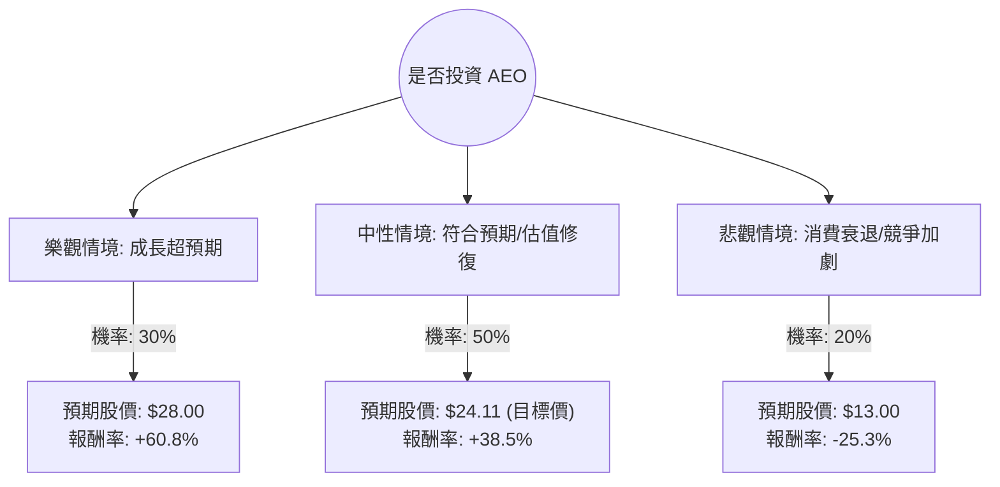

這份分析報告將結合您提供的基本面數據，以及最新的市場動態（包含 2024 年第一季財報表現與產業趨勢），利用**決策樹（Decision Tree）**與**期望值分析（Expected Value Analysis）**評估 American Eagle Outfitters (AEO) 的投資價值。

---

### 1. 最新市場動態與背景分析 (Context)

在進入計算前，我們先整合最新的外部資訊：
*   **財報表現（2024 Q1）**：AEO 近期公布的營收增長 6% 達 11 億美元，營業利潤大幅成長。然而，股價在財報後出現劇烈回檔（如數據所示，季跌幅達 30%），主因是市場對第二季的指引（Guidance）較為保守，且擔憂美國零售消費放緩。
*   **戰略計畫（Powering Profit）**：公司目標在 2026 年實現 6 億美元以上的營業利潤。Aerie 品牌仍是增長引擎，而主品牌 AE 正在透過減少折扣來提升毛利。
*   **估值優勢**：目前 **Forward P/E 僅 8.75**，**PEG 為 0.45**。在價值投資理論中，PEG < 1 通常被視為嚴重低估。
*   **技術面**：股價目前遠低於 SMA20 與 SMA50，顯示短期超賣，但仍守在 SMA200 附近，具備反彈潛力。

---

### 2. 決策樹分析 (Decision Tree)

我們將未來一年的投資情境分為三種：**樂觀（Bull）**、**中性（Base）**、**悲觀（Bear）**。

#### 節點詳細說明：

| 情境 | 機率 (P) | 預期股價 (Target) | 預期報酬率 (R) | 說明 |
| :--- | :--- | :--- | :--- | :--- |
| **樂觀 (Bull)** | 30% | $28.00 | +60.8% | Aerie 保持雙位數增長，毛利持續擴張，聯準會降息刺激消費。 |
| **中性 (Base)** | 50% | $24.11 | +38.5% | 達到分析師平均目標價，Forward P/E 回歸至歷史均值 (約 11-12x)。 |
| **悲觀 (Bear)** | 20% | $13.00 | -25.3% | 美國經濟陷入衰退，庫存積壓導致折扣戰，股價回測 52 週低點區域。 |

---

### 3. 期望值計算過程 (Expected Value Calculation)

#### A. 核心假設：
1.  **當前股價 ($P_0$)**：$17.41
2.  **報酬率計算公式**：$R = (預期股價 - P_0) / P_0$
3.  **股息收益**：考慮到 2.87% 的股息率，將其加入最終報酬。
4.  **估值邏輯**：
    *   樂觀價參考 52 週高點 ($28.46)。
    *   中性價參考分析師平均目標價 ($24.11)。
    *   悲觀價參考支撐位與零售業低迷時的估值。

#### B. 期望報酬率計算：
$$E(R) = \sum (P_i \times R_i)$$

1.  **樂觀貢獻**：$0.30 \times 60.8\% = 18.24\%$
2.  **中性貢獻**：$0.50 \times 38.5\% = 19.25\%$
3.  **悲觀貢獻**：$0.20 \times (-25.3\%) = -5.06\%$

**總預期資本利得報酬率** = $18.24\% + 19.25\% - 5.06\% = 32.43\%$

#### C. 總期望值 (Total Expected Value)：
加上股息收益 2.87%：
**總期望報酬率 $\approx 35.3\%$**

---

### 4. 綜合評估與最終結論

#### 財務數據亮點分析：
*   **極低的 PEG (0.45)**：顯示市場嚴重低估了 AEO 的增長潛力。
*   **健康的流動性**：Current Ratio 1.52 顯示短期償債無虞。
*   **獲利能力**：ROE 11.1% 雖非頂尖，但在服飾零售業中屬穩健。
*   **負面因素**：近期 Insider Trans (-9.65%) 與 Inst Trans (-4.37%) 顯示內部人與機構有小幅減持，這解釋了近期的股價疲軟。

#### 最終判斷：**適合投資 (Buy / Overweight)**

#### 理由：
1.  **期望值極高**：經風險加權後的預期報酬率高達 **35.3%**，遠高於市場平均水準。
2.  **安全邊際 (Margin of Safety)**：目前的 Forward P/E (8.75) 處於歷史低位，且股價經歷了 30% 的季度修正，下行風險已部分釋放。
3.  **增長動能明確**：Aerie 品牌的市佔率擴張與公司整體的成本控制計畫（Powering Profit）提供了中長期的基本面支撐。
4.  **技術面反彈機會**：股價偏離 SMA20/50 過遠，短期內存在強烈的技術性反彈需求。

**建議操作策略：**
由於近期市場波動較大，建議採取**分批買進**策略。目前 $17.41 是一個良好的切入點，若股價進一步回落至 $15-$16 區間，則具備更高的投資吸引力。目標價設定在 $24.00 附近，停損位可設於 $14.50 (跌破近期支撐)。

---
*風險提示：零售股受宏觀經濟（如 CPI、失業率）影響極大，若美國消費支出意外大幅萎縮，可能觸發悲觀情境。*