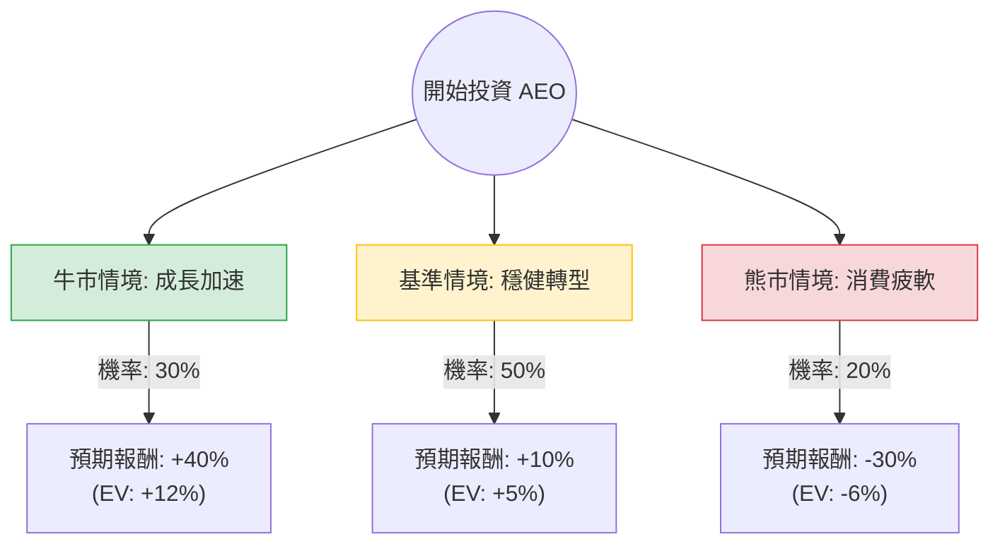

這份分析報告將結合您提供的基本面數據與最新的市場動態（包含 2024 年 3 月發布的「Powering Profitable Growth」三年計畫及最新財報），利用**決策樹（Decision Tree）**與**期望值分析（Expected Value Analysis）**評估 American Eagle Outfitters (AEO) 的投資價值。

---

### 一、 市場動態與核心假設

在進入決策樹之前，我們先整合最新資訊以設定假設：

1.  **最新財報表現**：AEO 近期財報顯示 Aerie 品牌持續強勁，且主品牌 American Eagle 庫存管理優化，毛利率（Gross Margin）提升至 32.9% 以上。
2.  **三年成長計畫**：公司目標在 2026 年實現 57 億至 60 億美元的營收，並將營業利潤率提升至 10%（目前約 5.43%）。
3.  **估值分析**：目前 Forward P/E 為 14.54，相較於歷史平均與同業（如 ANF）並不顯得昂貴，但 PEG 4.57 顯示市場對其長期高成長仍有疑慮。
4.  **風險因素**：高通膨對非必需消費品的壓力、11.86% 的高放空比例（Short Float）顯示市場存在看空情緒。

---

### 二、 決策樹分析 (Decision Tree)

以下決策樹模擬未來 12 個月的投資情境：

#### 1. 牛市情境 (Bull Case) - 權重 30%
*   **情境描述**：Aerie 品牌維持雙位數成長，且「Powering Profitable Growth」計畫進度超前，營業利潤率迅速向 10% 靠攏。
*   **預期報酬**：股價挑戰 $35 (約 +40%)。
*   **計算**：$0.30 \times 40\% = 12\%$

#### 2. 基準情境 (Base Case) - 權重 50%
*   **情境描述**：公司表現符合預期，EPS 成長 22%（如數據所示），估值維持在 Forward P/E 15 倍左右。股價隨獲利緩步上升。
*   **預期報酬**：股價達到分析師目標價 $28 (約 +10%)。
*   **計算**：$0.50 \times 10\% = 5\%$

#### 3. 熊市情境 (Bear Case) - 權重 20%
*   **情境描述**：美國經濟衰退導致消費支出大幅下降，庫存再度積壓，利潤率受損。高放空比例引發賣壓。
*   **預期報酬**：股價回測 SMA200 或更低 $18 (約 -30%)。
*   **計算**：$0.20 \times (-30\%) = -6\%$

---

### 三、 期望值計算 (Expected Value Calculation)

根據上述決策樹，總體期望報酬率計算如下：

$$EV = (0.30 \times 40\%) + (0.50 \times 10\%) + (0.20 \times -30\%)$$
$$EV = 12\% + 5\% - 6\% = 11\%$$

**核心假設說明：**
*   **獲利能力**：假設 EPS next Y (22.15%) 能如期兌現，這是支撐股價的核心動力。
*   **財務結構**：Debt/Eq 1.21 雖偏高，但 Current Ratio 1.63 顯示短期償債無虞，不會發生流動性危機。
*   **技術面**：SMA200 (+47.6%) 顯示長期趨勢向上，目前股價在 SMA50 附近震盪，屬於多頭排列中的整理期。

---

### 四、 最終結論

#### **評估結果：適合投資 (謹慎看多)**

**理由如下：**

1.  **正向期望值**：經過風險加權後的期望報酬率為 **11%**，優於無風險利率及多數零售同業。
2.  **轉型紅利**：AEO 目前正處於從單一品牌向「多品牌組合」轉型的關鍵期，Aerie 的高利潤貢獻尚未完全被市場定價（Forward P/E 僅 14.5 倍）。
3.  **成長性與估值平衡**：雖然 PEG 較高，但 EPS Q/Q 成長 29.29% 顯示短期動能強勁。0.78 的 P/S 值顯示股價相對於營收仍具備吸引力。
4.  **股利支撐**：2.04% 的殖利率為投資者提供了一定的下行保護。

**投資建議：**
*   **進場點**：目前股價 $25.48 接近分析師目標價 $25.78，建議在 $24 - $25 區間分批布局。
*   **風險監控**：需密切關注 **Short Float (11.86%)**。若股價跌破 SMA200 ($17-$18 區間)，則原先的成長假設失效，應執行停損。
*   **持有期限**：建議中長期持有（6-12 個月），以觀察其三年計畫的執行成效。

---
*免責聲明：本分析僅供參考，不構成任何投資建議。投資股票具有風險，入市前請獨立思考並審慎評估。*