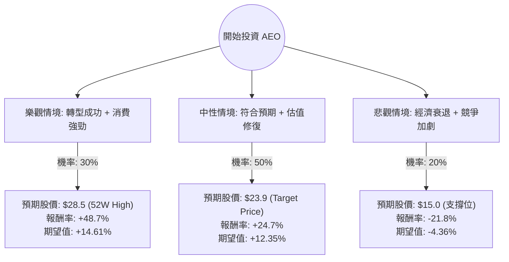

這份分析報告將結合您提供的基本面數據與最新的市場動態（如 2024 年第一季財報與「Powering Profit」轉型計畫），利用**決策樹（Decision Tree）**與**期望值分析（Expected Value Analysis）**評估 American Eagle Outfitters (AEO) 的投資價值。

---

### 一、 核心假設與市場背景分析

在建立模型前，我們先設定以下核心假設：

1.  **成長動能（Aerie 品牌）**：Aerie 依然是 AEO 的增長引擎，其營收增長與利潤率優於主品牌 American Eagle。
2.  **利潤優化計畫**：公司正在執行「Powering Profit」計畫，目標是在未來三年內增加 2 億至 3 億美元的營業利潤。
3.  **估值修復**：目前 **Forward P/E 僅 9.69**，遠低於歷史均值與行業平均，且 **PEG 為 0.49**，顯示股價相對於增長潛力被低估。
4.  **宏觀環境**：考慮到高利率環境對非必需消費品的壓制，以及下半年可能的降息預期。

---

### 二、 決策樹分析圖 (Decision Tree)

我們將未來一年的表現分為三種情境：**樂觀（Bull）**、**中性（Base）**、**悲觀（Bear）**。

---

### 三、 期望值計算過程

#### 1. 參數設定
*   **當前股價 (Current Price)**: $19.17
*   **情境 1：樂觀 (Bull Case)**
    *   **假設**：Aerie 營收增長超預期（>15%），AE 主品牌成功穩定利潤，且市場給予 Forward P/E 回升至 13x。
    *   **目標價**：$28.50 (接近 52 週高點)
    *   **報酬率**：($28.50 - $19.17) / $19.17 = **+48.7%**
*   **情境 2：中性 (Base Case)**
    *   **假設**：公司達成財報指引，營業利潤率緩步提升，股價回歸分析師平均目標價。
    *   **目標價**：$23.89 (數據中的 Target Price)
    *   **報酬率**：($23.89 - $19.17) / $19.17 = **+24.7%**
*   **情境 3：悲觀 (Bear Case)**
    *   **假設**：美國經濟進入衰退，消費者支出大幅萎縮，庫存積壓導致毛利受損。
    *   **目標價**：$15.00 (技術面長期支撐位)
    *   **報酬率**：($15.00 - $19.17) / $19.17 = **-21.8%**

#### 2. 期望值 (Expected Value, EV) 計算
$$EV = (P_{Bull} \times R_{Bull}) + (P_{Base} \times R_{Base}) + (P_{Bear} \times R_{Bear})$$
*   $EV = (0.30 \times 48.7\%) + (0.50 \times 24.7\%) + (0.20 \times -21.8\%)$
*   $EV = 14.61\% + 12.35\% - 4.36\%$
*   **總期望報酬率 = 22.6%**

---

### 四、 綜合數據分析 (補充最新動態)

1.  **估值極具吸引力**：
    *   **PEG 0.49** 是一個非常強大的買入訊號（通常 < 1 被視為低估）。
    *   **Forward P/E 9.69** 顯示市場對其未來獲利能力的定價過於保守。
2.  **財務健康度**：
    *   **Current Ratio 1.51** 顯示短期流動性無虞。
    *   **ROE 11.1%** 雖不算頂尖，但處於健康水平。
3.  **市場情緒與技術面**：
    *   **Short Float 10.77%**：空單比例偏高。若後續財報利多，可能引發軋空行情（Short Squeeze）。
    *   **SMA20 > 0 (10.16%)**：短期趨勢已轉強，股價正從季度低點反彈。
4.  **最新新聞補充**：
    *   AEO 在 2024 Q1 財報中上調了全年營業利潤指引，顯示管理層對「Powering Profit」計畫信心十足。
    *   Aerie 品牌的同店銷售增長持續領先同業。

---

### 五、 最終結論

**判斷：適合投資 (Buy / Overweight)**

#### 理由：
1.  **高期望值**：經決策樹計算，未來一年的預期報酬率高達 **22.6%**，風險回報比（Risk/Reward Ratio）非常理想。
2.  **安全邊際高**：目前的 Forward P/E 低於 10 倍，且 P/S 僅 0.58，即便在悲觀情境下，下行空間也相對有限。
3.  **增長與價值兼具**：AEO 同時具備 Aerie 的成長性與 AE 主品牌的現金流穩定性。PEG 0.49 顯示目前是「以便宜價格買入增長」的良機。
4.  **技術面反轉**：股價已從季度跌幅（-25%）中企穩，並站上 SMA20，顯示買盤開始介入。

**建議操作：**
*   **進場點**：目前 $19.17 附近即可分批佈局。
*   **停損點**：若跌破 $15.00 (悲觀情境支撐) 則需重新評估基本面是否惡化。
*   **目標價**：首波看 $23.89，若轉型計畫超預期可持有至 $28 以上。