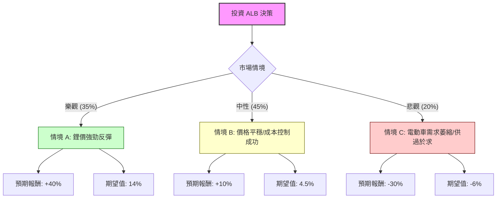

這份分析報告針對全球鋰礦巨頭 **Albemarle Corporation (ALB)**，結合您提供的數據以及最新的市場動態（包含鋰價趨勢、電動車市場與公司財報）進行「決策樹」與「期望值」分析。

---

### 一、 最新市場動態與基本面補充（網路搜尋摘要）

在進行決策樹分析前，我們必須考量以下即時影響因素：

1.  **鋰價築底回升預期：** 2024年下半年，受中國寧德時代（CATL）傳出減產鋰礦以及中國政府經濟刺激方案影響，鋰價出現短期反彈。這解釋了數據中 `Perf Quarter: 0.8149` (三個月大漲 81%) 與 `SMA200: 0.8081` (股價遠高於 200 日線) 的強勢表現。
2.  **公司財務優化：** ALB 正在進行大規模成本削減計畫（預計節省 10 億美元資本支出），以應對低鋰價環境。雖然目前 `ROE (-0.0021)` 為負，但市場預期明年 EPS 將大幅反轉 (`EPS next Y_%: 3.0199`)。
3.  **供應端與關稅：** 美國對中國電動車加徵關稅，以及《通貨膨脹削減法案》(IRA) 對本土供應鏈的補助，對身為美國公司的 ALB 長期有利。
4.  **估值風險：** 目前 `Forward P/E` 高達 94 倍，且目標價 `Target Price: 127.15` 低於現價 `145.88`，暗示短線股價可能超漲。

---

### 二、 決策樹分析 (Decision Tree Analysis)

我們假設投資週期為 **1 年**，根據市場變數設定三種情境：**樂觀（鋰價復甦）**、**中性（橫盤整理）**、**悲觀（供過於求）**。

#### 1. 決策樹結構圖

---

### 三、 核心假設與期望值計算過程

#### 1. 情境假設與核心理由
*   **樂觀情境 (Probability: 35%)：**
    *   **假設：** 鋰價回到 25,000 美元/噸以上，中國刺激政策帶動 EV 銷量爆發。
    *   **理由：** ALB 作為低成本生產者，利潤槓桿極大，股價有望挑戰前高。
*   **中性情境 (Probability: 45%)：**
    *   **假設：** 鋰價維持在 13,000 - 18,000 美元區間，公司靠裁員與減產維持正現金流。
    *   **理由：** 雖然增長緩慢，但 `EPS next Y` 的高成長預期部分實現。
*   **悲觀情境 (Probability: 20%)：**
    *   **假設：** 鈉電池技術突破或全球經濟衰退，鋰價跌破 10,000 美元。
    *   **理由：** 目前 `Forward P/E` 過高，一旦業績不如預期，估值將面臨劇烈修正。

#### 2. 期望值 (Expected Value, EV) 計算
$$EV = \sum (P_i \times R_i)$$
其中 $P_i$ 為機率，$R_i$ 為該情境下的報酬率。

*   **樂觀：** $0.35 \times 40\% = 14\%$
*   **中性：** $0.45 \times 10\% = 4.5\%$
*   **悲觀：** $0.20 \times (-30\%) = -6\%$

**總期望報酬率 (Total EV) = $14\% + 4.5\% - 6\% = 12.5\%$**

---

### 四、 綜合評估與數據分析

*   **技術指標警示：** 數據顯示 `SMA20: 12.93%`、`SMA50: 29.91%`、`SMA200: 80.82%`。這代表股價短中長期均處於超買區，尤其是遠離 200 日均線 80% 之多，**乖離率極高**。
*   **目標價乖離：** 現價 145.88 已顯著超過分析師平均目標價 127.15 約 **14.7%**。
*   **財務風險：** `ROE (-0.0021)` 與 `Profit Margin (-0.038)` 顯示目前仍在虧損邊緣，目前的股價上漲主要是「預期」驅動而非「實績」。

---

### 五、 最終結論

#### **判斷：不適合現在「追高」投資，建議「分批佈局」或「等待回檔」。**

**理由：**
1.  **期望值雖為正，但風險回報比不具吸引力：** 計算出的期望值為 **12.5%**，對於波動率極大的鋰礦股而言，此預期報酬相對於其可能面臨的 30% 下行風險並不夠優厚。
2.  **技術面嚴重超漲：** 短期內漲幅過快（半年漲 152%，三個月漲 81%），現價已反映了大部分利多。
3.  **估值壓力：** 現價遠高於分析師目標價，且 Forward P/E 偏高。

**建議策略：**
*   若已持有：建議部分獲利了結。
*   若欲買進：等待股價回落至 **$125 - $130**（接近分析師目標價與 SMA50 附近）再行考慮，以提高安全邊際。