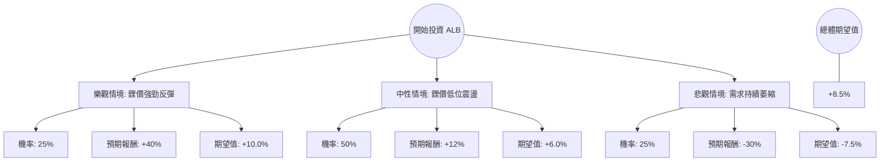

針對美股鋰礦龍頭 **Albemarle Corporation (ALB)**，我結合了您提供的基本面數據以及最新的市場動態（包含鋰價走勢、電動車需求放緩、以及川普政府政策預期）進行了深度分析。

以下是基於「決策樹」與「期望值分析」的投資評估報告。

---

### 一、 核心假設與市場背景分析

在建立決策樹之前，我們必須確立以下關鍵假設：

1.  **鋰價週期（核心變數）**：ALB 的獲利與碳酸鋰價格高度相關。目前鋰價處於歷史低位，市場正在爭論是否已觸底。
2.  **電動車（EV）需求**：全球 EV 銷量增速放緩，且美國可能面臨 IRA（通膨削減法案）補貼削減的風險，這對 ALB 是潛在利空。
3.  **財務狀況**：ALB 目前 ROE 為負（-5.24%），反映了過去一年鋰價崩跌的衝擊。但 Forward P/E 為 19.04，顯示市場預期明年獲利將轉正。
4.  **技術面與目標價**：目前股價 $168.42，分析師平均目標價為 $193.86（約 15% 上漲空間）。

---

### 二、 決策樹分析 (Decision Tree)

我們將未來一年的投資情境分為三種：**樂觀（復甦）**、**中性（震盪）**、**悲觀（低迷）**。

#### 節點詳細說明：

1.  **樂觀情境 (Bull Case) - 25% 機率**
    *   **條件**：鋰價因供應端減產超預期而快速回升；聯準會降息刺激消費；EV 需求回暖。
    *   **預期股價**：$235 (接近 52 週高點並突破)。
    *   **報酬率**：約 +40%。

2.  **中性情境 (Base Case) - 50% 機率**
    *   **條件**：鋰價在目前水平築底；ALB 成本控制奏效；市場維持對 Forward P/E 19 倍的估值。
    *   **預期股價**：$188 ~ $194 (接近分析師目標價)。
    *   **報酬率**：約 +12% ~ +15%。

3.  **悲觀情境 (Bear Case) - 25% 機率**
    *   **條件**：美國取消 EV 補貼；全球經濟衰退；鋰礦供應過剩持續。
    *   **預期股價**：$118 (回測支撐位)。
    *   **報酬率**：約 -30%。

---

### 三、 期望值 (Expected Value) 計算過程

期望值計算公式：
$$EV = \sum (Probability_i \times Return_i)$$

*   **樂觀情境期望值**：$0.25 \times 40\% = 10.0\%$
*   **中性情境期望值**：$0.50 \times 12\% = 6.0\%$
*   **悲觀情境期望值**：$0.25 \times (-30\%) = -7.5\%$

**總體期望報酬率 (Total EV) = 10.0% + 6.0% - 7.5% = 8.5%**

---

### 四、 綜合分析與最新動態補充

1.  **供給側改革**：近期包括 ALB 在內的多家鋰礦商已宣佈削減資本支出（Capex）並暫停部分擴產計畫。這通常是週期性產業觸底的訊號。
2.  **估值面**：P/B 為 2.72，相較於歷史高點已大幅修正。雖然目前 Profit Margin 為負（-13.17%），但這是落後指標。Forward P/E 顯示市場對其 2025 年的 EPS 轉正有信心。
3.  **風險點**：
    *   **Short Float (7.78%)**：空單比例不算極高，但仍存在壓力。
    *   **政策不確定性**：川普政府對綠能產業的態度是目前最大的黑天鵝。

---

### 五、 最終結論

**判斷：適合投資 (建議：分批佈局 / 謹慎看多)**

#### 理由：
1.  **期望值為正 (8.5%)**：雖然面臨產業逆風，但目前的股價已反映了大部分的利空，期望值顯示長期持有的勝率較高。
2.  **週期性底部特徵**：ALB 過去半年的表現 (+115%) 顯示資金已開始提前佈局復甦行情。雖然短期有回檔（近一個月 -6.46%），但 SMA200 (+66.4%) 趨勢向上，顯示長線趨勢已轉強。
3.  **財務韌性**：Debt/Eq 僅 0.35，流動比率 2.23，顯示 ALB 有足夠的財務實力撐過鋰價低迷期，不會有破產風險。

**操作建議：**
由於悲觀情境下的跌幅可能達 30%，建議投資者**不要一次性投入**。可在 $155 - $165 區間分批建立基本倉位，並密切觀察碳酸鋰期貨價格是否站穩腳步。若跌破 $140 則需重新評估悲觀情境發生的可能性。

***

**免責聲明：** 本分析僅供參考，不構成任何投資建議。投資股票具有風險，入市前請務必自行審慎評估。