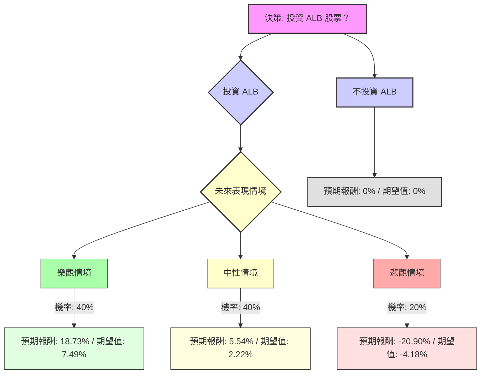

根據對美股公司 Albemarle (ALB) 的基本面數據、最新新聞、財報、市場動態及產業趨勢的綜合評估，以下將使用決策樹分析與期望值分析來判斷其目前是否適合投資。

### **核心假設**

1.  **市場趨勢 (Lithium Market Trend)**：
    *   鋰市場在經歷 2025 年的波動和價格下跌後，已在下半年開始反彈。
    *   預計 2026 年將進入再平衡階段，從供過於求轉向潛在的供不應求。
    *   電動車 (EV) 和儲能系統 (ESS) 的強勁需求是主要驅動力。
    *   分析師預計 2026 年鋰價將顯著上漲，例如 UBS 預計鋰輝石精礦價格將達到每噸 1,800 美元，摩根大通預計達到 2,000 美元，較 2025 年增長超過 50%。
    *   Ganfeng Lithium 董事長預計到 2026 年全球需求將增長 30-40%。
2.  **財務表現 (ALB Financial Performance)**：
    *   ALB 在 2025 年第三季度儘管鋰價較低，但調整後 EBITDA 仍增長 7%，並預計 2025 年全年自由現金流為 3 億至 4 億美元。
    *   公司正在實施成本節約措施，目標是實現約 4.5 億美元的成本和生產力改進。
    *   ALB 擁有低成本的鋰資產，使其在市場復甦時具有競爭優勢。
    *   2025 年第四季度財報將於 2026 年 2 月 11 日發布，預計將進一步確認市場復甦趨勢。
3.  **分析師情緒 (Analyst Sentiment)**：
    *   近期（2026 年 1 月）多家華爾街分析師上調 ALB 評級至「買入」或「跑贏大盤」，並顯著提高目標價，例如 HSBC ($200)、RBC Capital ($200)、Truist ($205)、Oppenheimer ($207)、UBS ($205)、Baird ($210)。
    *   儘管有報導稱平均目標價較當前股價為低，但這可能反映了舊的共識，而最新的分析師行動則普遍看好。

### **決策樹分析 (Decision Tree Analysis)**

**當前股價 (Current Close Price):** $189.51

**決策點：投資 ALB 股票？**

*   **選項 1: 投資 ALB**
    *   **情境 1: 樂觀情境 (Strong Lithium Market & ALB Outperformance)**
        *   **描述:** 鋰價持續強勁上漲，ALB 受益於其低成本資產和高效運營，市場份額擴大，盈利能力顯著提升。
        *   **機率 (Probability):** 40%
        *   **預期股價 (Estimated Price):** $225 (基於分析師高目標價 $200-$210+，並考慮市場強勁上漲潛力)
        *   **預期報酬 (Expected Return):** (($225 - $189.51) / $189.51) = 18.73%
        *   **期望值 (Expected Value):** 0.40 * 18.73% = 7.49%
    *   **情境 2: 中性情境 (Stable Lithium Market & Steady ALB Performance)**
        *   **描述:** 鋰市場穩定增長，ALB 保持穩健運營，實現預期成本節約，但增長速度符合市場平均水平。
        *   **機率 (Probability):** 40%
        *   **預期股價 (Estimated Price):** $200 (基於部分分析師目標價和市場再平衡預期)
        *   **預期報酬 (Expected Return):** (($200 - $189.51) / $189.51) = 5.54%
        *   **期望值 (Expected Value):** 0.40 * 5.54% = 2.22%
    *   **情境 3: 悲觀情境 (Weak Lithium Market & ALB Underperformance)**
        *   **描述:** 鋰價因供過於求或需求不及預期而下跌，ALB 面臨運營挑戰，盈利能力受損。
        *   **機率 (Probability):** 20%
        *   **預期股價 (Estimated Price):** $150 (基於分析師較低目標價和熊市觀點)
        *   **預期報酬 (Expected Return):** (($150 - $189.51) / $189.51) = -20.90%
        *   **期望值 (Expected Value):** 0.20 * -20.90% = -4.18%

*   **選項 2: 不投資 ALB**
    *   **預期報酬 (Expected Return):** 0% (假設將資金投入無風險資產，或簡單地不產生任何回報)
    *   **期望值 (Expected Value):** 0%

---

### **期望值分析 (Expected Value Analysis)**

**投資 ALB 的總期望值計算：**

總期望值 = (樂觀情境期望值) + (中性情境期望值) + (悲觀情境期望值)
總期望值 = (0.40 * 18.73%) + (0.40 * 5.54%) + (0.20 * -20.90%)
總期望值 = 7.492% + 2.216% - 4.18%
**總期望值 = 5.528%**

### **最終結論**

根據決策樹分析和期望值分析，投資 ALB 股票的整體期望值為 **5.528%**。

**判斷：適合投資**

**理由：**
儘管 ALB 的基本面數據中存在一些負面指標（如負的 ROE、ROA、ROI），且歷史上鋰價波動較大，但最新的市場動態和分析師情緒顯示出強烈的復甦跡象。鋰市場預計在 2026 年將從供過於求轉向供不應求，電動車和儲能系統的需求持續增長為鋰價提供了堅實支撐。 ALB 作為全球領先的低成本鋰生產商，有望從中受益。 近期多家華爾街分析師上調其評級和目標價，也反映了市場對其未來表現的樂觀預期。 考慮到投資 ALB 的整體期望值為正，且高於不投資的 0%，因此目前判斷 ALB 適合投資。然而，投資者仍需密切關注即將發布的 Q4 2025 財報 以及鋰市場的實時動態，因為商品價格的波動性仍然是主要風險。