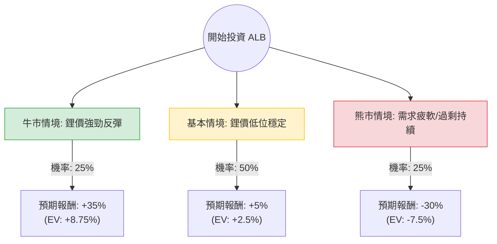

針對美股鋰礦龍頭 **Albemarle (ALB)** 的投資評估，我結合了您提供的基本面數據以及最新的市場動態（包含鋰價走勢、電動車需求及公司近期融資動作）進行分析。

---

### 一、 核心背景與市場動態分析

在進入決策樹之前，必須先釐清 ALB 目前面臨的關鍵變數：
1.  **鋰價波動**：鋰價在 2023 年經歷崩跌後，目前處於低位震盪。市場正在觀察供應端減產（如 ALB 縮減資本支出）是否能支撐價格回升。
2.  **估值壓力**：目前股價（$144.58）已遠高於分析師平均目標價（$127.15），且 **Forward P/E 高達 103.45**，顯示市場已提前反應復甦預期。
3.  **財務狀況**：雖然 Debt/Eq (0.38) 尚屬健康，但 **Profit Margin (-3.8%)** 為負，且近期透過發行存託股票融資約 20 億美元，這雖然緩解了現金流壓力，但也稀釋了股東權益。
4.  **技術面**：股價遠高於 SMA200 (82.6%)，短期內有過熱與回檔風險。

---

### 二、 決策樹分析 (Decision Tree)

以下使用 Markdown 繪製決策樹，評估未來 6-12 個月的投資情境：

#### 決策樹節點詳細說明：

| 情境 | 機率 (P) | 預期報酬 (R) | 期望值 (P * R) | 觸發條件 |
| :--- | :--- | :--- | :--- | :--- |
| **牛市 (Bull)** | 25% | +35% | **+8.75%** | 鋰價因供應短缺超預期反彈；EV 銷量回升；ALB 成本控制優於預期。 |
| **基本 (Base)** | 50% | +5% | **+2.5%** | 鋰價在目前水平橫盤；公司 EPS 達成預期 (2.79x 增長)；股價在高位震盪消化估值。 |
| **熊市 (Bear)** | 25% | -30% | **-7.5%** | 鋰礦產能過剩持續；全球經濟衰退導致 EV 需求萎縮；股價回歸目標價 ($127) 甚至更低。 |

---

### 三、 期望值分析與計算過程

#### 1. 總體期望值 (Total Expected Value) 計算：
$$EV = (0.25 \times 35\%) + (0.50 \times 5\%) + (0.25 \times -30\%)$$
$$EV = 8.75\% + 2.5\% - 7.5\% = \mathbf{3.75\%}$$

#### 2. 核心假設說明：
*   **市場假設**：假設鋰價已過最壞時期，但由於澳洲與非洲新礦產能釋放，短期內難以重回 2022 年的高點。
*   **財務假設**：ALB 下一年的 EPS 增長預期極高 (279%)，這已部分反映在股價中。若實際財報未能達標，下行風險極大。
*   **產業趨勢**：電動車增速放緩（尤其是美國市場）是主要阻力，但長期能源轉型趨勢不變。

#### 3. 風險報酬比分析：
目前的期望值僅為 **3.75%**，相對於美股大盤（S&P 500 歷史平均約 8-10%）或無風險利率（美債約 4-5%），ALB 目前的風險報酬比並不具備吸引力。

---

### 四、 最終結論

**評估結果：不適合投資（目前不建議進場）**

#### 理由如下：
1.  **估值過高**：當前股價 ($144.58) 已顯著超越分析師平均目標價 ($127.15)，且 Forward P/E 破百，容錯率極低。
2.  **技術面過熱**：半年內漲幅達 130%，且股價偏離 200 日均線 (SMA200) 過遠，短期回檔修正的機率極高。
3.  **期望值偏低**：經加權計算後的期望報酬率僅 3.75%，無法補償其作為商品循環股的高波動風險。
4.  **稀釋風險**：近期的大規模融資顯示公司仍需大量現金維持營運與擴張，短期內對每股盈餘 (EPS) 有壓制作用。

**建議操作：**
若您已持有，建議可考慮**部分獲利了結**；若尚未進場，建議等待股價回落至 **$120 - $130** 區間（接近目標價與支撐位），且觀察到鋰價有明確止跌回升信號後，再行分批佈局。