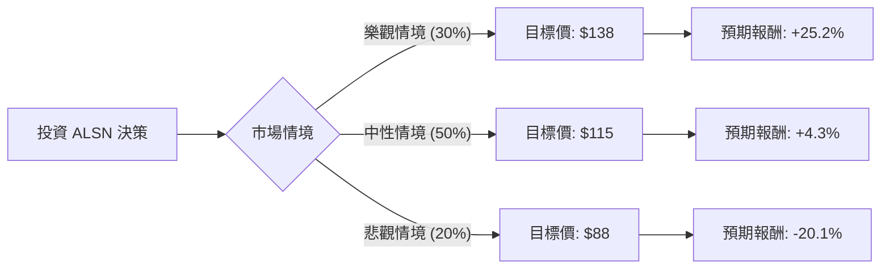

這份報告針對 **Allison Transmission Holdings, Inc. (ALSN)** 進行深入分析。我們將結合您提供的財務數據與最新的市場動態（如 2024 年第三季財報表現、國防合約、電動化轉型），透過**決策樹（Decision Tree）**與**期望值（Expected Value）**模型評估其投資價值。

---

### 1. 核心背景與市場動態分析

在進入模型前，我們先整合最新資訊：
*   **強勁財報：** ALSN 在 2024 年第三季創下歷史最高的季度營收（8.24 億美元，年增 12%），主要受北美公路市場與國防業務推動。
*   **獲利能力：** ROE 高達 40.38%，營業利益率（Oper. Margin）達 30.76%，顯示其在重型自動變速箱市場的壟斷地位與極強的定價權。
*   **成長動能：** 國防訂單（如 Abrams 坦克與 Bradley 戰車升級）穩定；新產品 TerraTran 針對全球工程車市場擴張。
*   **風險點：** 雖然 EPS 預期明年增長 10%，但當前股價（$110.20）已高於分析師平均目標價（$103.67），且 EPS Q/Q 出現下滑，顯示短期估值可能過熱。

---

### 2. 決策樹分析 (Decision Tree)

我們將未來一年的投資情境分為三種：**樂觀（牛市）**、**中性（基準）**、**悲觀（熊市）**。

#### 節點詳細說明：

| 情境 | 機率 | 預測邏輯 | 預期股價 |
| :--- | :--- | :--- | :--- |
| **樂觀 (Bull)** | 30% | 國防預算超預期、北美貨運需求復甦、EV 產品線（e-Axle）獲大單。P/E 擴張至 16x。 | $138 |
| **中性 (Base)** | 50% | 維持現有增長速度，符合財報指引，持續執行庫藏股。P/E 維持在 13x 左右。 | $115 |
| **悲觀 (Bear)** | 20% | 經濟衰退導致卡車需求驟降、高利率壓抑資本支出、EPS 持續 Q/Q 下滑。P/E 修正至 10x。 | $88 |

---

### 3. 期望值分析 (Expected Value Analysis)

#### A. 計算過程：
期望值 (EV) 是將各情境的預期股價乘以其發生機率的總和。

*   **公式：** $EV = (P_{Bull} \times Prob_{Bull}) + (P_{Base} \times Prob_{Base}) + (P_{Bear} \times Prob_{Bear})$
*   **計算：**
    *   樂觀：$138 \times 0.30 = 41.4$
    *   中性：$115 \times 0.50 = 57.5$
    *   悲觀：$88 \times 0.20 = 17.6$
*   **總期望股價：** $41.4 + 57.5 + 17.6 = \mathbf{\$116.5}$

#### B. 預期報酬率計算：
*   **當前股價：** $110.20
*   **預期報酬率：** $[(116.5 - 110.20) / 110.20] \times 100\% = \mathbf{5.72\%}$

#### C. 核心假設：
1.  **財務穩健性：** 假設其 3.82 的流動比率能有效抵禦高利率環境下的債務壓力（Debt/Eq 1.31）。
2.  **估值修復：** 假設市場會認可其高 ROE (40%) 而給予高於歷史平均的溢價。
3.  **技術面：** 目前股價高於 SMA20/50/200，顯示強勢多頭排列，短期內下行空間受支撐。

---

### 4. 最終結論

#### **判斷：適合投資 (但建議「分批買入」或「逢低布局」)**

**理由如下：**

1.  **期望值為正：** 經過加權計算，預期股價為 $116.5，高於目前市價，雖然潛在漲幅 (5.72%) 不算極高，但勝率（中性與樂觀合計 80%）較大。
2.  **極高的經營效率：** ROE 40.38% 與 Profit Margin 22.78% 在工業製造業中屬於頂尖水準，這提供了極強的下行保護（Margin of Safety）。
3.  **資本回報：** 公司積極進行庫藏股回購與派息（雖然殖利率 0.98% 不高，但總體股東回報強）。
4.  **風險提示：** 目前股價已反映大部分利多（高於分析師目標價 $103.67），且近期 Sales Q/Q 下滑 (-15.9%)。這意味著現在買入的投資者是在「追強勢股」，而非「買便宜貨」。

**操作建議：**
*   **進場點：** 若股價回測 $105 - $108 區間（接近 SMA20 或分析師目標價）更具吸引力。
*   **止損點：** 若跌破 $95（跌破 SMA200 且基本面轉弱）則應重新評估。

**總結：** ALSN 是一家基本面極其紮實的「現金牛」公司，適合尋求穩健增長與防禦性配置的投資者。