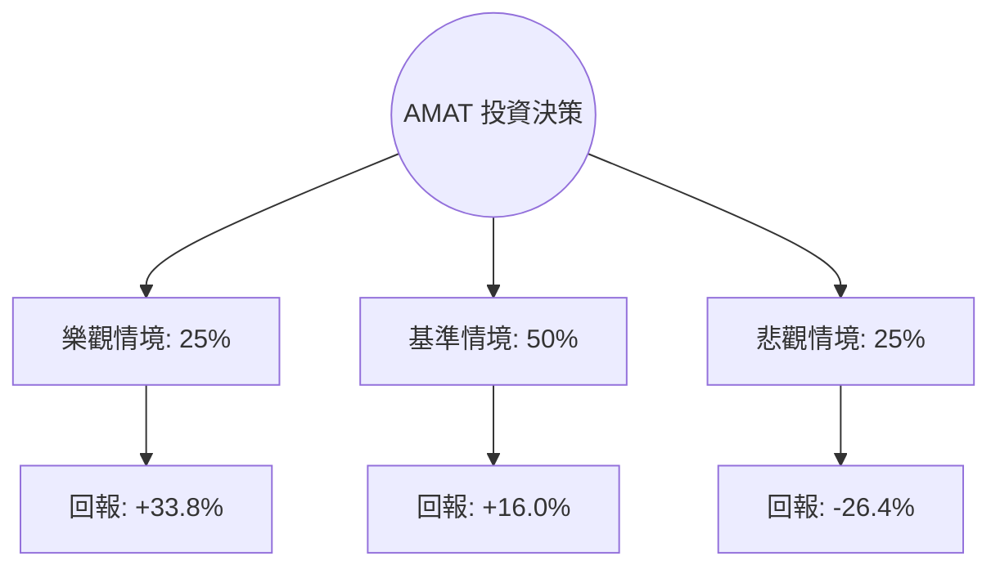

# AMAT 量化投資分析報告：基於期望值模型與決策樹分析

作為量化投資分析師，針對 **Applied Materials (AMAT)** 的當前數據（股價 $448.25，P/E 42.74，年度漲幅 188%）進行概率建模。目前市場處於極高動能與高估值並存的狀態，以下是深度分析：

---

### 1. 核心驅動因素與風險 (Drivers & Risks)

#### **關鍵催化劑 (Catalysts)**
1.  **GAA (Gate-All-Around) 技術轉型**：隨著晶圓代工廠（TSMC, Samsung, Intel）向 2nm 節點推進，GAA 結構對沉積與刻蝕設備的需求強度比 FinFET 高出約 20-30%。AMAT 在此領域的市佔率領先，是未來 12 個月營收增長的核心引擎。
2.  **AI 驅動的 HBM 與先進封裝**：高頻寬記憶體 (HBM) 產能擴張帶動對 AMAT 封裝設備的需求。AI 伺服器對邏輯晶片與記憶體的雙重需求，將抵消傳統 PC/手機市場的疲軟。
3.  **ICAPS 業務的韌性**：物聯網、汽車與電力電子（ICAPS）領域的成熟製程需求依然穩健，為公司提供穩定的現金流支撐。

#### **主要風險點 (Risks)**
1.  **中國市場出口管制**：AMAT 約有 30-40% 的營收來自中國。若美國進一步收緊對成熟製程設備的出口限制，將直接衝擊其營收基石。
2.  **估值倍數壓縮 (Multiple Compression)**：目前 P/E 高達 42.74，遠高於歷史均值（約 15-20x）。若聯準會降息路徑不如預期或 AI 投資回報率受質疑，市場將進行劇烈的估值修正。
3.  **週期性見頂風險**：過去一年股價漲幅達 188%，市場預期已極度樂觀，任何財報指引的微小瑕疵都可能引發獲利了結。

---

### 2. 情境設定與機率賦予 (Scenario Modeling)

基於未來 12 個月的展望，設定以下三種互斥情境：

#### **樂觀情境 (Bull Case)**
*   **發生條件**：AI 基礎設施需求超預期增長；2nm GAA 提前量產；中國營收受限制程度低於預期。
*   **預估機率**：25%
*   **目標價格**：$600 (基於 Forward P/E 35x 與 EPS 超預期增長)
*   **預期回報**：+33.8%

#### **基準情境 (Base Case)**
*   **發生條件**：符合分析師預期（Target Price $519.82）；記憶體市場溫和復甦；AI 貢獻抵消傳統業務平庸。
*   **預估機率**：50%
*   **目標價格**：$520 (接近分析師共識目標價)
*   **預期回報**：+16.0%

#### **悲觀情境 (Bear Case)**
*   **發生條件**：美國對華出口全面收緊；AI 資本支出放緩；全球宏觀衰退導致半導體設備訂單延後。
*   **預估機率**：25%
*   **目標價格**：$330 (估值回歸，P/E 修正至 25x 左右)
*   **預期回報**：-26.4%

---

### 3. 期望值計算與決策樹 (EV Calculation & Decision Tree)

#### **決策樹結構**

#### **總期望值計算**
*   `EV = (0.25 * 33.8%) + (0.50 * 16.0%) + (0.25 * -26.4%)`
*   `EV = 8.45% + 8.0% - 6.6% = 9.85%`

#### **風險回報比分析**
*   **上行潛力**：+16.0% ~ +33.8%
*   **下行空間**：-26.4%
*   **不對稱性評估**：期望值為正（9.85%），但風險回報比（Risk/Reward Ratio）約為 1:1.28。這顯示目前的價格已反映了大部分利多，安全邊際（Margin of Safety）相對薄弱。

---

### 4. 決策總結 (Decision Summary)

| 情境 | 發生機率 (%) | 預期報酬率 (%) | 關鍵驅動/觸發因素 |
| :--- | :--- | :--- | :--- |
| **樂觀 (Bull)** | 25% | +33.8% | GAA 技術全面爆發，AI 需求無上限增長 |
| **基準 (Base)** | 50% | +16.0% | 達到分析師目標價 $520，業務穩健增長 |
| **悲觀 (Bear)** | 25% | -26.4% | 政策制裁加劇，高估值泡沫破裂 |
| **整體期望值** | **100%** | **+9.85%** | **加權平均預期回報** |

**最終結論：**
1. **投資建議**：**持有 (Hold) / 逢低買入 (Buy on Dips)**
2. **核心逻辑**：AMAT 的期望值為正（9.85%），顯示長期基本面依然強勁，特別是 GAA 與 AI 封裝的技術領先地位。然而，當前 P/E 42.74 處於歷史高位，且過去一年漲幅過大，短期內「估值修正」的風險不容忽視。目前的數學贏面雖存在，但缺乏極具吸引力的不對稱性。
3. **風控建議**：若股價跌破 SMA50（目前顯示溢價 16%），或美國商務部發布新的對華半導體設備禁令，應視為悲觀情境觸發訊號，建議減碼以保護利潤。建議分批進場，將成本控制在 $400 以下以提高安全邊際。