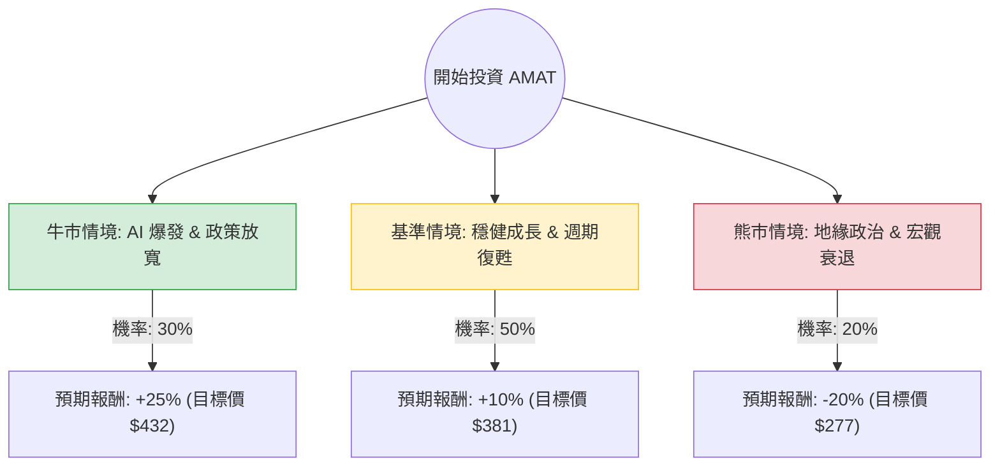

這份分析將結合您提供的基本面數據與最新的市場動態（如 AI 浪潮、半導體設備週期、地緣政治風險），利用**決策樹（Decision Tree）**與**期望值分析（Expected Value Analysis）**來評估 Applied Materials (AMAT) 的投資價值。

---

### 一、 核心假設與市場背景分析

在建立模型前，我們先整合基本面與外部資訊：

1.  **AI 驅動的高階需求（利多）**：AMAT 在「先進封裝」與「GAA（閘極全環）電晶體結構」技術領先。隨著 AI 晶片需求激增，台積電、三星、Intel 等大廠擴大資本支出，對 AMAT 的高階設備需求強勁。
2.  **中國市場風險（利空/不確定性）**：AMAT 約有 30-40% 的營收來自中國（主要是成熟製程）。美國商務部持續收緊出口管制，是最大的下行風險。
3.  **財務穩健度（利多）**：ROE 高達 38.86%，債務股本比僅 0.33，顯示公司獲利能力極強且財務結構健康。
4.  **估值水平**：目前 P/E 35.96，Forward P/E 25.18。雖然歷史估值偏高，但 PEG 1.39 顯示相對於盈餘成長性，估值尚屬合理。

---

### 二、 決策樹分析圖 (Decision Tree)

我們以未來 12 個月的投資回報為目標，設定三種主要情境：

---

### 三、 期望值計算過程

#### 1. 參數設定
*   **當前股價 ($P_0$):** $346.18 (參考您提供的數據)
*   **情境 A：牛市 (Bull Case)**
    *   **假設**：AI 需求超預期，且美國對中出口限制未進一步惡化。EPS 成長達到預期的上限。
    *   **預期股價**：參考 Target Price $416 並考慮溢價，設定為 $432.7 (約 +25%)。
    *   **機率**：30%
*   **情境 B：基準 (Base Case)**
    *   **假設**：半導體設備週期如期復甦，中國市場營收持平，AI 貢獻穩定。
    *   **預期股價**：$380.8 (約 +10%，接近 Forward P/E 隱含價值)。
    *   **機率**：50%
*   **情境 C：熊市 (Bear Case)**
    *   **假設**：美國發布更嚴厲的對中禁令，或全球經濟陷入衰退導致資本支出縮減。
    *   **預期股價**：$276.9 (約 -20%，回測 SMA200 支撐位)。
    *   **機率**：20%

#### 2. 期望值 (EV) 計算公式
$$EV = (P_{Bull} \times Prob_{Bull}) + (P_{Base} \times Prob_{Base}) + (P_{Bear} \times Prob_{Bear})$$

*   **計算**：
    *   $EV = (432.7 \times 0.3) + (380.8 \times 0.5) + (276.9 \times 0.2)$
    *   $EV = 129.81 + 190.4 + 55.38$
    *   **$EV = 375.59$**

#### 3. 預期報酬率
*   $Expected Return = (375.59 - 346.18) / 346.18 \approx \mathbf{8.5\%}$

---

### 四、 綜合評估與最終結論

#### 1. 核心數據支持
*   **成長動能**：EPS 下一年預計成長 26.42%，且 Q/Q 成長高達 75.25%，顯示短期動能極強。
*   **技術面**：股價目前在 SMA200 之上 (+49.91%)，顯示長期趨勢向上，但短期可能面臨 SMA20 的修正壓力。
*   **安全邊際**：雖然 P/E 較高，但強大的自由現金流 (P/FCF 44.98) 與低負債比提供了良好的抗風險能力。

#### 2. 投資判斷：**適合投資 (建議分批買入)**

#### 3. 理由總結：
1.  **期望值為正**：計算出的預期股價 $375.59 高於當前股價，且具備約 8.5% 的預期勝率。
2.  **AI 基礎設施的不可或缺性**：AMAT 是半導體製造的「軍火商」，無論是 NVIDIA 還是 AMD 獲勝，都需要 AMAT 的設備來生產晶片。
3.  **財務體質極佳**：ROE 38.8% 顯示其在產業中的壟斷地位與高議價能力。
4.  **風險提示**：由於目前股價距離 52 週高點較近，且 Perf Year 已達 138%，建議不要一次性歐印 (All-in)，應採取**定期定額**或**回檔至 SMA50 附近**再行加碼，以規避地緣政治突發消息帶來的波動。

**最終建議：** AMAT 是一間基本面極其強韌的公司，在 AI 長期趨勢下具備高度投資價值，目前的估值反映了成長預期，適合尋求中長期成長的投資者。