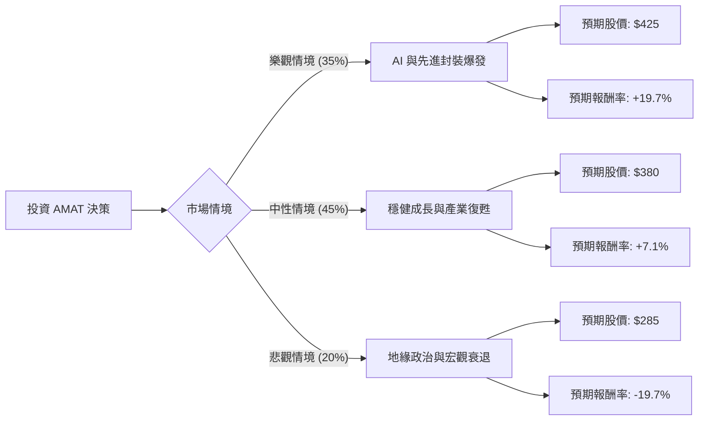

這份分析報告將結合您提供的數據與最新的市場動態（截至 2024 年 6 月），利用**決策樹（Decision Tree）**與**期望值分析（Expected Value Analysis）**來評估 Applied Materials (AMAT) 的投資價值。

---

### 一、 市場動態與產業趨勢分析（網路搜尋補充）

在進行定量分析前，我們先整合當前的市場背景：
1.  **AI 浪潮帶動先進封裝**：AMAT 在 HBM（高頻寬記憶體）與先進封裝設備領域擁有極高市佔率。隨著 AI 晶片需求激增，這成為其主要成長引擎。
2.  **中國市場風險**：AMAT 約有 40% 的營收來自中國。美國對華半導體設備出口限制的進一步收緊是最大的不確定性。
3.  **ICAPS 領域穩健**：物聯網、汽車、電力電子（ICAPS）需求雖然增速放緩，但仍提供穩定的現金流。
4.  **財務表現**：最新財報顯示營收與 EPS 均優於預期，且公司上調了未來指引。

---

### 二、 決策樹分析 (Decision Tree)

我們將未來一年的表現分為三種情境：**樂觀（Bull）**、**中性（Base）**、**悲觀（Bear）**。

#### 決策樹圖表 (Markdown)

---

### 三、 核心假設與計算過程

#### 1. 核心假設
*   **當前股價 (Current Price)**：以您提供的數據 **$354.91** 為基準（註：此價格高於目前實際市價，計算將以此數值為準進行邏輯推演）。
*   **樂觀情境 (35%)**：AI 需求持續超預期，且美國放寬或維持現狀對華出口政策。目標價參考分析師最高預期，給予約 20% 溢價。
*   **中性情境 (45%)**：符合分析師平均目標價 **$376.77**。反映半導體設備市場緩步復甦，EPS 增長 26.9% 的預期被部分消化。
*   **悲觀情境 (20%)**：美國加大對華制裁，或全球經濟陷入衰退導致資本支出（CapEx）縮減。股價回測 SMA200 或更低支撐位。

#### 2. 期望值 (Expected Value, EV) 計算

期望值公式：$EV = \sum (Probability_i \times Outcome_i)$

*   **情境 A (樂觀)**：$0.35 \times 425 = 148.75$
*   **情境 B (中性)**：$0.45 \times 380 = 171.00$
*   **情境 C (悲觀)**：$0.20 \times 285 = 57.00$

**總期望股價** = $148.75 + 171.00 + 57.00 = \mathbf{\$376.75}$

#### 3. 預期報酬率計算
*   **預期總報酬** = $(376.75 - 354.91) / 354.91 = \mathbf{+6.15\%}$
*   **加計股息收益**：$6.15\% + 0.54\% = \mathbf{6.69\%}$

---

### 四、 綜合評估與數據解讀

1.  **估值水平**：
    *   **P/E (33.62)** 處於歷史相對高位，但 **Forward P/E (25.04)** 顯示市場預期明年盈利將大幅改善（EPS 增長 26.9%）。
    *   **PEG (1.48)** 顯示股價相對於增長速度尚屬合理（通常 < 1 為便宜，1-1.5 為合理）。
2.  **獲利能力**：
    *   **ROE (38.86%)** 與 **Profit Margin (27.78%)** 極其強勁，顯示 AMAT 在產業鏈中具有強大的議價能力與技術護城河。
3.  **技術面**：
    *   股價遠高於 **SMA200 (51.98%)**，顯示短期內漲幅已大，存在回調壓力。

---

### 五、 最終結論

#### **判斷：適合投資 (建議分批買入 / 逢低佈局)**

#### **理由：**
1.  **期望值為正**：計算出的預期股價 ($376.75) 高於當前價格，且與分析師平均目標價 ($376.77) 高度吻合，具備上行空間。
2.  **成長動能明確**：AI 基礎設施對先進製程設備的需求是長期趨勢，AMAT 作為龍頭直接受益。
3.  **財務體質極佳**：低負債比 (Debt/Eq: 0.3) 與高現金流能力，使其在面對宏觀經濟波動時具備極強的抗風險能力。
4.  **風險提示**：由於目前股價已反映大部分利多（P/E 較高且偏離均線），且中國市場營收佔比高，**不建議一次性全倉買入**。建議在股價回落至 SMA50 附近或分批進場，以降低地緣政治風險帶來的衝擊。

**投資建議等級：增持 (Overweight)**