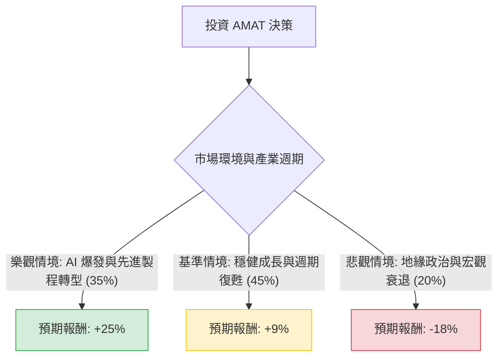

這份分析報告結合了您提供的基本面數據與最新的市場動態（截至 2024 年 6 月），利用**決策樹（Decision Tree）**與**期望值分析（Expected Value Analysis）**來評估 Applied Materials (AMAT) 的投資價值。

---

### 一、 核心假設與市場背景分析

在建立模型前，我們先整合基本面與外部資訊：

1.  **AI 浪潮與先進封裝（利多）**：AMAT 是半導體設備龍頭，受惠於 AI 晶片對先進製程（如 GAA 電晶體架構）與先進封裝（HBM 記憶體）的強勁需求。
2.  **中國市場風險（中性偏利空）**：AMAT 約有 40% 的營收來自中國。雖然目前成熟製程設備需求旺盛，但美國出口管制政策的進一步收緊是潛在威脅。
3.  **估值水平（中性）**：目前 P/E 約 40 倍，高於歷史平均，但 Forward P/E 降至 27.74，顯示市場預期明年 EPS 將有顯著增長（數據顯示 EPS next Y 成長 27.17%）。
4.  **財務體質（極強）**：ROE 38.86% 與低負債比（Debt/Eq 0.33）顯示其極佳的營運效率與抗風險能力。

---

### 二、 決策樹分析 (Decision Tree)

以下為 AMAT 未來一年的投資情境預測：

#### 節點詳細說明：

1.  **樂觀情境 (Bull Case) - 35% 機率**
    *   **描述**：AI 基礎設施需求超出預期，台積電、三星加速轉向 GAA 架構，帶動 AMAT 高毛利設備出貨。
    *   **預期報酬**：目標價上看 $485 (基於 Forward P/E 32x)。
    *   **期望值貢獻**：$0.35 \times 25\% = 8.75\%$

2.  **基準情境 (Base Case) - 45% 機率**
    *   **描述**：半導體設備市場緩步復甦，中國需求維持穩定，公司達到分析師預期的 $424.67 目標價。
    *   **預期報酬**：約 +9% (從目前 $390 附近起算)。
    *   **期望值貢獻**：$0.45 \times 9\% = 4.05\%$

3.  **悲觀情境 (Bear Case) - 20% 機率**
    *   **描述**：美國對華出口限制升級，或高利率環境導致科技股估值修正（P/E 回歸至 25x 以下）。
    *   **預期報酬**：目標價回落至 $320 附近。
    *   **期望值貢獻**：$0.20 \times (-18\%) = -3.6\%$

---

### 三、 期望值計算過程

我們將各情境的「機率」與「預期報酬」相乘後加總，得出整體期望報酬率：

$$EV = (P_{Bull} \times R_{Bull}) + (P_{Base} \times R_{Base}) + (P_{Bear} \times R_{Bear})$$

*   **計算**：
    *   $0.35 \times 0.25 = 0.0875$
    *   $0.45 \times 0.09 = 0.0405$
    *   $0.20 \times (-0.18) = -0.036$
*   **總計**：
    *   $0.0875 + 0.0405 - 0.036 = 0.092$
*   **最終期望報酬率 (Expected Return)**：**9.2%**

---

### 四、 最終結論與投資建議

#### **結論：適合投資 (謹慎看多)**

**判斷理由：**

1.  **正向期望值**：經過風險加權後的期望報酬率為 **9.2%**。雖然不是極高的爆發性成長，但在當前高估值環境下，仍屬穩健。
2.  **成長動能明確**：數據顯示 EPS 下一年度預期增長 **27.17%**，這將有效消化目前較高的 P/E。PEG 為 1.51，對於半導體龍頭而言處於合理區間。
3.  **護城河極深**：ROE (38.86%) 與 ROI (27.31%) 顯示 AMAT 在設備市場具有極強的定價權與技術壟斷力。
4.  **技術面支撐**：目前股價高於 SMA50 (9.41%) 與 SMA200 (51%)，顯示長期趨勢仍處於多頭排列。

**投資策略建議：**
*   **分批進場**：由於目前股價接近 52 週高點（僅差約 4%），且 P/E 偏高，建議不要一次性投入，可採取分批買進策略。
*   **關注風險點**：需密切關注美國商務部對半導體設備出口的最新政策，以及中國市場營收佔比的變化。若中國營收佔比因制裁大幅下滑，需重新修正「悲觀情境」的機率。

---
*免責聲明：本分析僅供參考，不構成任何投資建議。投資者應自行承擔市場風險。*