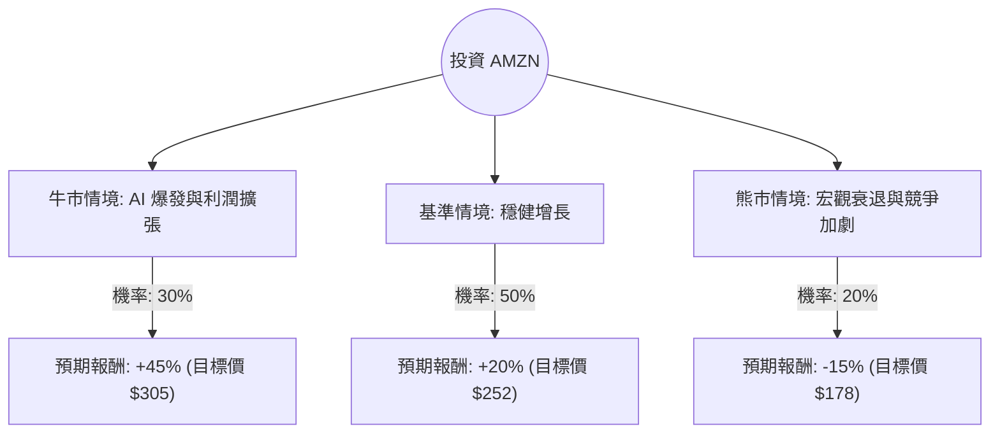

為了評估 Amazon (AMZN) 的投資價值，我結合了您提供的基本面數據以及最新的市場動態（包括 2024 年第三季財報表現、AWS 雲端業務進展及 AI 佈局）。

以下是基於**決策樹分析**與**期望值分析**的詳細評估報告。

---

### 一、 核心假設與市場背景分析

在建立模型前，我們先整合關鍵資訊：
1.  **AWS 與 AI 動能**：AWS 營收增長重新加速（約 19%），且公司大幅增加資本支出（預計 2024 年達 750 億美元）用於 AI 基礎設施。
2.  **零售利潤率改善**：透過物流網絡區域化，零售業務的營運利潤率持續提升。
3.  **估值水平**：目前 **Forward P/E 為 21.74**，相對於其歷史平均值及 EPS 成長率（EPS next Y: 21.24%）處於合理甚至偏低區間（PEG 1.18 顯示估值並未過度泡沫）。
4.  **技術面壓力**：數據顯示 SMA20/50/200 均為負值，短期股價處於修正或盤整階段，這通常是價值投資者的切入點。

---

### 二、 決策樹分析 (Decision Tree)

我們以 **12 個月** 為投資期限，設定三種情境：

#### 節點詳細說明：

1.  **牛市情境 (Bull Case) - 30% 機率**：
    *   **條件**：AWS 受 AI 需求驅動增長超過 22%；廣告業務持續高雙位數增長；零售利潤率突破歷史高點。
    *   **預期報酬**：基於 Target Price $280 並考慮超額增長，上調至 $305。
2.  **基準情境 (Base Case) - 50% 機率**：
    *   **條件**：AWS 穩定在 17-19% 增長；宏觀經濟軟著陸，消費者支出穩定。
    *   **預期報酬**：回歸分析師平均目標價 $252 - $280 區間（取保守值 $252）。
3.  **熊市情境 (Bear Case) - 20% 機率**：
    *   **條件**：美國經濟進入衰退導致雲端支出縮減；反壟斷法規限制增長；資本支出過高導致自由現金流（FCF）受壓。
    *   **預期報酬**：回測 52 週低點附近（約 $178）。

---

### 三、 期望值分析 (Expected Value Analysis)

#### 1. 計算過程
我們使用預期報酬率（Return %）來計算整體期望值：
*   **目前股價 (Current Price)**: $210.00

| 情境 | 預期股價 | 報酬率 (R) | 機率 (P) | P × R |
| :--- | :--- | :--- | :--- | :--- |
| **牛市** | $305 | +45.2% | 0.30 | 13.56% |
| **基準** | $252 | +20.0% | 0.50 | 10.00% |
| **熊市** | $178 | -15.2% | 0.20 | -3.04% |
| **總計** | - | - | **1.00** | **20.52%** |

#### 2. 期望值結果
*   **預期報酬率 (Expected Return)** = **20.52%**
*   **預期股價 (Expected Price)** = $210 × (1 + 20.52%) ≈ **$253.09**

---

### 四、 綜合評估與最終結論

#### 1. 財務數據支持點
*   **獲利能力強勁**：ROE 22.29% 與 ROA 10.77% 顯示資產利用效率極高。
*   **估值吸引力**：Forward P/E (21.74) 低於 Current P/E (28.55)，且 PEG 接近 1，代表股價尚未反映未來的盈利增長。
*   **營運效率**：Gross Margin 達 50.29%，這在零售與雲端混合模型中是非常優秀的表現。

#### 2. 風險提示
*   **短期趨勢**：SMA 指標全線為負，顯示短期內可能仍有下行壓力或震盪，不建議一次性重倉。
*   **現金流壓力**：P/FCF 高達 285.69，反映出目前公司將大量現金投入 AI 基礎設施建設，短期內分紅或回購的可能性極低。

#### 3. 最終判斷：**適合投資 (Suitable for Investment)**

**理由：**
1.  **正向期望值**：20.52% 的預期報酬率遠高於市場平均水準（S&P 500 長期平均約 8-10%）。
2.  **安全邊際**：目前股價 $210 距離分析師平均目標價 $280.58 有約 33% 的上漲空間。
3.  **AI 轉型成功**：AWS 的重新加速證明了 Amazon 在 AI 基礎設施競賽中的領先地位，這將是未來 3-5 年的核心增長引擎。
4.  **建議策略**：鑑於技術面（SMA）偏弱，建議採取**「分批買入（Dollar Cost Averaging）」**策略，以應對短期可能的市場波動，並長期持有以獲取 AI 與雲端業務增長的紅利。