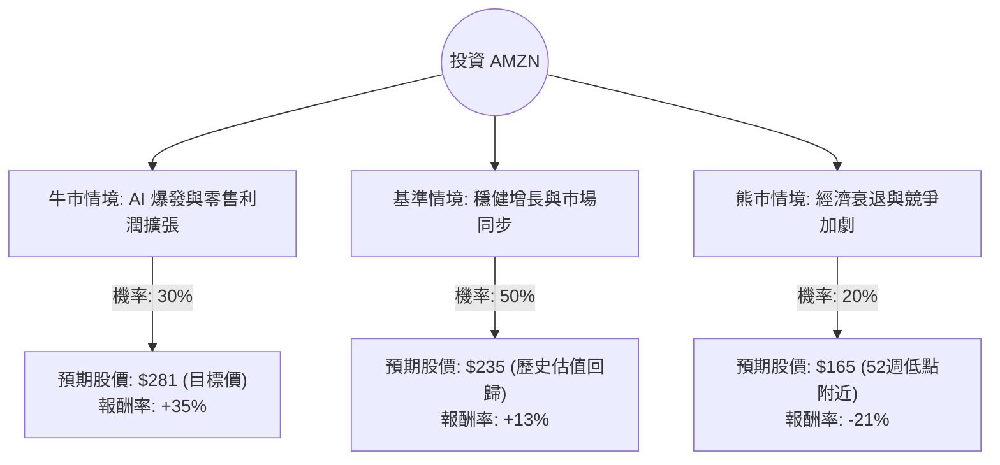

這份分析報告結合了您提供的基本面數據與最新的市場動態（包含 AWS 的 AI 發展、零售利潤率改善及宏觀經濟環境），利用**決策樹（Decision Tree）**與**期望值分析（Expected Value Analysis）**評估 Amazon (AMZN) 的投資價值。

---

### 一、 核心假設與市場背景分析

在構建決策樹前，我們基於最新資訊設定以下核心假設：

1.  **AWS 與 AI 增長（利多）**：AWS 目前是 Amazon 的利潤引擎。隨著企業對生成式 AI（如 Amazon Bedrock）的需求激增，AWS 營收增長率已回升至 19% 以上。
2.  **零售效率與廣告（利多）**：Amazon 成功優化了物流網絡（區域化配送），顯著提升了零售部門的營業利潤率。同時，高毛利的廣告業務持續以約 20% 的速度增長。
3.  **資本支出壓力（利空/風險）**：為了競爭 AI 市場，Amazon 大幅增加資本支出（CapEx），這可能短期內壓低自由現金流（P/FCF 目前高達 278，反映了高額再投資）。
4.  **宏觀經濟（中性/風險）**：利率環境雖趨於降息，但若美國消費支出因通膨殘餘而放緩，將直接影響 Amazon 的電商收入。

---

### 二、 決策樹分析 (Decision Tree)

以下決策樹模擬了未來 12 個月內 AMZN 可能面臨的三種主要情境：

#### 節點詳細說明：

1.  **牛市情境 (Bull Case) - 30% 機率**：
    *   **條件**：AWS AI 營收貢獻超預期；廣告業務市佔率大幅提升；零售利潤率突破歷史高點。
    *   **預期報酬**：參考分析師目標價 $281.42，較目前 $208.27 約有 **+35%** 的空間。

2.  **基準情境 (Base Case) - 50% 機率**：
    *   **條件**：AWS 維持 17-19% 的穩定增長；電商業務隨通膨降溫穩步回升；Forward P/E (21.11) 得到支撐。
    *   **預期報酬**：預估股價回升至 $235 左右（反映 EPS next Y 21.5% 的增長），報酬率約 **+13%**。

3.  **熊市情境 (Bear Case) - 20% 機率**：
    *   **條件**：美國經濟陷入硬著陸導致消費萎縮；AI 投資回報週期過長導致利潤受損；反壟斷法規干擾。
    *   **預期報酬**：股價回測支撐位 $165（接近 52W Low），報酬率約 **-21%**。

---

### 三、 期望值計算 (Expected Value Calculation)

我們將各情境的機率與預期報酬率相乘，得出整體的期望報酬率：

| 情境 | 機率 (P) | 預期報酬率 (R) | 加權期望值 (P * R) |
| :--- | :--- | :--- | :--- |
| **牛市** | 0.30 | +35% | +10.5% |
| **基準** | 0.50 | +13% | +6.5% |
| **熊市** | 0.20 | -21% | -4.2% |
| **總計** | **1.00** | | **+12.8%** |

**計算過程：**
$EV = (0.30 \times 35\%) + (0.50 \times 13\%) + (0.20 \times -21\%)$
$EV = 10.5\% + 6.5\% - 4.2\% = 12.8\%$

---

### 四、 綜合數據分析與補充

1.  **估值面**：
    *   **P/E (27.79)** 與 **Forward P/E (21.11)**：對於一家預期增長超過 20% 的科技巨頭來說，目前的估值處於合理甚至偏低區間（歷史上 AMZN 的 P/E 常年超過 50）。
    *   **PEG (1.17)**：接近 1.0，顯示股價與增長速度匹配，具備投資吸引力。
2.  **技術面**：
    *   數據顯示 SMA20, SMA50, SMA200 均為負值（-5% 到 -11%），這代表股價近期處於**回檔修正階段**。從逆向投資角度看，這通常是分批入場的機會，而非追高。
3.  **財務健康度**：
    *   **ROE (22.29%)** 與 **Debt/Eq (0.41)** 顯示公司獲利能力強且財務結構穩健。

---

### 五、 最終結論

**投資建議：適合投資 (Buy / Overweight)**

#### 理由：
1.  **正向期望值**：經風險加權後的預期報酬率為 **12.8%**，顯著高於無風險利率及市場平均預期。
2.  **估值優勢**：Forward P/E 僅 21 倍，對於擁有 AWS 這種高護城河業務的公司而言，目前的價格（$208）提供了良好的安全邊際。
3.  **增長動能明確**：AI 對雲端基礎設施的推動才剛開始，加上廣告業務的利潤貢獻，Amazon 的獲利結構正在從「低毛利零售」轉向「高毛利服務」。
4.  **技術面回檔提供買點**：目前股價低於 SMA200 約 11%，顯示市場情緒近期過於悲觀，基本面並未惡化，是典型的「優質股回調」。

**風險提示：**
*   需密切關注 **P/FCF (278.09)**，這反映了公司目前將大量現金投入基礎設施，若未來幾季 AWS 增長放緩，市場可能會質疑其投資效率。
*   建議採取**分批進場**策略，以應對短期內可能的宏觀波動。