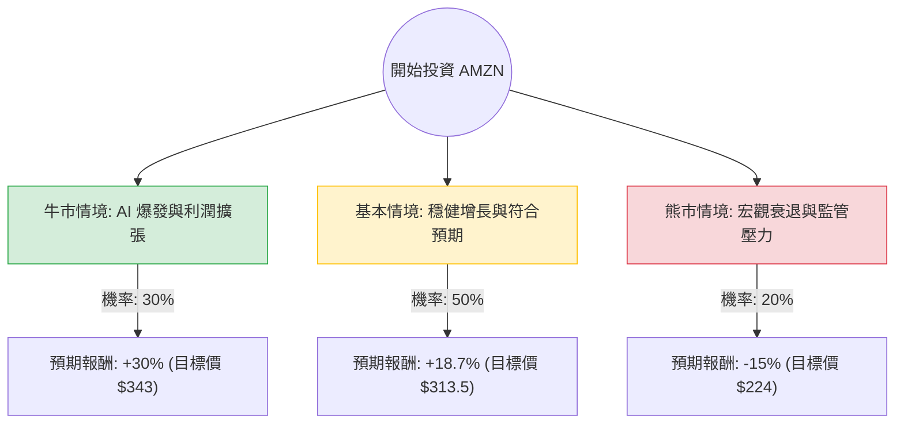

針對亞馬遜（AMZN）的投資評估，我結合了您提供的基本面數據以及最新的市場動態（包含 AWS 雲端增長、AI 佈局及零售利潤率優化）進行分析。

以下是基於**決策樹分析（Decision Tree）**與**期望值分析（Expected Value Analysis）**的詳細報告。

---

### 一、 核心假設與市場背景分析

在構建決策樹前，我們先設定三個核心維度的假設：

1.  **AWS 與 AI 增長（權重最高）**：AWS 目前是 Amazon 的獲利引擎。隨著企業對生成式 AI（如 Amazon Bedrock）的需求增加，AWS 營收增長率若能維持在 19% 以上，將帶動估值上修。
2.  **零售利潤率優化**：Amazon 透過區域化配送網絡降低了物流成本。營運利潤率（Oper. Margin）目前為 12.14%，若能持續提升，將顯著改善 EPS。
3.  **宏觀經濟與監管風險**：聯準會利率政策影響消費支出，且 FTC 的反壟斷訴訟仍是潛在的下行風險。

---

### 二、 亞馬遜（AMZN）投資決策樹

我們以 **12 個月持有期**為基準，預測三種情境：

#### 決策樹節點詳細說明：

| 情境節點 | 機率 (P) | 預期報酬 (R) | 關鍵觸發因素 |
| :--- | :--- | :--- | :--- |
| **牛市情境 (Bull Case)** | 30% | **+30%** | AWS 增長超預期（>20%），AI 晶片（Trainium）大幅降低成本，廣告業務持續高增長。 |
| **基本情境 (Base Case)** | 50% | **+18.7%** | 達到分析師平均目標價 $313.55。零售業務利潤穩定，AWS 隨產業趨勢穩健增長。 |
| **熊市情境 (Bear Case)** | 20% | **-15%** | 美國消費支出疲軟，FTC 訴訟導致業務拆分風險增加，AI 投入成本過高但回收緩慢。 |

---

### 三、 期望值（Expected Value）計算過程

我們根據上述機率與報酬率計算總體期望報酬率：

**計算公式：**
$$EV = (P_{Bull} \times R_{Bull}) + (P_{Base} \times R_{Base}) + (P_{Bear} \times R_{Bear})$$

**計算步驟：**
1.  **牛市貢獻**：$0.30 \times 30\% = 9.0\%$
2.  **基本情境貢獻**：$0.50 \times 18.7\% = 9.35\%$
3.  **熊市貢獻**：$0.20 \times (-15\%) = -3.0\%$

**總期望報酬率 (Total EV)：**
$$9.0\% + 9.35\% - 3.0\% = \mathbf{15.35\%}$$

---

### 四、 基本面數據補充分析

*   **估值合理性**：目前 **Forward P/E 為 26.17**，對比其歷史平均值處於相對低位。**PEG 為 1.2**，顯示相對於其 EPS 增長速度（EPS Q/Q 達 75.33%），目前的股價並未過度泡沫。
*   **獲利能力**：**ROE (24.28%)** 與 **Gross Margin (50.6%)** 表現極其強勁，顯示公司在電商與雲端領域擁有極高的競爭護城河。
*   **技術面**：股價目前在 **SMA200 (+14.58%)** 之上，顯示長期趨勢偏多；短期 **SMA20 (-0.61%)** 顯示近期處於小幅拉回的盤整期，是較佳的切入點。

---

### 五、 最終結論

#### **判斷：適合投資 (Buy / Overweight)**

**理由如下：**

1.  **正向期望值**：經過風險加權後的期望報酬率為 **15.35%**，顯著高於市場平均預期報酬。
2.  **增長引擎明確**：AWS 的 AI 轉型已進入收割期，且廣告業務（高毛利）已成為第三大支柱，能有效抵禦零售端波動。
3.  **財務體質穩健**：Debt/Eq 僅 0.51，現金流充裕，足以支撐其在 AI 基礎設施上的資本支出。
4.  **風險可控**：雖然有監管風險，但 Amazon 的業務多元化（雲端、廣告、物流、訂閱）使其具備極強的抗風險能力。

**建議操作策略：**
目前股價 $264.14 距離分析師目標價 $313.55 仍有約 18% 的上漲空間。建議可在當前價格分批佈局，若股價回測 SMA50（約 $237 附近）可加大配置。