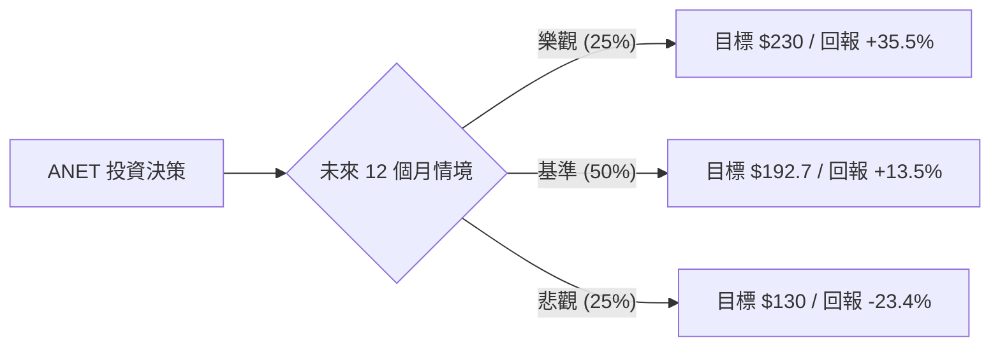

# Arista Networks (ANET) 量化投資分析報告

作為量化投資分析師，針對 Arista Networks (ANET) 的當前數據與市場動態，我將透過機率思考框架，拆解其未來 12 個月的期望值 (Expected Value, EV) 表現。

---

### 1. 核心驅動因素與風險 (Drivers & Risks)

#### **關鍵催化劑 (Catalysts)**
1.  **AI 乙太網路 (Ethernet) 對 InfiniBand 的替代效應**：隨著 AI 算力需求從單一 GPU 擴展至大規模集群，市場正從 Nvidia 壟斷的 InfiniBand 轉向更具開放性與擴展性的乙太網路。Arista 作為乙太網路交換機龍頭，其 **Etherlink** 產品線與 **Ultra Ethernet Consortium (UEC)** 標準的推進，將是 2024-2025 年營收超預期的核心動力。
2.  **雲端巨頭 (Cloud Titans) 資本支出回升**：Meta 與 Microsoft 是 ANET 的最大客戶（合計營收佔比約 40%+）。根據最新財報，這兩家公司均上修了 2024 年 AI 基礎設施的資本支出預期，這將直接轉化為 ANET 高階交換機的訂單。
3.  **企業級園區網路 (Enterprise Campus) 的市佔擴張**：ANET 正利用其在資料中心積累的軟體優勢（EOS 系統）切入企業園區市場，挑戰 Cisco 的傳統領地，提供第二增長曲線。

#### **主要風險點 (Risks)**
1.  **Nvidia Spectrum-X 的競爭壓力**：Nvidia 推出的 Spectrum-X 乙太網路平台旨在垂直整合其 GPU 與網路設備，若 Nvidia 透過綑綁銷售策略強攻市場，可能壓縮 ANET 在 AI 後端網路的增長空間。
2.  **估值倍數壓縮 (Valuation Compression)**：目前 P/E 高達 57.38x，遠高於行業平均。若營收增速無法維持在 30% 以上，市場可能下修其估值倍數至 Forward P/E 30x 左右。
3.  **供應鏈與庫存正常化**：過去兩年的缺貨導致客戶過度下單，隨著交期縮短，需警惕客戶進入庫存去化期導致的訂單短暫真空。

---

### 2. 情境設定與機率賦予 (Scenario Modeling)

基於目前 $169.71 的股價與 192.7 的目標價，設定以下三種互斥且窮盡的情境：

#### **樂觀情境 (Bull Case)**
*   **發生條件**：AI 網路需求爆發，乙太網路在 AI 後端市場滲透率超過 40%；Meta/MSFT 訂單量超預期 20% 以上；毛利率維持在 64% 以上。
*   **預估機率**：**25%**
*   **目標價格與預期回報**：**$230 (+35.5%)**。基於 Forward P/E 45x 與 EPS 超預期增長。

#### **基準情境 (Base Case)**
*   **發生條件**：符合目前市場共識，AI 業務穩健增長，抵消傳統雲端業務的平穩期；企業級市場緩步擴張。
*   **預估機率**：**50%**
*   **目標價格與預期回報**：**$192.7 (+13.5%)**。即分析師平均目標價，反映 Forward P/E 37x。

#### **悲觀情境 (Bear Case)**
*   **發生條件**：Nvidia 競爭導致市佔流失；宏觀經濟衰退導致企業縮減 IT 支出；估值回歸至歷史均值。
*   **預估機率**：**25%**
*   **目標價格與預期回報**：**$130 (-23.4%)**。回測 SMA200 支撐位，反映 Forward P/E 25x 的安全邊際。

---

### 3. 期望值計算與決策樹 (EV Calculation & Decision Tree)

#### **決策樹結構**

#### **總期望值計算**
*   `EV = (0.25 * 35.5%) + (0.50 * 13.5%) + (0.25 * -23.4%)`
*   `EV = 8.875% + 6.75% - 5.85%`
*   **`EV = 9.775%`**

#### **風險回報比分析**
*   **上行潛力 (Upside)**：相較於基準情境有 13.5%~35.5% 的空間。
*   **下行風險 (Downside)**：約 -23.4%。
*   **不對稱性**：期望值為正（~9.78%），且在 AI 基礎設施建設的強週期下，上行機率與空間略大於下行，具備配置價值。

---

### 4. 決策總結 (Decision Summary)

| 情境 | 發生機率 (%) | 預期報酬率 (%) | 關鍵驅動/觸發因素 |
| :--- | :--- | :--- | :--- |
| **樂觀 (Bull)** | 25% | +35.5% | AI 乙太網路標準確立，營收增速 >40% |
| **基準 (Base)** | 50% | +13.5% | 雲端巨頭資本支出符合預期，維持龍頭地位 |
| **悲觀 (Bear)** | 25% | -23.4% | Nvidia 競爭加劇，估值倍數大幅修正 |
| **整體期望值** | **100%** | **+9.78%** | **具備正向期望值的成長股配置** |

**最終結論：**
1. **投資建議**：**買入 (Buy)**
2. **核心邏輯**：ANET 擁有極佳的財務體質（Debt/Eq 為 0，ROE 31.5%），且正處於 AI 網路架構轉型的甜蜜點。雖然 57x 的 P/E 偏高，但 9.78% 的正期望值顯示，即便考慮了 25% 的悲觀修正風險，該標的在機率分布上仍對多頭有利。
3. **風控建議**：若股價跌破 **$151 (SMA200 附近)** 或 **季度毛利率連續兩季下滑**，顯示競爭格局惡化，應視為進入悲觀情境的訊號，建議執行減碼或止損。【結束指令】