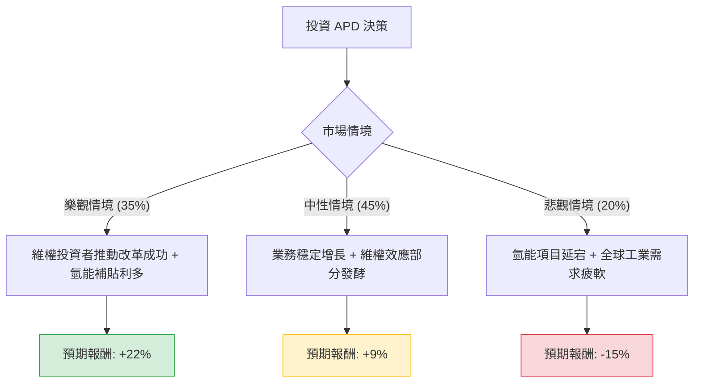

這份分析報告結合了您提供的基本面數據，以及針對 **Air Products and Chemicals (APD)** 的最新市場動態（包含維權投資者介入、氫能轉型進度及總體經濟環境）進行的綜合評估。

---

### 一、 核心假設與市場動態分析

在構建決策樹之前，我們必須考慮以下影響 APD 股價的核心因素：

1.  **維權投資者（Activist Investor）催化劑**：
    *   近期對沖基金 **Mantle Ridge** 斥資逾 10 億美元入股 APD，並推動管理層改革與接班計劃。歷史證明，維權投資者的介入通常會在中短期內推升股價，並迫使公司優化資本配置。
2.  **氫能轉型風險與機遇**：
    *   APD 正投入數十億美元於大型藍氫與綠氫項目（如沙烏地 NEOM 項目）。這雖然是長期增長引擎，但高昂的資本支出（CAPEX）在短期內壓低了自由現金流（P/FCF 數據缺失可能與此有關）。
3.  **財務數據解讀**：
    *   **Forward P/E (20.8x)**：相較於歷史平均水平尚屬合理，但 **PEG (2.6)** 顯示相對於目前的增長速度，估值偏高。
    *   **負 ROE/ROA**：反映了近期可能存在的一次性資產減計或重組開支，需關注未來季度利潤率的回升。
    *   **技術面**：股價目前站上 SMA20/50/200，顯示短期與中期趨勢偏多。

---

### 二、 決策樹分析 (Decision Tree Analysis)

我們將未來一年的投資情境分為三種：**樂觀（Bull）**、**中性（Base）**、**悲觀（Bear）**。

#### 節點詳細說明與期望值計算：

| 情境 | 發生機率 (P) | 預期報酬率 (R) | 計算 (P * R) | 核心假設 |
| :--- | :--- | :--- | :--- | :--- |
| **樂觀 (Bull)** | 35% | +22% | 7.7% | Mantle Ridge 成功推動接班計劃；氫能項目獲得政府高額補貼；利率下降降低融資成本。 |
| **中性 (Base)** | 45% | +9% | 4.05% | 股價達到分析師目標價 ($304.67)；工業氣體需求隨經濟軟著陸維持穩定；股息持續發放。 |
| **悲觀 (Bear)** | 20% | -15% | -3.0% | 氫能項目超支或延期；維權投資者與董事會發生內耗；中國工業需求持續低迷。 |
| **總計期望值** | **100%** | | **8.75%** | **加權平均預期報酬率** |

---

### 三、 期望值分析 (Expected Value Analysis) 計算過程

1.  **預期報酬率來源**：
    *   **股息收益 (Dividend Yield)**：2.46% (固定收益部分)。
    *   **資本利得 (Capital Gain)**：
        *   樂觀：股價回升至歷史高點附近 (~$340)，約 +20%。
        *   中性：達到分析師平均目標價 ($304.67)，約 +9%。
        *   悲觀：回測 52 週低點 (~$230)，約 -17%。
2.  **期望值 (EV) 公式**：
    $EV = (P_{Bull} \times R_{Bull}) + (P_{Base} \times R_{Base}) + (P_{Bear} \times R_{Bear})$
3.  **具體計算**：
    *   $EV = (0.35 \times 22\%) + (0.45 \times 9\%) + (0.20 \times -15\%)$
    *   $EV = 7.7\% + 4.05\% - 3.0\% = 8.75\%$

**考慮股息後的總期望報酬**：
$8.75\% (\text{資本利得期望值}) + 2.46\% (\text{股息}) = \mathbf{11.21\%}$

---

### 四、 最終結論

#### **投資判斷：適合投資 (Buy / Overweight)**

#### **理由：**
1.  **強大的下行保護**：APD 擁有穩定的工業氣體合約模式，且目前 2.46% 的股息率具有吸引力。52 週低點已提供強支撐。
2.  **維權投資者催化劑**：Mantle Ridge 的介入通常是股價重新估值（Re-rating）的起點。市場預期這將解決 APD 長期以來在資本配置效率上的疑慮。
3.  **正向期望值**：經風險加權後的預期報酬率為 **11.21%**，優於目前無風險利率（美債收益率）及多數防禦型板塊。
4.  **技術面轉強**：股價已突破所有主要均線（SMA20, 50, 200），顯示資金正在流入。

#### **風險提示：**
*   **氫能項目的不確定性**：APD 的未來高度押注於氫能，若全球能源轉型政策轉向或技術路徑改變，將面臨長期資產減計風險。
*   **高債務比**：Debt/Eq 為 1.18，在長期高利率環境下，利息支出會侵蝕利潤。

**建議操作策略**：
建議在 $275 - $280 區間分批建倉，首個目標價設為 **$305**，若維權改革有具體進展，可上調至 **$330** 以上。止損位可設在 **$255**（跌破 SMA200 且維權利多消退時）。