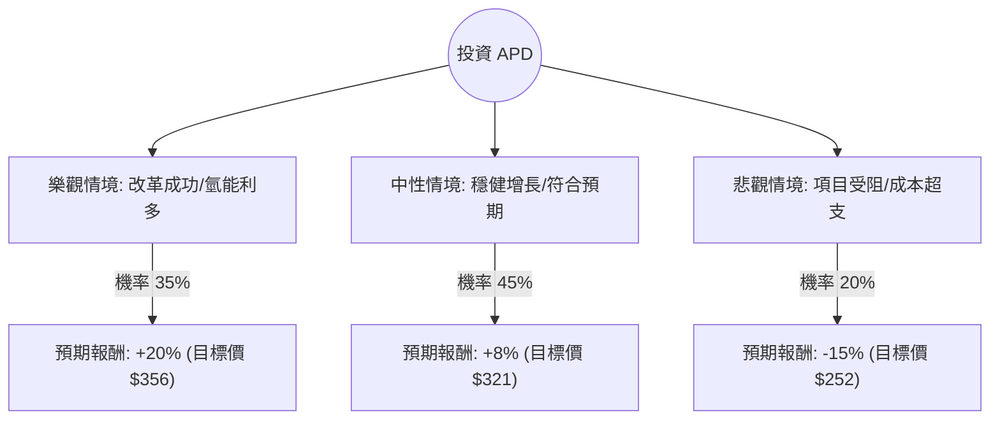

這份分析報告將結合您提供的基本面數據，以及最新的市場動態（特別是近期激進投資者的介入與氫能轉型進度），利用**決策樹（Decision Tree）**與**期望值分析（Expected Value Analysis）**評估 Air Products and Chemicals (APD) 的投資價值。

---

### 1. 最新市場動態與背景分析 (Web Search Summary)

在進行定量分析前，我們先整合最新的外部資訊：
*   **激進投資者介入（核心催化劑）：** 知名激進對沖基金 **Mantle Ridge** 與 **D.E. Shaw** 近期大量持股 APD。Mantle Ridge 正在推動公司進行管理層接班計劃改革及優化資本配置（特別是針對大型氫能項目的資本支出風險）。
*   **氫能轉型風險與機遇：** APD 正投入數十億美元於沙烏地阿拉伯 NEOM 綠氫項目及路易斯安那州藍氫項目。市場對其長期回報持樂觀態度，但短期內龐大的資本支出（CapEx）對現金流造成壓力。
*   **財務狀況：** 雖然數據顯示近期 ROE 為負（受一次性減值或會計調整影響），但 **Forward P/E 為 21.14**，顯示市場預期明年獲利將回升。股息率 2.42% 具備吸引力。
*   **技術面：** 目前股價接近 52 週高點，且位於 SMA20/50/200 均線之上，呈現強勢多頭排列。

---

### 2. 決策樹分析 (Decision Tree)

我們將未來一年的投資情境分為三種：**樂觀（激進投資者成功推動改革）**、**中性（維持現狀/穩健增長）**、**悲觀（氫能項目延宕或宏觀衰退）**。

#### 節點詳細說明：

1.  **樂觀情境 (35%)**：
    *   **假設**：Mantle Ridge 成功推動接班計劃，市場信心大增；NEOM 項目進度超前；通膨下降導致融資成本減輕。
    *   **預期報酬**：股價突破歷史高點，加上 2.4% 股息，總回報約 20%。
2.  **中性情境 (45%)**：
    *   **假設**：公司維持現有策略，激進投資者與管理層達成和解；工業氣體核心業務隨經濟復甦穩健增長。
    *   **預期報酬**：達到分析師平均目標價 ($316.79)，加上股息，總回報約 8-9%。
3.  **悲觀情境 (20%)**：
    *   **假設**：大型氫能項目出現重大成本超支或技術故障；高利率環境持續更久，壓制高資本支出企業的估值。
    *   **預期報酬**：股價回測 SMA200 支撐位或更低，總回報約 -15%。

---

### 3. 期望值計算 (Expected Value Calculation)

我們根據上述情境與機率計算一年期的預期收益率（Expected Return, ER）：

**計算公式：**
$$ER = \sum (Probability_i \times Return_i)$$

**計算過程：**
*   **樂觀情境貢獻**：$0.35 \times 20\% = 7.0\%$
*   **中性情境貢獻**：$0.45 \times 8\% = 3.6\%$
*   **悲觀情境貢獻**：$0.20 \times (-15\%) = -3.0\%$

**總期望值 (EV)：**
$$7.0\% + 3.6\% - 3.0\% = 7.6\%$$

---

### 4. 核心假設與風險評估

*   **市場假設**：假設未來 12 個月美國經濟不會陷入深度衰退，工業氣體需求保持穩定。
*   **財務假設**：Forward P/E 21.14 倍被視為合理估值區間（歷史均值約 20-25 倍）。
*   **產業趨勢**：全球脫碳趨勢（Decarbonization）持續，氫能作為長期能源轉型核心的地位不變。
*   **關鍵風險**：
    *   **債務壓力**：Debt/Eq 為 1.18，在高利率環境下，利息支出可能侵蝕利潤。
    *   **內部人交易**：數據顯示 Insider Trans 為 -6.83%，需留意內部人減持信號。

---

### 5. 最終結論

#### **判斷：適合投資 (建議分批買入)**

**理由：**
1.  **期望值為正 (7.6%)**：雖然 7.6% 的預期報酬不算極高，但考慮到 APD 作為工業氣體巨頭的護城河與穩定的股息（2.42%），其風險調整後的收益具備吸引力。
2.  **激進投資者催化劑**：Mantle Ridge 的介入通常是股價重估（Re-rating）的強大動力，這為股價提供了額外的「安全邊際」與上行潛力。
3.  **技術面強勢**：股價站穩所有均線之上，且 Sales Q/Q (5.8%) 與 EPS Q/Q (9.85%) 顯示基本面正在改善。
4.  **估值合理**：Forward P/E 21.14 處於歷史合理區間，並未過度泡沫化。

**操作建議：**
由於目前股價接近 52 週高點 ($297.24 vs $301.25)，建議投資者**不要一次性追高**。可先建立 50% 的觀察倉位，若股價回調至 SMA50 (約 $285 附近) 或激進投資者有更具體的改革方案釋出時，再行加碼。