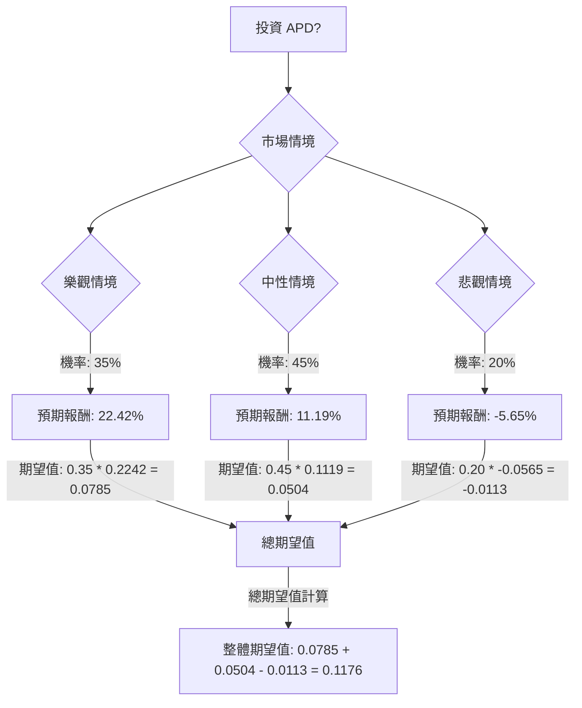

根據對美股公司 Air Products and Chemicals (APD) 的基本面數據、最新市場資訊、財報、產業趨勢以及分析師評級的綜合評估，以下將運用決策樹分析與期望值分析來判斷其目前是否適合投資。

### 核心假設

在進行決策樹分析前，我們建立以下核心假設：

*   **市場趨勢：** 全球工業氣體市場預計在 2026 年至 2034 年間以 4.96% 至 5.95% 的複合年增長率 (CAGR) 持續增長，主要受製造業、醫療保健、化工、金屬加工和能源等行業的需求推動。 氫氣和清潔能源解決方案的需求將成為 APD 的重要增長動力。
*   **財務表現：** 假設 APD 能夠實現其 2026 財年調整後每股收益 (EPS) 預期，即 $12.85 至 $13.15 之間。 2025 財年的 GAAP 虧損主要歸因於一次性費用，不代表持續的營運問題。
*   **公司營運：** APD 的重大策略性項目（如 NEOM 綠氫項目和低排放氨項目）將大致按計劃推進，並在未來貢獻收益。 成本控制和營運效率措施將產生積極成果。 公司將維持其穩定的股息政策。
*   **分析師預期：** 分析師的目標價範圍為未來股價提供了合理的參考區間。

### 決策樹分析

我們將考慮三種情境：樂觀、中性、悲觀，並為每種情境分配機率和預期報酬。

**當前股價 (P0)：** $267.25
**年度股息 (D)：** $1.79 (每季) * 4 = $7.16
**股息收益率：** $7.16 / $267.25 = 2.68%

#### 1. 樂觀情境 (Bullish Scenario)

*   **情境描述：** APD 成功執行轉型策略，新項目（特別是氫氣/氨氣項目）按計劃上線並顯著貢獻收益，工業氣體需求強勁，成本控制有效。分析師情緒進一步改善。
*   **預期股價 (P1)：** 假設股價達到分析師目標價的高端，例如 $320.00 (在 $245.00 至 $345.00 的範圍內)。
*   **股價升值：** ($320.00 - $267.25) / $267.25 = 19.74%
*   **預期報酬：** 股價升值 + 股息收益率 = 19.74% + 2.68% = 22.42%
*   **機率 (Probability)：** 35%

#### 2. 中性情境 (Neutral Scenario)

*   **情境描述：** APD 實現其 2026 財年 EPS 指導，但面臨一些溫和的逆風（例如，持續的氦氣市場挑戰、部分項目輕微延遲、全球經濟適度增長）。股價趨向分析師的平均目標價。
*   **預期股價 (P1)：** 假設股價達到分析師的平均目標價，例如 $290.00 (中位數目標價)。
*   **股價升值：** ($290.00 - $267.25) / $267.25 = 8.51%
*   **預期報酬：** 股價升值 + 股息收益率 = 8.51% + 2.68% = 11.19%
*   **機率 (Probability)：** 45%

#### 3. 悲觀情境 (Bearish Scenario)

*   **情境描述：** 發生重大項目延遲或取消（例如德州綠氫項目取消的影響），工業氣體需求弱於預期，競爭加劇，或宏觀經濟下行對收益產生負面影響。氦氣市場逆風持續或惡化。
*   **預期股價 (P1)：** 假設股價跌至分析師目標價的低端，例如 $245.00。
*   **股價升值：** ($245.00 - $267.25) / $267.25 = -8.33%
*   **預期報酬：** 股價升值 + 股息收益率 = -8.33% + 2.68% = -5.65%
*   **機率 (Probability)：** 20%

---

### 決策樹圖 (Markdown)

### 計算過程

1.  **樂觀情境期望值：**
    *   預期報酬 = 22.42%
    *   機率 = 35%
    *   期望值 = 0.35 * 0.2242 = 0.07847 ≈ 0.0785

2.  **中性情境期望值：**
    *   預期報酬 = 11.19%
    *   機率 = 45%
    *   期望值 = 0.45 * 0.1119 = 0.050355 ≈ 0.0504

3.  **悲觀情境期望值：**
    *   預期報酬 = -5.65%
    *   機率 = 20%
    *   期望值 = 0.20 * -0.0565 = -0.0113

4.  **整體期望值：**
    *   整體期望值 = 樂觀情境期望值 + 中性情境期望值 + 悲觀情境期望值
    *   整體期望值 = 0.0785 + 0.0504 - 0.0113 = 0.1176

### 最終結論

根據上述決策樹分析和期望值計算，投資 APD 的**整體期望值為 11.76%**。

**判斷：適合投資**

**理由：**
儘管 APD 在 2025 財年因一次性費用導致 GAAP 收益為負，且面臨氦氣市場逆風和國際業務風險，但其 2026 財年調整後 EPS 預期顯示出穩健的增長前景 (7-9%)。 工業氣體市場的持續擴張，特別是在清潔能源（氫氣、低排放氨）和先進製造領域的需求增長，為 APD 提供了結構性增長機會。 公司在產品品質和定價方面相對於競爭對手表現良好。

分析師普遍給予「買入」或「適度買入」評級，平均目標價顯示出約 5.88% 至 10.3% 的潛在上漲空間。 此外，APD 擁有長達 56 年的穩定股息支付歷史，且 2026 財年的股息支付率預計在 50% 左右，顯示其股息安全。

綜合來看，11.76% 的正向整體期望值表明，在考慮了潛在的樂觀、中性和悲觀情境及其相應機率後，投資 APD 預計能帶來正向回報。因此，目前 APD 適合投資。