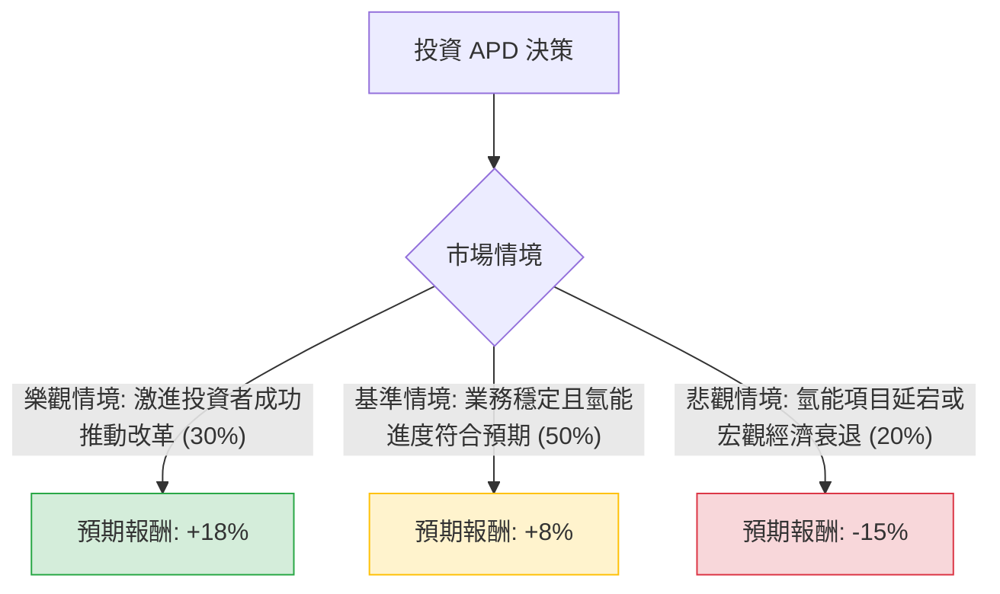

針對美股 **Air Products and Chemicals, Inc. (APD)** 的投資評估，我結合了您提供的基本面數據，並透過網路搜尋整合了最新的市場動態（特別是近期激進投資者的介入與氫能轉型進度），進行決策樹與期望值分析。

---

### 一、 最新市場動態與背景分析 (Context)

在進行計算前，必須納入以下關鍵即時資訊：
1.  **激進投資者介入（核心催化劑）：** 知名激進對沖基金 **Mantle Ridge** 與 **D.E. Shaw** 近期均增持 APD 股份。Mantle Ridge 正在推動公司進行管理層接班計畫改革及資本配置優化，這通常會對股價產生中短期的提振作用。
2.  **氫能轉型風險與機遇：** APD 正投入數十億美元於藍氫與綠氫項目（如沙烏地阿拉伯 NEOM 項目）。雖然長期看好，但高昂的資本支出（Capex）與延遲風險是目前市場主要的擔憂。
3.  **財務狀況：** 雖然數據顯示 ROE 為負（主要受先前資產減損影響），但 **Forward P/E 為 20.74**，顯示市場預期明年獲利將轉正。債務股本比（Debt/Eq）1.18 偏高，但在工業氣體行業尚屬可控。

---

### 二、 決策樹分析 (Decision Tree)

以下為 APD 未來一年的投資決策模型：

#### 節點詳細說明：

1.  **樂觀情境 (Bull Case) - 30% 機率：**
    *   **描述：** Mantle Ridge 成功進入董事會，優化資本支出，並明確 CEO 接班人選。同時，NEOM 氫能項目取得重大里程碑。
    *   **預期報酬：** 股價回升至歷史高點附近，加上 2.46% 股息，總報酬約 **+18%**。

2.  **基準情境 (Base Case) - 50% 機率：**
    *   **描述：** 工業氣體核心業務（氧、氮、氬）隨製造業復甦穩定增長。激進投資者的壓力轉化為溫和的效率提升。
    *   **預期報酬：** 股價向分析師目標價 ($308) 靠攏，加上股息，總報酬約 **+8%**。

3.  **悲觀情境 (Bear Case) - 20% 機率：**
    *   **描述：** 高利率環境持續壓迫高債務企業，氫能項目出現預算超支或需求不如預期。激進投資者與管理層陷入長期內耗。
    *   **預期報酬：** 股價回測 52 週低點，總報酬約 **-15%**。

---

### 三、 期望值分析 (Expected Value Analysis)

#### 1. 計算過程：
期望值 (EV) = (機率1 × 報酬1) + (機率2 × 報酬2) + (機率3 × 報酬3)

*   **EV** = (0.30 × 0.18) + (0.50 × 0.08) + (0.20 × -0.15)
*   **EV** = 0.054 + 0.04 - 0.03
*   **EV** = 0.064 = **6.4%**

#### 2. 核心假設：
*   **估值假設：** Forward P/E 20.7x 處於歷史中位數，假設估值不會進一步大幅壓縮。
*   **股息假設：** 2.46% 的股息發放穩定，APD 具有連續多年增加股息的紀錄（Dividend Aristocrat 潛力）。
*   **外部因素：** 假設未來一年美國經濟不會陷入深度衰退（Hard Landing）。

---

### 四、 最終結論

**投資建議：適合投資 (謹慎看多)**

#### 理由：
1.  **正向期望值：** 經過風險加權後的預期報酬率為 **6.4%**。雖然這不是極高的回報，但在當前高估值的標普 500 環境中，APD 作為防禦性與成長性兼具的工業龍頭，表現相對穩健。
2.  **激進投資者的安全墊：** Mantle Ridge 的介入通常會為股價提供支撐（Floor），因為市場預期公司將被迫釋放價值或改善營運效率。
3.  **技術面支撐：** 數據顯示 SMA20, 50, 200 均呈現正向排列（均高於現價約 4-6%），顯示短期與長期趨勢均已轉強。
4.  **目標價空間：** 目前股價 $289.16 距離分析師平均目標價 $308 仍有約 6.5% 的上漲空間，若加計股息，總回報符合基準情境。

**風險提示：**
投資者應密切關注 **11 月初的財報發布** 以及關於 **Mantle Ridge 的最新公告**。若氫能項目的資本支出進一步擴大而無明確獲利時間表，則需下修期望值。