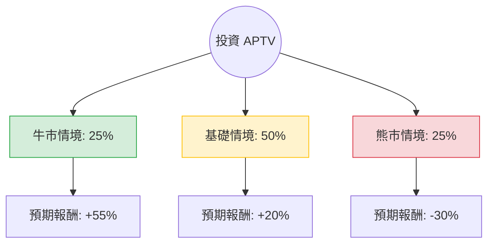

針對美股 **Aptiv PLC (APTV)** 的投資評估，我結合了您提供的財務數據與最新的市場動態（包含 2024 年第三季財報與產業趨勢），進行了決策樹與期望值分析。

---

### 一、 最新市場動態與背景分析 (Web Search Summary)

1.  **財報表現 (Q3 2024)**：Aptiv 最近的財報顯示，儘管全球汽車產量疲軟，但其調整後每股收益 (EPS) 超出預期。公司透過**股票回購**（今年已回購約 11 億美元）和**成本削減**來抵消營收增長放緩的壓力。
2.  **產業趨勢**：
    *   **EV 轉型放緩**：全球電動車 (EV) 需求增速低於預期，導致福特、通用等主要客戶縮減 EV 計劃，這對 Aptiv 的「信號與電源解決方案」部門造成壓力。
    *   **軟體定義汽車 (SDV)**：長期趨勢仍看好，Aptiv 在車用電子架構與自動駕駛軟體（如 Wind River）具備領先地位。
3.  **風險因素**：
    *   **Motional 減資**：Aptiv 已停止對自動駕駛合資公司 Motional 的進一步注資，以減少現金流損耗，這在短期內對利潤率有利，但反映了自動駕駛商業化的延遲。
    *   **競爭壓力**：面臨來自中國本土供應商在低價 EV 市場的強烈競爭。

---

### 二、 決策樹分析 (Decision Tree)

以下決策樹基於未來 12 個月的預期情境：

#### 節點詳細說明：

1.  **牛市情境 (Bull Case) - 25% 機率**：
    *   **條件**：全球 EV 需求超預期復甦；聯準會降息刺激汽車消費；Aptiv 成功獲取更多非美系車廠（如歐洲或亞洲）訂單。
    *   **預期股價**：$92 (接近分析師目標價上限)。
    *   **預期報酬**：約 +55%。

2.  **基礎情境 (Base Case) - 50% 機率**：
    *   **條件**：汽車市場維持低速增長；Aptiv 透過回購與成本控制維持 EPS 增長；Forward P/E 從目前的 8.15 倍修復至歷史均值（約 12-15 倍）。
    *   **預期股價**：$72 (接近當前分析師平均目標價 $82 的保守估計)。
    *   **預期報酬**：約 +20%。

3.  **熊市情境 (Bear Case) - 25% 機率**：
    *   **條件**：全球經濟衰退導致汽車銷量大跌；中國競爭對手大幅侵蝕利潤；EV 轉型完全停滯。
    *   **預期股價**：$42 (接近 52 週低點)。
    *   **預期報酬**：約 -30%。

---

### 三、 期望值分析 (Expected Value Analysis)

#### 1. 核心假設
*   **當前股價**：$59.62
*   **估值基礎**：Forward P/E 僅 8.15，顯示市場已過度定價了負面消息（P/E 78.48 是受過去一次性減值影響，前瞻 P/E 更具參考性）。
*   **安全邊際**：P/B 1.38 處於歷史低位，下行空間受資產價值支撐。

#### 2. 計算過程
期望值 (EV) = (機率1 × 報酬1) + (機率2 × 報酬2) + (機率3 × 報酬3)

*   **牛市貢獻**：$0.25 \times 55\% = 13.75\%$
*   **基礎貢獻**：$0.50 \times 20\% = 10.00\%$
*   **熊市貢獻**：$0.25 \times (-30\%) = -7.50\%$

**總期望報酬率 = 13.75% + 10.00% - 7.50% = 16.25%**

---

### 四、 最終結論

**評估結果：適合投資 (建議分批買入)**

#### 理由：
1.  **期望值為正且具吸引力**：16.25% 的預期報酬率顯著高於標普 500 指數的長期平均回報（約 8-10%）。
2.  **估值極具優勢**：Forward P/E 僅 8.15 倍，對於一家處於汽車電子化核心地位的科技供應商來說，處於「價值窪地」。
3.  **財務韌性**：儘管營收受大環境影響，但公司透過回購（Inst Trans +1.43%）與利潤率管理展現了強大的管理能力。
4.  **技術面支撐**：目前股價接近 52 週區間的中下部，且 P/S 僅 0.62，顯示風險溢價已得到充分釋放。

**風險提示**：
短期內股價可能隨汽車產業數據波動。建議投資者關注 **2025 年初的汽車產量指引** 以及 **聯準會利率政策** 對終端消費的影響。若股價跌破 $50，需重新評估熊市情境發生的可能性。