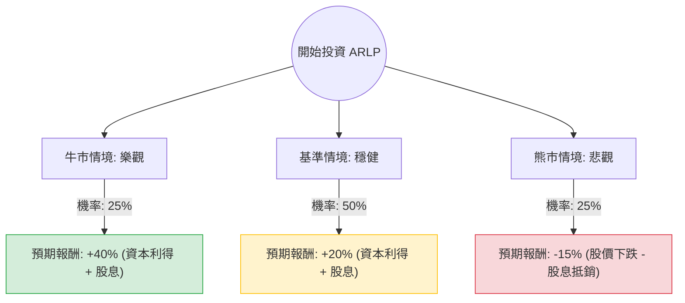

這份分析報告將結合您提供的基本面數據與最新的市場動態（包含 2024 年第一季財報表現及產業趨勢），利用**決策樹（Decision Tree）**與**期望值分析（Expected Value Analysis）**評估 Alliance Resource Partners, L.P. (ARLP) 的投資價值。

---

### 一、 核心背景與市場動態分析

在進入決策樹之前，我們先整合最新資訊：
1.  **財務表現**：ARLP 2024 Q1 營收略低於預期，主要受煤炭銷量下降影響，但其**每噸利潤保持穩定**。
2.  **多元化戰略**：公司正積極從純煤炭商轉型，其**石油與天然氣特許權使用費（Royalties）**業務貢獻了高利潤率的現金流。
3.  **股利政策**：目前殖利率高達 **9.44%**，且 P/FCF（股價自由現金流比）僅 8.79，顯示現金流足以支撐高配息。
4.  **產業趨勢**：雖然長期面臨去碳化壓力，但短期內 AI 數據中心對電力需求的激增，意外支撐了燃煤發電的壽命。

---

### 二、 決策樹分析圖 (Decision Tree)

我們以 **1 年投資期限**為基準，設定三種可能的情境：

---

### 三、 期望值計算與核心假設

#### 1. 核心假設 (Core Assumptions)
*   **牛市情境 (Bull Case)**：AI 帶動電力需求超預期，煤價反彈；石油特許權收益隨油價上漲；公司成功上調全年指引。預期股價達到 $35 + 9.4% 股息。
*   **基準情境 (Base Case)**：煤炭合約價格穩定，出口市場維持現狀；公司維持現有配息。預期股價達到分析師目標價 $30.75 + 9.4% 股息。
*   **熊市情境 (Bear Case)**：天然氣價格持續低迷導致煤炭替代效應加劇；環保法規收緊；全球經濟衰退導致能源需求下滑。預期股價跌至 $20 + 9.4% 股息。

#### 2. 期望值 (EV) 計算過程
期望值公式：$EV = \sum (P_i \times R_i)$
*(其中 $P$ 為機率，$R$ 為該情境下的總報酬率)*

*   **牛市 (25%)**：$0.25 \times 40\% = 10\%$
*   **基準 (50%)**：$0.50 \times 20\% = 10\%$
*   **熊市 (25%)**：$0.25 \times (-15\%) = -3.75\%$

**總期望報酬率 (Total Expected Return) = 10% + 10% - 3.75% = 16.25%**

---

### 四、 數據深度解讀

*   **估值優勢**：Forward P/E 僅 9.59，低於行業平均，且 PEG 為 1.04，顯示股價尚未過度反映其增長潛力。
*   **財務穩健度**：Debt/Eq 僅 0.25，在能源產業中屬於極低負債，這賦予公司在景氣低迷時極強的抗風險能力。
*   **技術面**：目前股價高於 SMA20、50、200，呈現多頭排列，且近期表現（Perf Month +8.97%）顯示資金正在流入。

---

### 五、 最終結論

#### **判斷：適合投資 (Buy / Overweight)**

**理由如下：**
1.  **正向期望值**：經過風險加權後的預期報酬率為 **16.25%**，遠高於無風險利率及大盤平均預期。
2.  **極高的安全邊際**：9.44% 的股息率提供了強大的下行保護（Downside Protection）。即使股價不漲，投資者仍能獲得接近雙位數的現金回報。
3.  **結構性需求支撐**：AI 數據中心對電力穩定性的需求，讓煤炭從「夕陽產業」轉變為「過渡期必要的基載能源」，ARLP 作為低成本生產者將持續受益。
4.  **資產負債表強勁**：低負債率與高 ROE (16.7%) 證明了管理層卓越的資本配置能力。

**風險提示：**
*   需留意 ARLP 為 **MLP (Master Limited Partnership)** 結構，台灣投資者需注意美國預扣稅（通常為 37%）對實際收益的影響。
*   天然氣價格若長期低於 $2/MMBtu，將對煤炭需求產生替代壓力。

**建議操作：**
目前股價 $26.49 接近 52 週高點，建議可採「分批進場」策略，或在股價回測 SMA50 ($24.5 附近) 時加碼，以獲取最大化的期望價值。